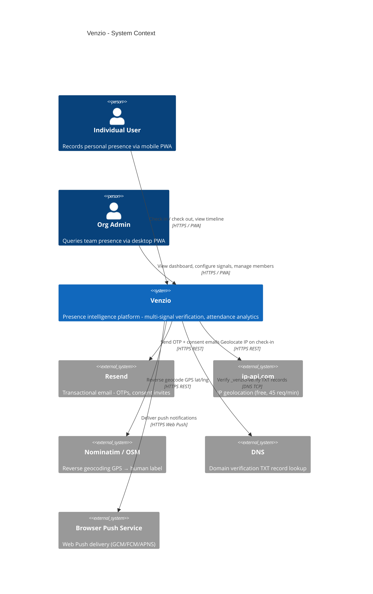
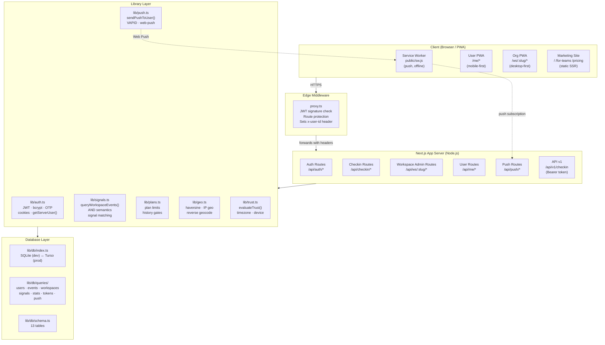
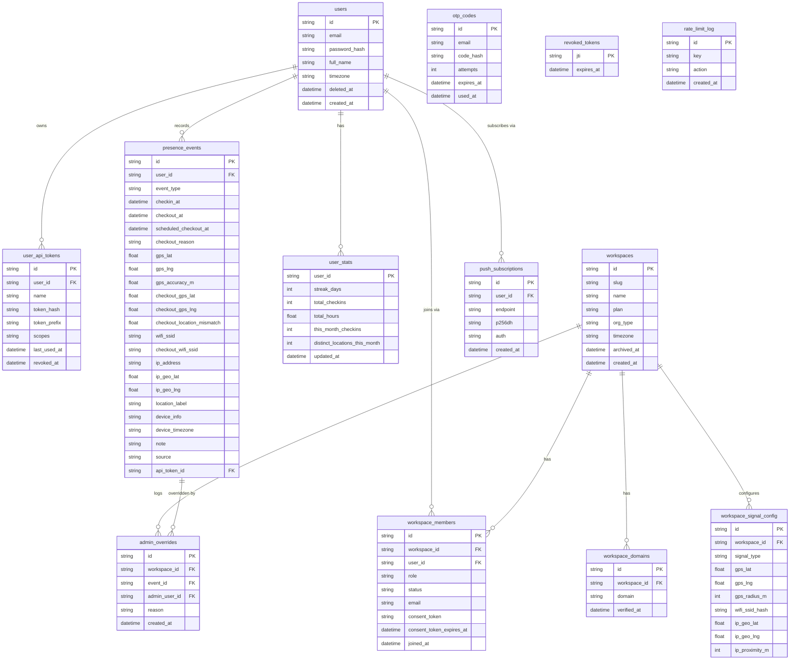
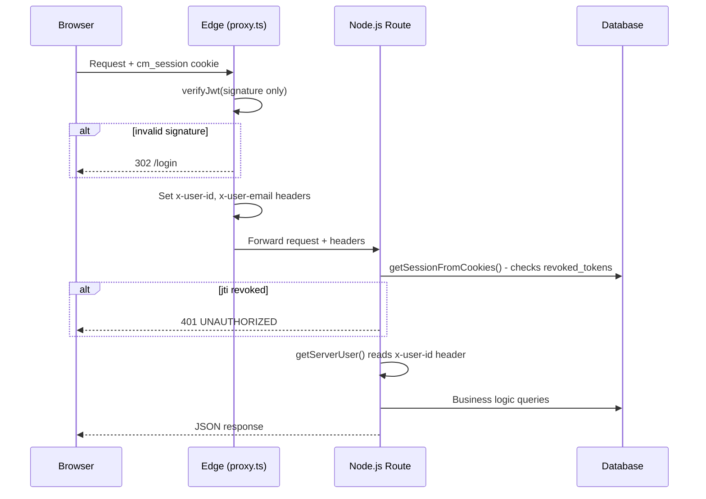

# Venzio - High Level Design

> Last updated: 2026-04-21 (post Phases 1–6 overhaul)

---

## 1. System Context



---

## 2. Application Architecture



---

## 3. Database Schema - Entity Relationships



---

## 4. Key Design Decisions

### 4.1 Signal AND Semantics - Core USP

Every configured signal type **must** match for a check-in to be `verified`. Partial matches are tracked but don't count as office presence. See [`signal-matching.md`](./signal-matching.md).

```
configured: [GPS, WiFi]

event A: GPS ✓  WiFi ✓  → verified   ✅ counts as office
event B: GPS ✓  WiFi ✗  → partial    ⚠️ doesn't count
event C: GPS ✗  WiFi ✗  → none       ❌ doesn't count
event D: (override)      → override  ✅ counts as office
```

### 4.2 Two-Tier Auth: Edge vs Node

| Layer | What it does | Why |
|-------|-------------|-----|
| Edge (proxy.ts) | JWT signature verify only | Fast, no DB access, blocks unauthenticated requests at CDN |
| Node (route handlers) | Full `getSessionFromCookies()` - includes revocation check | Revocation requires SQLite/Turso query |

### 4.3 Immutable Events

`presence_events` rows are **never updated or deleted** after insert (except `note` field). Admin corrections go in `admin_overrides`, not the original event. This preserves a full audit trail.

### 4.4 Soft Deletes

`users.deleted_at` and `workspaces.archived_at` - data is never hard-deleted. The `deleted_at IS NULL` filter is placed on the **JOIN condition** for LEFT JOINs (not in WHERE) to avoid converting LEFT JOINs into INNER JOINs.

### 4.5 Plan History Gates

`queryWorkspaceEvents()` applies a history gate before querying events:

| Plan | History |
|------|---------|
| free | 3 months |
| starter | 12 months |
| growth | 7 years |

### 4.6 API Token O(1) Lookup

Raw token = `prefix (8 chars) + secret`. `token_prefix` is stored in DB and indexed. On `POST /api/v1/checkin`:

1. Extract prefix from bearer token header (O(1))
2. Query `WHERE token_prefix = ?` → small candidate set
3. bcrypt.compare only over candidates

Avoids O(n) bcrypt comparison over all active tokens.

---

## 5. Request Lifecycle



---

## 6. Technology Choices

| Decision | Choice | Reason |
|----------|--------|--------|
| Framework | Next.js 16 App Router | SSR + API routes in one project, edge middleware |
| Database (dev) | better-sqlite3 | Zero config, fast, local file |
| Database (prod) | Turso (libSQL) | SQLite-compatible, distributed, edge-friendly |
| Auth | Custom JWT (jose) | No vendor lock-in, full control over cookie settings |
| Email | Resend | Simple API, reliable delivery, free tier |
| Push | VAPID / web-push | Open standard, works on Chrome/Safari/Firefox |
| Geocode | Nominatim | Free, no key, OSM data |
| IP Geo | ip-api.com | Free, no key, 45 req/min |
| Styling | Tailwind v4 utility-only | No component library = no visual debt |
| Cookie SameSite | Lax (not Strict) | Strict caused PWA session loss on iOS/Android cold-opens |
