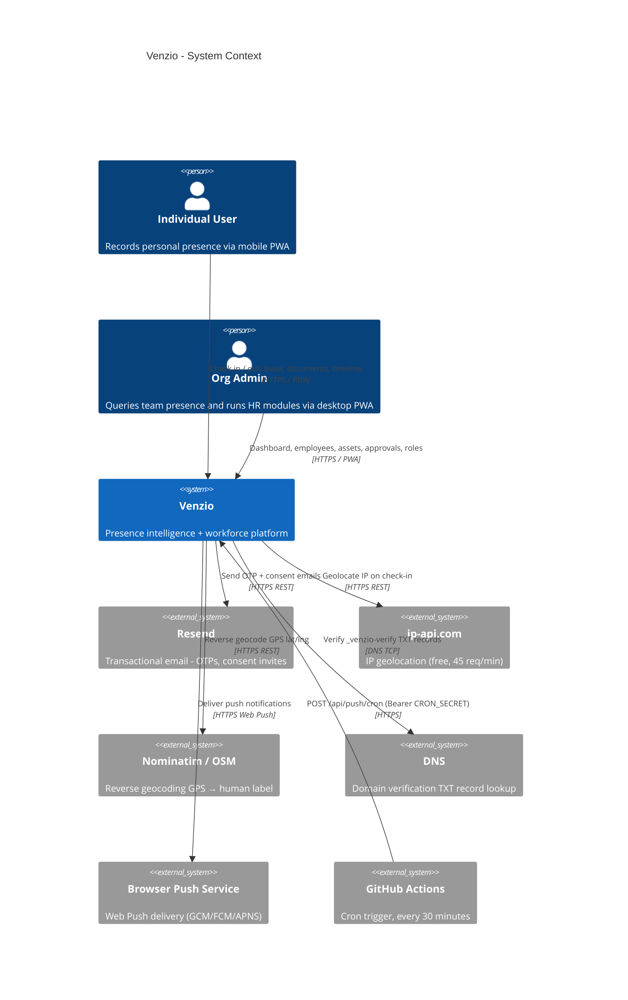
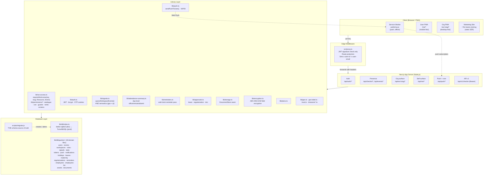
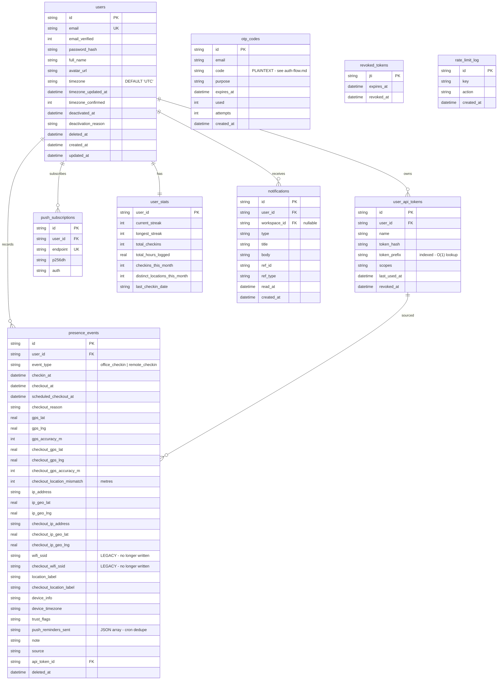
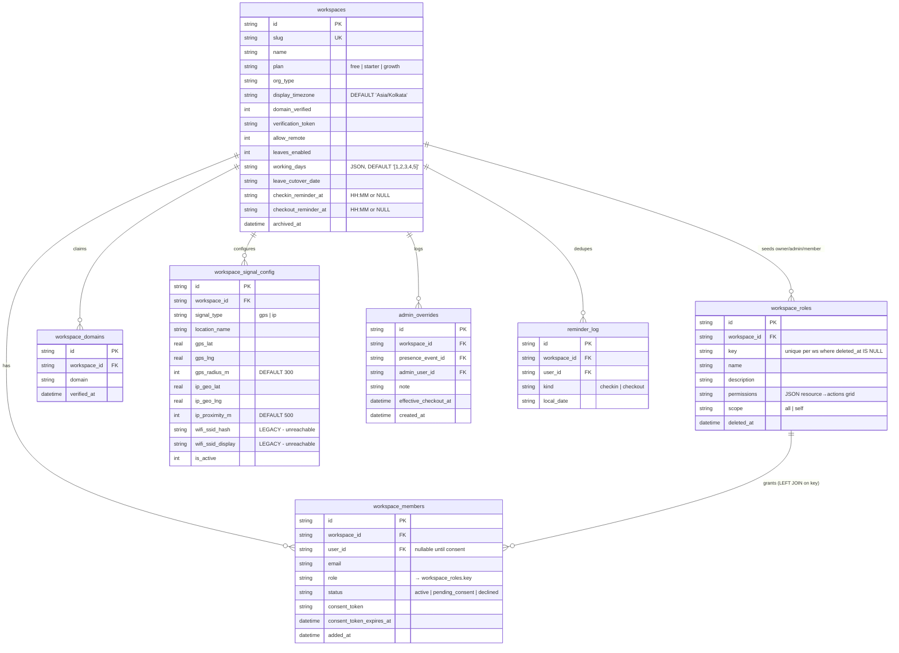
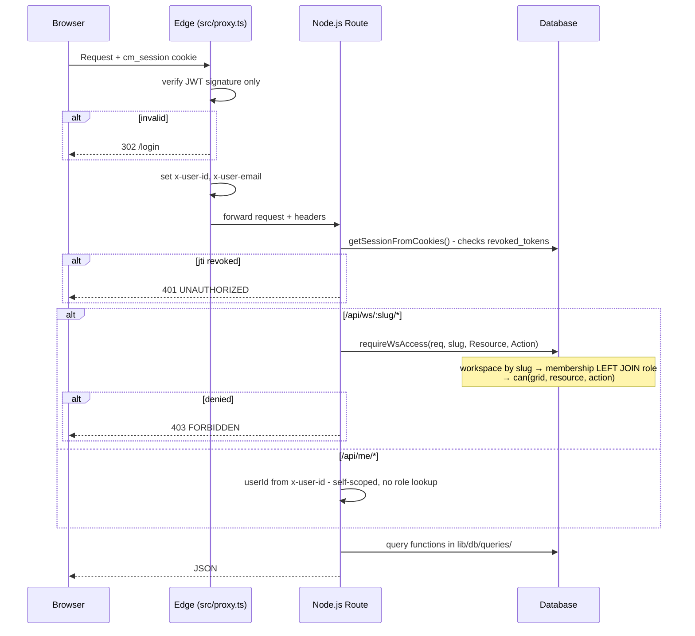

# Venzio - High Level Design

> Last updated: 2026-09-01

---

## 1. System Context


```mermaid
C4Context
  title Venzio - System Context

  Person(user, "Individual User", "Records personal presence via mobile PWA")
  Person(admin, "Org Admin", "Queries team presence and runs HR modules via desktop PWA")

  System(venzio, "Venzio", "Presence intelligence + workforce platform")

  System_Ext(resend, "Resend", "Transactional email - OTPs, consent invites")
  System_Ext(ipapi, "ip-api.com", "IP geolocation (free, 45 req/min)")
  System_Ext(nominatim, "Nominatim / OSM", "Reverse geocoding GPS → human label")
  System_Ext(dns, "DNS", "Domain verification TXT record lookup")
  System_Ext(vapid, "Browser Push Service", "Web Push delivery (GCM/FCM/APNS)")
  System_Ext(gha, "GitHub Actions", "Cron trigger, every 30 minutes")

  Rel(user, venzio, "Check in / out, leave, documents, timeline", "HTTPS / PWA")
  Rel(admin, venzio, "Dashboard, employees, assets, approvals, roles", "HTTPS / PWA")
  Rel(venzio, resend, "Send OTP + consent emails", "HTTPS REST")
  Rel(venzio, ipapi, "Geolocate IP on check-in", "HTTPS REST")
  Rel(venzio, nominatim, "Reverse geocode GPS lat/lng", "HTTPS REST")
  Rel(venzio, dns, "Verify _venzio-verify TXT records", "DNS TCP")
  Rel(venzio, vapid, "Deliver push notifications", "HTTPS Web Push")
  Rel(gha, venzio, "POST /api/push/cron (Bearer CRON_SECRET)", "HTTPS")
```

---

## 2. Application Architecture


```mermaid
graph TB
  subgraph Client["Client (Browser / PWA)"]
    SW["Service Worker\npublic/sw.js\n(push, offline)"]
    MePWA["User PWA\n/me/*\n(mobile-first)"]
    WsPWA["Org PWA\n/ws/:slug/*\n(desktop-first)"]
    MarketingSite["Marketing Site\n/ /for-teams /pricing\n(static SSR)"]
  end

  subgraph Edge["Edge Middleware"]
    Proxy["src/proxy.ts\nJWT signature check only\nRoute protection\nSets x-user-id / x-user-email"]
  end

  subgraph AppServer["Next.js App Server (Node.js)"]
    AuthRoutes["Auth\n/api/auth/*"]
    CheckinRoutes["Presence\n/api/checkin/*, /api/events/*"]
    WSRoutes["Org surface\n/api/ws/:slug/*"]
    MeRoutes["Self surface\n/api/me/*"]
    PushRoutes["Push + cron\n/api/push/*"]
    V1Routes["API v1\n/api/v1/checkin (Bearer)"]
  end

  subgraph LibLayer["Library Layer"]
    Access["lib/ws-access.ts\nrequireWsAccess(req, slug, Resource, Action)\nlib/permissions/*  catalogue · can · guards · ranks · screens"]
    Auth["lib/auth.ts\nJWT · bcrypt · OTP cookies"]
    Signals["lib/signals.ts\nqueryWorkspaceEvents()\nAND semantics (gps + ip)"]
    Attend["lib/attendance-summary.ts\nday-level office/remote/absent"]
    Reminders["lib/reminders.ts\nwall-clock reminder pass"]
    Approvals["lib/approvals.ts\nleave · regularization · doc"]
    Storage["lib/storage.ts\nDocumentStore seam"]
    Crypto["lib/encryption.ts\nAES-256-GCM field encryption"]
    PushLib["lib/push.ts\nsendPushToUser() · VAPID"]
    Plans["lib/plans.ts"]
    Geo["lib/geo.ts · geo-label.ts · trust.ts · timezone*.ts"]
  end

  subgraph DBLayer["Database Layer"]
    DBIndex["lib/db/index.ts\nbetter-sqlite3 (dev) ↔ Turso/libSQL (prod)"]
    Queries["lib/db/queries/  (18 domain files)\nusers · events · workspaces · roles · signals · stats\ntokens · push · notifications · holidays · leaves · maternity\nregularizations · reminders · employees · employees-list\nassets · documents"]
    Migrate["scripts/migrate.js\nTHE schema source of truth"]
  end

  Client -->|HTTPS| Edge
  Edge -->|forwards with headers| AppServer
  AppServer --> LibLayer
  LibLayer --> DBLayer
  Migrate -.->|creates / alters| DBIndex
  SW -.->|push subscription| PushRoutes
  PushLib -.->|Web Push| SW
```

> `src/lib/db/schema.ts` **no longer exists.** It was unreferenced dead code
> describing 13 tables. `scripts/migrate.js` is the single schema source of
> truth: fresh databases get every table and column from `BASE_SCHEMA`, existing
> ones get additive `ALTER TABLE` statements that skip on "duplicate column".
> Run `npm run migrate`.

---

## 3. Database Schema

28 tables. Grouped below because one diagram of all of them is unreadable.

### 3.1 Identity, session and presence


```mermaid
erDiagram
  users {
    string id PK
    string email UK
    int email_verified
    string password_hash
    string full_name
    string avatar_url
    string timezone "DEFAULT 'UTC'"
    datetime timezone_updated_at
    int timezone_confirmed
    datetime deactivated_at
    string deactivation_reason
    datetime deleted_at
    datetime created_at
    datetime updated_at
  }

  otp_codes {
    string id PK
    string email
    string code "PLAINTEXT - see auth-flow.md"
    string purpose
    datetime expires_at
    int used
    int attempts
    datetime created_at
  }

  revoked_tokens {
    string jti PK
    datetime expires_at
    datetime revoked_at
  }

  rate_limit_log {
    string id PK
    string key
    string action
    datetime created_at
  }

  user_api_tokens {
    string id PK
    string user_id FK
    string name
    string token_hash
    string token_prefix "indexed - O(1) lookup"
    string scopes
    datetime last_used_at
    datetime revoked_at
  }

  push_subscriptions {
    string id PK
    string user_id FK
    string endpoint UK
    string p256dh
    string auth
  }

  user_stats {
    string user_id PK
    int current_streak
    int longest_streak
    int total_checkins
    real total_hours_logged
    int checkins_this_month
    int distinct_locations_this_month
    string last_checkin_date
  }

  presence_events {
    string id PK
    string user_id FK
    string event_type "office_checkin | remote_checkin"
    datetime checkin_at
    datetime checkout_at
    datetime scheduled_checkout_at
    string checkout_reason
    real gps_lat
    real gps_lng
    int gps_accuracy_m
    real checkout_gps_lat
    real checkout_gps_lng
    int checkout_gps_accuracy_m
    int checkout_location_mismatch "metres"
    string ip_address
    real ip_geo_lat
    real ip_geo_lng
    string checkout_ip_address
    real checkout_ip_geo_lat
    real checkout_ip_geo_lng
    string wifi_ssid "LEGACY - no longer written"
    string checkout_wifi_ssid "LEGACY - no longer written"
    string location_label
    string checkout_location_label
    string device_info
    string device_timezone
    string trust_flags
    string push_reminders_sent "JSON array - cron dedupe"
    string note
    string source
    string api_token_id FK
    datetime deleted_at
  }

  notifications {
    string id PK
    string user_id FK
    string workspace_id FK "nullable"
    string type
    string title
    string body
    string ref_id
    string ref_type
    datetime read_at
    datetime created_at
  }

  users ||--o{ presence_events : records
  users ||--o{ user_api_tokens : owns
  users ||--|| user_stats : has
  users ||--o{ push_subscriptions : subscribes
  users ||--o{ notifications : receives
  user_api_tokens ||--o{ presence_events : "sourced"
```

**`presence_events` carries no `workspace_id`.** Verification is always computed
for a chosen workspace, and membership is what scopes every query over it.

### 3.2 Workspace, permissions and signals


```mermaid
erDiagram
  workspaces {
    string id PK
    string slug UK
    string name
    string plan "free | starter | growth"
    string org_type
    string display_timezone "DEFAULT 'Asia/Kolkata'"
    int domain_verified
    string verification_token
    int allow_remote
    int leaves_enabled
    string working_days "JSON, DEFAULT '[1,2,3,4,5]'"
    string leave_cutover_date
    string checkin_reminder_at "HH:MM or NULL"
    string checkout_reminder_at "HH:MM or NULL"
    datetime archived_at
  }

  workspace_members {
    string id PK
    string workspace_id FK
    string user_id FK "nullable until consent"
    string email
    string role "→ workspace_roles.key"
    string status "active | pending_consent | declined"
    string consent_token
    datetime consent_token_expires_at
    datetime added_at
  }

  workspace_roles {
    string id PK
    string workspace_id FK
    string key "unique per ws where deleted_at IS NULL"
    string name
    string description
    string permissions "JSON resource→actions grid"
    string scope "all | self"
    datetime deleted_at
  }

  workspace_domains {
    string id PK
    string workspace_id FK
    string domain
    datetime verified_at
  }

  workspace_signal_config {
    string id PK
    string workspace_id FK
    string signal_type "gps | ip"
    string location_name
    real gps_lat
    real gps_lng
    int gps_radius_m "DEFAULT 300"
    real ip_geo_lat
    real ip_geo_lng
    int ip_proximity_m "DEFAULT 500"
    string wifi_ssid_hash "LEGACY - unreachable"
    string wifi_ssid_display "LEGACY - unreachable"
    int is_active
  }

  admin_overrides {
    string id PK
    string workspace_id FK
    string presence_event_id FK
    string admin_user_id FK
    string note
    datetime effective_checkout_at
    datetime created_at
  }

  reminder_log {
    string id PK
    string workspace_id FK
    string user_id FK
    string kind "checkin | checkout"
    string local_date
  }

  workspaces ||--o{ workspace_members : has
  workspaces ||--o{ workspace_roles : "seeds owner/admin/member"
  workspaces ||--o{ workspace_domains : claims
  workspaces ||--o{ workspace_signal_config : configures
  workspaces ||--o{ admin_overrides : logs
  workspaces ||--o{ reminder_log : dedupes
  workspace_roles ||--o{ workspace_members : "grants (LEFT JOIN on key)"
```

`reminder_log` has a unique index on `(workspace_id, user_id, kind, local_date)`;
`workspace_roles` on `(workspace_id, key) WHERE deleted_at IS NULL`.

### 3.3 Workforce - employees, leave, assets, documents


```mermaid
erDiagram
  employees {
    string id PK
    string workspace_id FK
    string user_id FK "nullable"
    string employee_id "staff number"
    string first_name
    string last_name
    string work_email
    string employee_status "active | terminated | suspended | on_leave | notice_period"
    datetime deleted_at
  }

  employment_details {
    string id PK
    string employee_id FK "UNIQUE"
    string workspace_id FK
    string designation
    string department
    string work_location
    string work_mode "office | remote | hybrid"
    string reporting_manager_id FK
    string employment_type
    string source_of_hire
    string date_of_joining
    string exit_date
  }

  employee_sensitive {
    string id PK
    string employee_id FK "UNIQUE"
    string workspace_id FK
    string pan_encrypted "AES-256-GCM"
    string aadhaar_encrypted "AES-256-GCM"
    string bank_account_encrypted "AES-256-GCM"
    string uan "plaintext"
    string passport_number "plaintext"
    string bank_ifsc "plaintext"
    string bank_name "plaintext"
  }

  employee_documents {
    string id PK
    string workspace_id FK
    string employee_id FK
    string doc_key
    string name
    string owner "admin | employee"
    string status "missing | pending | verified | rejected | issued"
    string file_name
    string mime_type
    int size_bytes
    datetime deleted_at
  }

  employee_document_blobs {
    string id PK
    string document_id FK "UNIQUE"
    string workspace_id FK
    string data_base64
  }

  workspace_assets {
    string id PK
    string workspace_id FK
    string name
    string category
    string serial_number
    string status "assigned | available | repair | retired"
    string assigned_employee_id FK
    datetime assigned_at
    real purchase_value
    datetime deleted_at
  }

  maternity_cases {
    string id PK
    string workspace_id FK
    string employee_id FK
    string due_date
    string start_date
    string end_date
    int weeks "DEFAULT 26"
    string status "requested | approved | onleave | returned"
    string returned_on
    datetime deleted_at
  }

  workspace_leave_types {
    string id PK
    string workspace_id FK
    string name
    string accrual_frequency "monthly | quarterly | half-yearly | yearly"
    int accrual_credits
    string credit_timing "start | end"
    datetime deleted_at
  }

  leave_requests {
    string id PK
    string workspace_id FK
    string user_id FK
    string leave_type_id FK
    string start_date
    string end_date
    string reason
    string status "pending | approved | rejected"
    string rejection_reason
    string actioned_by_user_id FK
  }

  leave_opening_balances {
    string id PK
    string workspace_id FK
    string user_id FK
    string leave_type_id FK
    real balance_days
    string note
  }

  workspace_holidays {
    string id PK
    string workspace_id FK
    string name
    string date
    string description
    string created_by FK
    datetime deleted_at
  }

  regularization_requests {
    string id PK
    string workspace_id FK
    string user_id FK
    string target_date
    string presence_event_id FK
    string requested_type "office | remote"
    string reason
    string status "pending | approved | rejected"
    string rejection_reason
    string actioned_by_user_id FK
    string resulting_presence_event_id FK
  }

  employees ||--o| employment_details : has
  employees ||--o| employee_sensitive : has
  employees ||--o{ employee_documents : owns
  employee_documents ||--o| employee_document_blobs : bytes
  employees ||--o{ workspace_assets : "assigned"
  employees ||--o{ maternity_cases : has
  employees ||--o{ employees : "reports to"
  workspace_leave_types ||--o{ leave_requests : "booked against"
  workspace_leave_types ||--o{ leave_opening_balances : "carried into"
```

---

## 4. Key Design Decisions

### 4.1 Signal AND semantics - core USP

Every configured signal type must match for an event to be `verified`. Only
`gps` and `ip` exist — **WiFi was removed**. Config-light (no signals) yields
`verified`, not `none`. See [`signal-matching.md`](./signal-matching.md).

```
configured: [GPS, IP]

event A: GPS ✓  IP ✓  → verified
event B: GPS ✓  IP ✗  → partial
event C: GPS ✗  IP ✗  → none
event D: (override)   → override
no signals configured → verified (config-light)
```

### 4.2 Two-tier auth: Edge vs Node

| Layer | What it does | Why |
|-------|-------------|-----|
| Edge (`src/proxy.ts`) | JWT signature verify only, sets `x-user-id` | Fast, no DB access, blocks unauthenticated requests early |
| Node (route handlers) | `getSessionFromCookies()` including the `revoked_tokens` check | Revocation requires a SQLite/Turso query |

### 4.3 Permissions are a resource × action grid, not a boolean

`requireWsAdmin()` is gone. Every `/api/ws/[slug]/*` route calls
`requireWsAccess(request, slug, Resource, Action)`, which resolves membership
and role in one joined query and asks `can(grid, resource, action)`. Rank
(`canManage` / `canGrant`) answers the separate question of who may act on
whom, and `guardEscalation` is the real ceiling because every custom role shares
`CUSTOM_ROLE_RANK`. See [`permissions.md`](./permissions.md).

### 4.4 Immutable rows, additive corrections

`presence_events`, `leave_requests` and `regularization_requests` are never
rewritten after they settle. Admin corrections go in `admin_overrides`.
`maternity_cases` is the deliberate exception — a case is a mutable object with
a lifecycle, which is exactly why it is not modelled as a leave request.

### 4.5 Soft deletes

`users.deleted_at`, `workspaces.archived_at`, `employees.deleted_at`,
`workspace_roles.deleted_at`, `workspace_leave_types.deleted_at`,
`workspace_holidays.deleted_at`, `workspace_assets.deleted_at`,
`employee_documents.deleted_at`, `maternity_cases.deleted_at`,
`presence_events.deleted_at`.

The one deliberate hard delete is `employee_document_blobs`, removed in the same
transaction that soft-deletes its metadata row: an unreachable blob is a storage
leak, not an audit trail.

For `LEFT JOIN`s the `deleted_at IS NULL` filter goes on the **JOIN condition**,
not in `WHERE`, so the join is not silently converted into an `INNER JOIN`.

### 4.6 Plan gates

| Plan | Max users | History | Locations* | CSV |
|------|-----------|---------|-----------|-----|
| free | 10 | 3 months | 1 | No |
| starter | unlimited | 12 months | 1 | Yes |
| growth | unlimited | 84 months (7 y) | 5 | Yes |

Applied inside `queryWorkspaceEvents()` before signal matching.
\* `maxLocations` is displayed but **not enforced** anywhere in the signal routes.

### 4.7 API token O(1) lookup

Raw token = `prefix (8 chars) + secret`. `token_prefix` is stored and indexed
(`idx_api_tokens_prefix`). `POST /api/v1/checkin` extracts the prefix, queries
by it, then runs bcrypt only over that tiny candidate set.

### 4.8 Field-level encryption and the storage seam

Three employee fields are AES-256-GCM encrypted with `FIELD_ENCRYPTION_KEY`;
document bytes live as base64 TEXT behind the `DocumentStore` interface so an S3
backend is a one-file change. See [`employee-records.md`](./employee-records.md)
and [`assets-and-documents.md`](./assets-and-documents.md).

---

## 5. Request Lifecycle


```mermaid
sequenceDiagram
  participant B as Browser
  participant E as Edge (src/proxy.ts)
  participant N as Node.js Route
  participant D as Database

  B->>E: Request + cm_session cookie
  E->>E: verify JWT signature only
  alt invalid
    E-->>B: 302 /login
  end
  E->>E: set x-user-id, x-user-email
  E->>N: forward request + headers
  N->>D: getSessionFromCookies() - checks revoked_tokens
  alt jti revoked
    N-->>B: 401 UNAUTHORIZED
  end
  alt /api/ws/:slug/*
    N->>D: requireWsAccess(req, slug, Resource, Action)
    Note over D: workspace by slug → membership LEFT JOIN role<br/>→ can(grid, resource, action)
    alt denied
      N-->>B: 403 FORBIDDEN
    end
  else /api/me/*
    N->>N: userId from x-user-id - self-scoped, no role lookup
  end
  N->>D: query functions in lib/db/queries/
  N-->>B: JSON
```

---

## 6. Technology Choices

| Decision | Choice | Reason |
|----------|--------|--------|
| Framework | Next.js 16 App Router | SSR + API routes in one project, edge middleware |
| Database (dev) | better-sqlite3 | Zero config, fast, local file |
| Database (prod) | Turso / libSQL, `aws-ap-south-1` | SQLite-compatible; the region gives Indian data residency, which matters because PAN/Aadhaar are Indian statutory identifiers |
| Migrations | one idempotent `scripts/migrate.js` | Fresh DB and existing DB from the same file; no migration-ordering state to lose |
| Auth | Custom JWT (jose) | No vendor lock-in, full control over cookie settings |
| Email | Resend | Simple API, free tier; OTPs fall back to console in dev |
| Push | VAPID / web-push | Open standard, Chrome/Safari/Firefox |
| Scheduler | GitHub Actions cron, `0,30 * * * *` | No extra infra; half-hour ticks are required for half-hour timezone offsets |
| Document storage | base64 TEXT behind `DocumentStore` | No bucket, no signed URLs; verified byte-identical round-trip at 2.79 MB. Bytes and metadata are **not** written in one transaction — a write *ordering* invariant keeps them consistent instead, and it is the only approach an S3 store could honour too ([why](./assets-and-documents.md#upload-write-order--a-row-never-names-bytes-that-are-not-stored)) |
| Field crypto | AES-256-GCM, `crypto` builtin | Auth tag detects tampering; no dependency |
| Spreadsheets | exceljs | Holiday and leave-balance import, asset export |
| Geocode / IP geo | Nominatim / ip-api.com | Free, no key |
| Styling | Tailwind v4, utility-only | No component library = no visual debt |
| Cookie SameSite | Lax (not Strict) | Strict caused PWA session loss on iOS/Android cold-opens |
