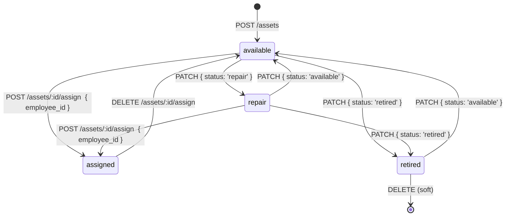
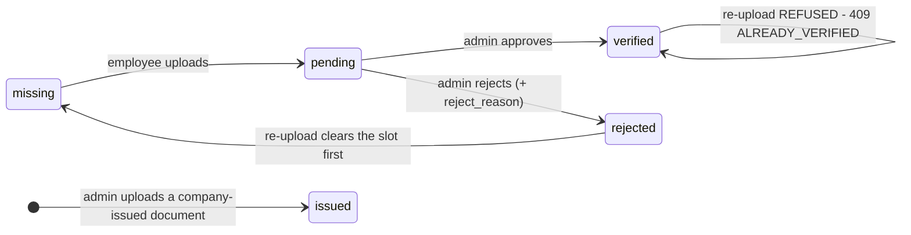
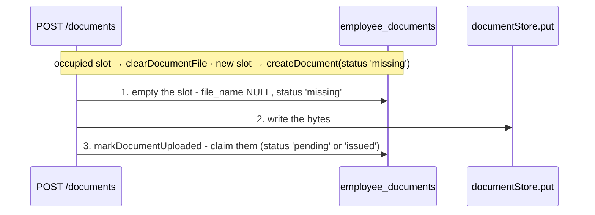
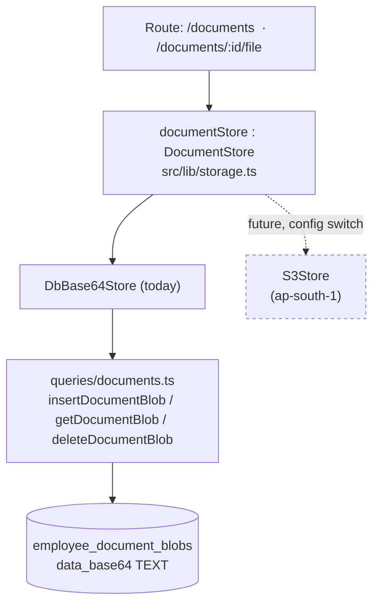

# Assets & Employee Documents

> Last updated: 2026-09-01
>
> Source of truth: `src/lib/db/queries/assets.ts`, `src/lib/db/queries/documents.ts`,
> `src/lib/storage.ts`, `src/lib/api/documents-upload.ts`, and the routes under
> `/api/ws/[slug]/assets*`, `/api/ws/[slug]/employees/[id]/documents*`,
> `/api/me/ws/[slug]/documents*`.

Two modules that hang off `employees`, gated on two separate catalogue rows:
`Resource.Assets` and `Resource.Documents`.

---

## 1. Assets

`workspace_assets` is the company hardware register. Soft-deleted, always
scoped by `workspace_id`, so a retired laptop's assignment history survives.

```sql
workspace_assets (
  id, workspace_id, category, name, serial_number, condition,
  status TEXT NOT NULL DEFAULT 'available'
    CHECK(status IN ('assigned','available','repair','retired')),
  assigned_employee_id TEXT REFERENCES employees(id),
  assigned_at, purchase_value REAL, notes,
  deleted_at, created_at, updated_at
)
```

### Lifecycle



**`assigned` has exactly two edges, and both of them live in the `/assign`
endpoint pair.** `POST` is the only way in, `DELETE` the only way out. A second
path that could clear a holder is a second place to get it wrong, so `PATCH`
holds both mirrored guards instead:

| Attempted `PATCH` | Answer |
|-------------------|--------|
| `{ status: 'assigned' }` on an asset with **no** holder | `409 ASSIGN_VIA_ENDPOINT` |
| any status **other than** `assigned` on an asset that **has** a holder | `409 RETURN_FIRST` |

So `assigned → retired` and `assigned → repair` are **not** legal edges, however
natural they read. Either one would leave `assigned_employee_id` and
`assigned_at` set on a row the register calls retired or in-repair — "unassigned
but still marked assigned", the state that makes an asset register lie, and a
dead end besides: the table offers *Return* only on `assigned`, and assigning it
to anyone else answers `409 ALREADY_ASSIGNED`. The real path is `assigned →
available` (via `DELETE /assign`) `→ retired`.

The `RETURN_FIRST` guard is keyed on `existing.assigned_employee_id`, not on
`existing.status`, so a row already in that broken state — written before the
guard existed — cannot be patched further sideways, and `DELETE /assign` (which
also checks the holder) is still the way out of it.

`assignAsset()` sets `assigned_employee_id`, `assigned_at` **and** `status =
'assigned'` in one statement, so an asset can never read `assigned` with a null
holder. `unassignAsset()` clears both columns and returns the asset to
`available` in the same statement. A caller wanting `repair` or `retired`
follows with a `PATCH`, which is now legal because the holder is gone.

Route-level rules, all verified in `assets/[id]/assign/route.ts`:

- `employee_id` comes from the client, so it is resolved with
  `getEmployee(employeeId, ctx.workspace.id)` **before** it is written —
  otherwise an asset could be handed to an employee of another tenant.
- Assigning a `retired` asset → `409 ASSET_RETIRED`.
- Assigning an asset already held by someone else → `409 ALREADY_ASSIGNED`
  ("return it first"). Re-assigning to the same holder is a no-op, not an error.

Lists use a `LEFT JOIN` to `employees` (an unassigned asset must still appear)
and return `assignee_first_name` / `assignee_last_name` /
`assignee_employee_id`. `listAssets` supports `category` and `status` filters;
`getAssetStatusCounts` and `listAssetCategories` drive the filter chips.

`listAssetsForEmployee` — the "what this person holds" list on an employee
profile — filters `AND status = 'assigned'` as well as on the holder column.
The two move together on every write path above, so the extra predicate is
belt-and-braces for rows written before those guards existed; without it, such a
row surfaces as "your offboarded colleague still has the laptop".

### Export

`GET /api/ws/[slug]/assets/export` honours the same `?category=` / `?status=`
filters as the list, so the CSV always matches what the admin is looking at. It
is gated on **`assets:read`, not `export:read`** — `Resource.Export` governs the
attendance workbook, and an assets-only role should still be able to take its own
list away with it. The file is written with a UTF-8 BOM and CRLF line endings;
without the BOM Excel reads it as the local ANSI codepage and mangles every
non-ASCII name.

---

## 2. Employee documents — the metadata / bytes split

Two tables, deliberately:

```sql
employee_documents (          -- METADATA. Read by every folder view.
  id, workspace_id, employee_id,
  doc_key,                    -- stable slot key, e.g. 'pan_card'
  name, owner  CHECK(owner  IN ('admin','employee')),
  status CHECK(status IN ('missing','pending','verified','rejected','issued')),
  file_name, mime_type, size_bytes, reject_reason,
  uploaded_by, verified_by, uploaded_at,
  deleted_at, created_at, updated_at
)
-- partial unique index (workspace_id, employee_id, doc_key) WHERE deleted_at IS NULL

employee_document_blobs (     -- BYTES. Read only on download.
  id, document_id UNIQUE REFERENCES employee_documents(id) ON DELETE CASCADE,
  workspace_id, data_base64 TEXT NOT NULL, created_at
)
```

A join would drag megabytes through every list query, so there is no join —
`listEmployeeDocuments` never touches the blob table.

### Owner decides the starting status

| `owner` | Meaning | Starts at | Path |
|---------|---------|-----------|------|
| `employee` | the employee must produce it (ID proof, past payslips) | `missing` → `pending` on upload | awaits admin verification |
| `admin` | the company issues it (offer letter, contract) | `issued` | nothing to verify about a file the company produced |



Every re-upload passes back through `missing`: the slot's claim on a file is
dropped before the new bytes are written, so `rejected → pending` is two steps,
not one. See "Upload write order" below.

`markDocumentUploaded()` clears `reject_reason` **and** `verified_by` on every
re-upload: a re-upload after a rejection is a fresh submission, and carrying the
old refusal or the old verifier forward would make the row describe a file that
no longer exists. `setDocumentReview()` writes `reject_reason` on every call, so
approving a previously rejected document clears the stale explanation.

A **verified** document is settled — the `/me` upload path refuses to replace it
(`409 ALREADY_VERIFIED`). The admin deletes the slot if it genuinely needs
replacing.

### The `/me` surface is self-only, structurally

`/api/me/ws/[slug]/documents` takes **no employee id** in the path and accepts
none from the body. The employee record is resolved from `ctx.userId` via
`findEmployeeByUserId`, and every query is scoped to what comes back. A member
therefore cannot reach another person's documents through this surface, whatever
they send. The `owner` form field is ignored there on purpose: letting a member
self-declare a document `admin`/`issued` would let them mark their own upload as
company-issued and skip verification entirely.

### Upload validation — one implementation, two surfaces

`parseDocumentUpload()` in `src/lib/api/documents-upload.ts` is shared by the
admin and `/me` routes so the two can never diverge:

| Check | Rule |
|-------|------|
| Size | `MAX_FILE_BYTES = 2 MB`. Checked **twice** — against `File.size` before reading (so a huge upload is not buffered) and against the real buffer length afterwards, because `File.size` is metadata like any other |
| Type | `sniffMimeType()` on the leading bytes: `%PDF`, the 8-byte PNG signature, `FF D8 FF` for JPEG. `File.type` is **never trusted** — it is attacker-controlled and would let an HTML or SVG payload be stored and served back under a benign Content-Type |
| `doc_key` | `/^[a-z0-9_]{1,64}$/` |

Failures map to `400 MISSING_FILE`, `422 VALIDATION_ERROR`, `413
FILE_TOO_LARGE`, `415 UNSUPPORTED_MEDIA_TYPE`.

Two further upload rejections, on the `/me` route only:

| Limit | Rule |
|-------|------|
| Rate | **20 uploads per user per hour**, on the shared `rate_limit_log` keyed `documents:<userId>`, action `document_upload`. Checked **before** the body is read, so a rate-limited caller never gets to push 2 MB through the server. 20 rather than the regularizations route's 10 because a new joiner fills a whole folder in one sitting and every retry after a rejection costs another hit. Exceeded → `429 RATE_LIMITED` |
| Slots | **40 live (non-deleted) rows per employee**, counted by `countEmployeeDocuments()`. `doc_key` is member-chosen and every unseen key opens a new row, so without a ceiling a member can mint slots until the workspace's storage is gone. Checked only on the *new-slot* branch — replacing the file in a slot they already hold is never blocked. Exceeded → `409 SLOT_LIMIT` |

The admin route carries neither: it is already behind `documents:write`.

Both routes answer a lost race for the same `doc_key` with `409 DUPLICATE_SLOT`.
`findDocumentByKey` + `createDocument` is check-then-act and nothing stops a
second request slipping between the two, so the partial unique index is the real
guard; `createDocument` recognises SQLite's `UNIQUE constraint failed` text
(identical on better-sqlite3 and libSQL) and throws a named
`DuplicateDocumentSlotError` the route turns into a 409 rather than letting a
driver exception escape as a 500.

### Upload write order — a row never names bytes that are not stored

**The invariant:** *a metadata row must never claim a file whose bytes are not
stored yet.* Both POST routes therefore run the same three steps in the same
order:



`clearDocumentFile()` is the piece that was missing before. It drops
`file_name`, `mime_type`, `size_bytes`, `uploaded_at`, `reject_reason` and
`verified_by` and sets `status = 'missing'`, keeping `owner` and `name` — the
slot is unchanged, only its contents. In that window the row honestly describes
no file: it leaves the approvals feed, the download link goes, and `PATCH`
refuses to review it (`existing.file_name` is NULL).

Why the order matters. Metadata-first, bytes-second — what this used to do —
fails two ways: a failed `put` leaves a row advertising a download that 404s,
and on a re-upload over a **rejected** slot it leaves the **new file name
pointing at the old rejected bytes**, so an admin verifies a document that is
not the one on screen. Ordered this way, every crash point leaves either an
empty slot or a row pointing at exactly the bytes it describes.

**Why not a transaction.** It is the obvious fix and it does not work here —
worth stating plainly, because someone will try it:

- `db.transaction()` cannot cover the two writes on the **SQLite** path at all.
  `createSQLiteDB().transaction()` runs `BEGIN`, then hands the callback
  `this` — *the same non-transactional `DB` object*, on one shared connection.
  It `await`s inside the open transaction, so a concurrent request's statements
  land inside it and are committed or rolled back with it.
- `insertDocumentBlob()` already opens its **own** `db.transaction()`. Nesting
  it inside another would either throw (libSQL) or run the blob write inside the
  outer one's scope rather than its own.
- And an S3-backed store could never join a SQL transaction: no transaction
  spans a `PUT`. The ordering invariant is the only discipline that survives the
  swap, which is the point of having it rather than a transaction.

### Deletion is mark-then-reap

`deleteDocument()` **soft-deletes the metadata only** — who uploaded what, and
when, stays auditable. The route then calls `documentStore.delete()`, which
hard-deletes the bytes. A soft-deleted blob would be unreachable dead weight:
nothing can serve it, and every storage measure would count it forever.

Two properties come out of doing it in that order, through the store:

1. **The soft delete lands first**, so the document is already unreachable
   (`getDocumentBlob` joins the metadata row and filters `deleted_at IS NULL`)
   even if the byte deletion then fails. The worst case is orphaned bytes nobody
   can serve — never a live row whose file has been shredded.
2. **The blob delete goes through the seam.** The query layer used to issue a
   raw `DELETE FROM employee_document_blobs` of its own, which quietly falsified
   the promise in §3 that swapping in S3 touches no query file: that statement
   reads as harmless today and deletes *nothing at all* the day the store is S3,
   leaking every object in the bucket while the metadata disappears.

---

## 3. The storage decision



```ts
interface DocumentStore {
  put(workspaceId, documentId, bytes: Buffer, mime: string): Promise<{ size: number }>
  get(workspaceId, documentId): Promise<{ bytes: Buffer; mime: string } | null>
  delete(workspaceId, documentId): Promise<void>
}
export const documentStore: DocumentStore = new DbBase64Store()
```

Three rules keep the seam honest:

1. **Nothing outside `lib/storage.ts` and `db/queries/documents.ts` may see
   base64.** Callers hand over and receive `Buffer`. The three blob helpers are
   exported for `DbBase64Store` and nothing else — a route that imports them is
   bypassing the seam and defeating the swap.
2. **Bytes and metadata live in separate tables** (above).
3. **Every byte written *or removed* goes through the interface, `delete`
   included.** A raw `DELETE FROM employee_document_blobs` in a query file is
   the one that looks harmless — see "Deletion is mark-then-reap" above.

`workspaceId` is a parameter on every method rather than being implied by the
document id: it keeps the tenant boundary visible at the storage layer (an S3
implementation would use it as a key prefix) and lets the DB implementation
scope its queries the way every other query in the codebase does. The MIME type
is not stored on the blob row — storing it twice would give it two places to
disagree — so `get()` reads it back off the metadata row and falls back to
`application/octet-stream`, which makes the browser download rather than render.

### Why base64-in-DB, and what was rejected

| Option | Decision | Reason |
|--------|----------|--------|
| **base64 TEXT in Turso** | **chosen** | One connection, no bucket, no signed URLs, no second failure domain. Works identically in local dev (SQLite file) with no emulator. (It does **not** buy a shared transaction with the metadata row — see the write-order section above for why that was never available.) |
| Vercel Blob | rejected | The Hobby tier is non-commercial-use-only and Venzio is a commercial product |
| S3 | deferred | Adds a vendor and a second failure domain for no benefit at current volume. The `DocumentStore` seam exists precisely so this stays a one-file change |

**Chunking: none, on purpose.** A **2.79 MB base64 value** (≈2 MB raw — the
`MAX_FILE_BYTES` cap) was measured round-tripping through Turso **byte-identical
in 351–513 ms**. Splitting payloads across rows would add reassembly logic to
buy nothing.

### Exit criteria — when to move to S3

Revisit when **either** holds:

- total document volume approaches **~2 GB**, or
- serverless memory on download becomes a problem (the whole file is buffered
  and base64-decoded in the function).

Raising `MAX_FILE_BYTES` past Turso's row/response limits is also a move-to-S3
trigger, not a reach-for-chunking trigger. The target is **S3 in
`ap-south-1`**: Turso already runs in `aws-ap-south-1`, so documents currently
inherit Indian data residency, and the replacement must not lose it — relevant
because the same records carry PAN and Aadhaar, Indian statutory identifiers
(see [`employee-records.md`](./employee-records.md)).

### `npm run db:sync` and the blob table

The local-DB sync **skips** `employee_document_blobs` — there is no reason to
pull production document bytes onto a laptop, and it is the one table that can
make the copy enormous.

`scripts/sync-local-db.js` holds the skip list in `SYNC_EXCLUDED_TABLES`, checked
by `shouldSkipRows()`. Two details matter:

- **The table is still CREATEd locally, only its rows are skipped.** Dropping the
  table instead would break any query that joins it, so a synced laptop has the
  full document *metadata* and an empty blob table: the document list renders
  correctly, and only the bytes are missing.
- The skip is logged explicitly (`Skipped employee_document_blobs (N row(s) —
  blob storage)`) rather than being silent, so the behaviour is visible in the
  sync output.

Set `SYNC_INCLUDE_BLOBS=1` to copy them anyway — the escape hatch for debugging a
document bug that needs the real bytes.

---

## 4. Routes

| Endpoint | Gate |
|----------|------|
| `GET/POST /api/ws/[slug]/assets` | `assets:read` / `assets:write` |
| `PATCH /api/ws/[slug]/assets/[id]` | `assets:write` |
| `DELETE /api/ws/[slug]/assets/[id]` | `assets:delete` |
| `POST/DELETE /api/ws/[slug]/assets/[id]/assign` | `assets:write` |
| `GET /api/ws/[slug]/assets/export` | `assets:read` |
| `GET/POST /api/ws/[slug]/employees/[id]/documents` | `documents:read` / `documents:write` |
| `PATCH /api/ws/[slug]/employees/[id]/documents/[docId]` | `documents:write` |
| `DELETE /api/ws/[slug]/employees/[id]/documents/[docId]` | `documents:delete` |
| `GET /api/ws/[slug]/employees/[id]/documents/[docId]/file` | `documents:read` |
| `GET/POST /api/me/ws/[slug]/documents` | `requireWsMember` — self only |
| `GET /api/me/ws/[slug]/documents/[docId]/file` | `requireWsMember` — self only |

Pending employee uploads surface in the approvals feed as `kind: 'doc'` — see
[`leave-flow.md`](./leave-flow.md#the-approvals-feed).
