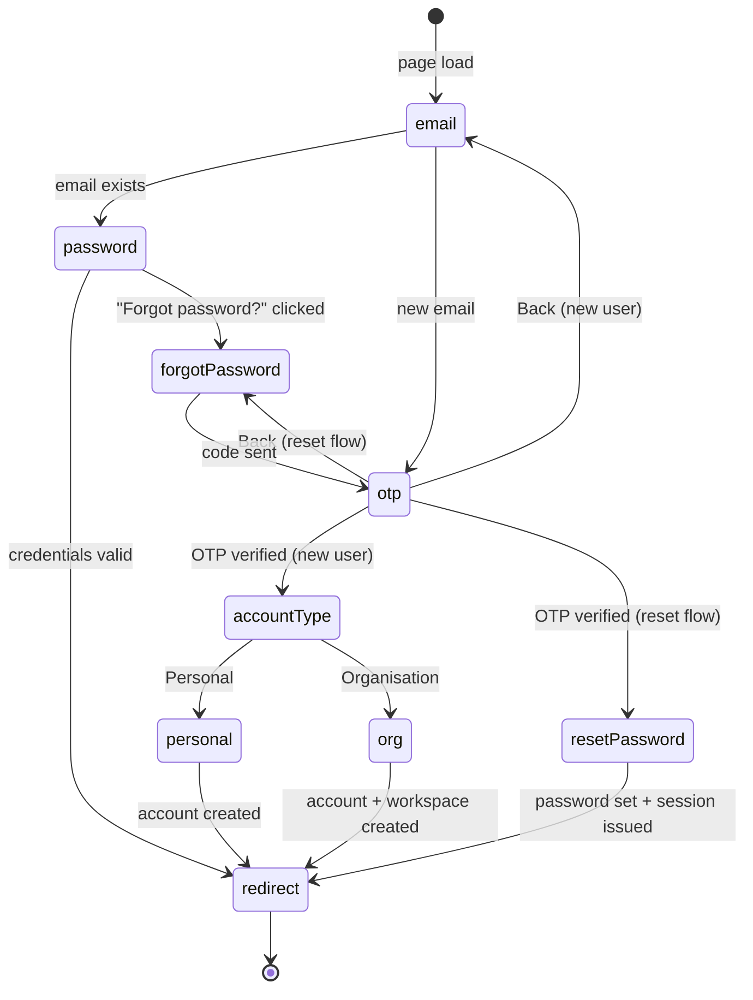
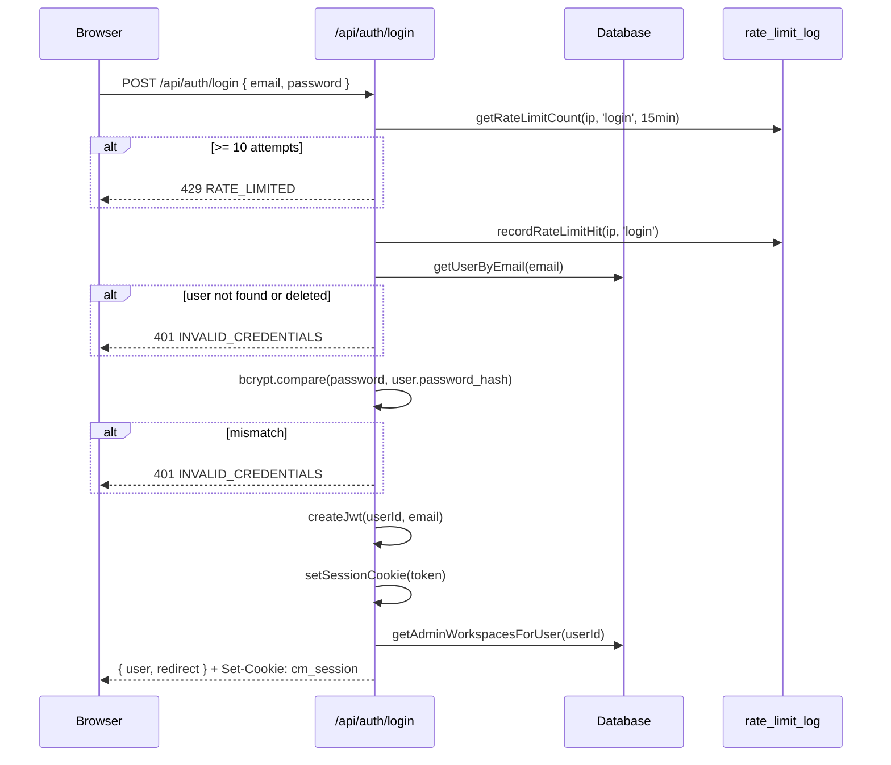
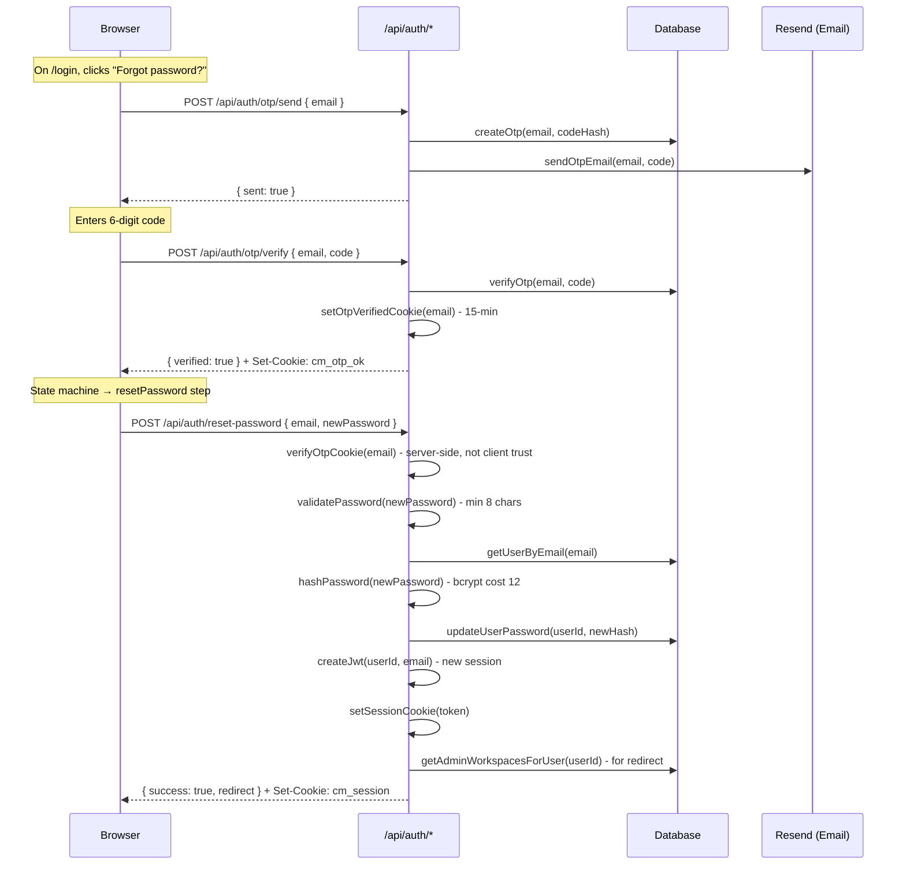
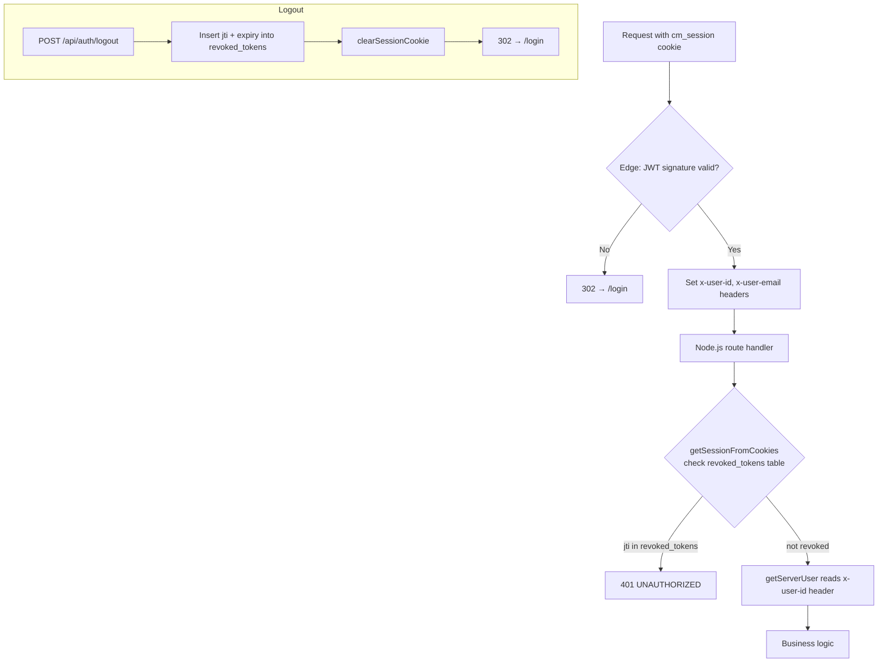
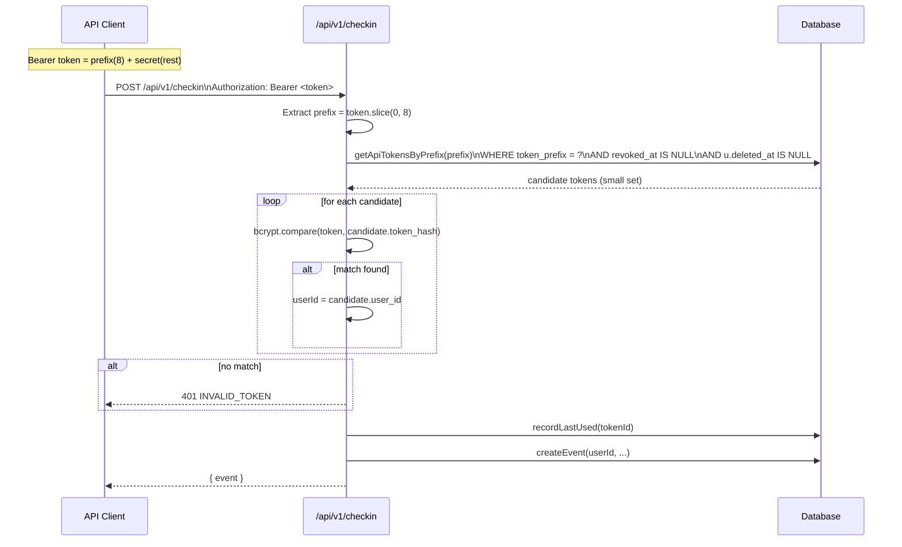

# Authentication & Session Flows

---

## 1. Login / Registration State Machine

The login page (`/login`) is a single client-side state machine with 8 states:



---

## 2. New User Registration - Full Sequence

```mermaid
sequenceDiagram
  participant U as Browser
  participant A as /api/auth/*
  participant DB as Database
  participant E as Resend (Email)

  U->>A: POST /api/auth/check-email { email }
  A->>DB: getUserByEmail(email)
  DB-->>A: null
  A-->>U: { exists: false }

  U->>A: POST /api/auth/otp/send { email }
  A->>DB: createOtp(email, codeHash)
  A->>E: sendOtpEmail(email, code)
  A-->>U: { sent: true, expiresIn: 600 }

  Note over U: User enters 6-digit code

  U->>A: POST /api/auth/otp/verify { email, code }
  A->>DB: verifyOtp(email, code) - checks hash + expiry + attempts
  A->>A: setOtpVerifiedCookie(email) - 15-min httpOnly JWT
  A-->>U: { verified: true } + Set-Cookie: cm_otp_ok

  Note over U: Chooses Personal or Organisation

  U->>A: POST /api/auth/register { email, fullName, password, accountType, ... }
  A->>A: verifyOtpCookie(email) - validates cm_otp_ok server-side
  A->>A: hashPassword(password) - bcrypt cost 12
  A->>DB: createUser(email, hash, name)
  alt accountType === 'org'
    A->>DB: createWorkspace(name, slug, plan='free')
    A->>DB: createWorkspaceMember(userId, workspaceId, role='admin')
  end
  A->>A: createJwt(userId, email) - 30-day, unique jti
  A->>A: setSessionCookie(token) - httpOnly; SameSite=Lax; Secure
  A->>A: clearOtpCookie()
  A-->>U: { user, redirect } + Set-Cookie: cm_session
```

---

## 3. Existing User Login



---

## 4. Forgot Password / Reset Flow



---

## 5. Session & Revocation



**Cookie properties:**
```
cm_session: httpOnly; SameSite=Lax; Secure (prod); Path=/; Max-Age=2592000 (30 days)
cm_otp_ok:  httpOnly; SameSite=Lax; Secure (prod); Path=/; Max-Age=900 (15 min)
```

**Why SameSite=Lax (not Strict):** `Strict` caused session loss when users opened the PWA from the home screen on iOS/Android - the OS treats the home-screen-to-browser navigation as cross-origin. `Lax` still blocks cross-site POST mutations; only top-level GET navigations carry the cookie.

---

## 6. API Token Authentication (V1 Checkin)



**O(1) prefix lookup:** The `token_prefix` column is indexed (`idx_api_tokens_prefix`). The prefix query returns a tiny candidate set. bcrypt runs only on those candidates - not over all active tokens.

---

## 7. OTP Security Properties

| Property | Value |
|----------|-------|
| Code length | 6 digits |
| Expiry | 10 minutes |
| Max attempts | 5 per code (then locked) |
| Rate limit | 3 sends per 15 minutes per email |
| Storage | bcrypt hash of code - never stored in plaintext |
| Cookie proof | `cm_otp_ok` is a 15-min signed JWT - server never trusts `otpVerified: true` from client |
