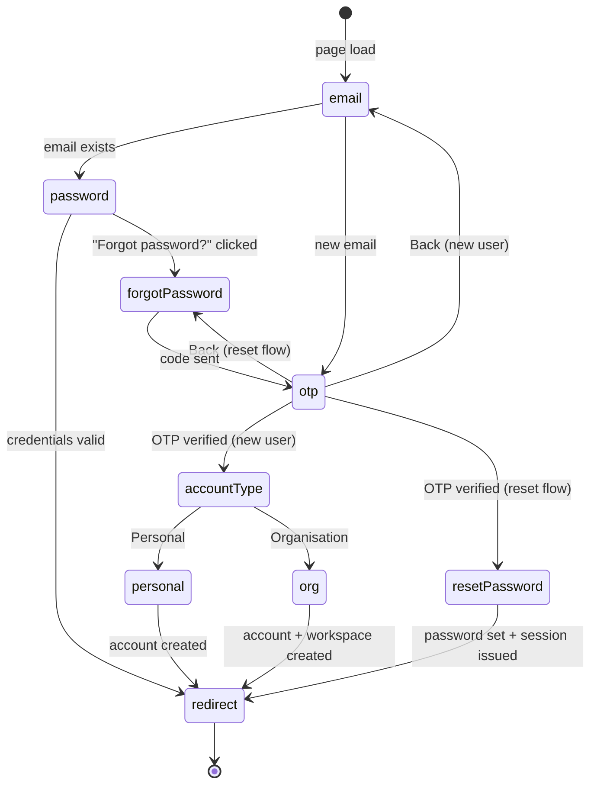
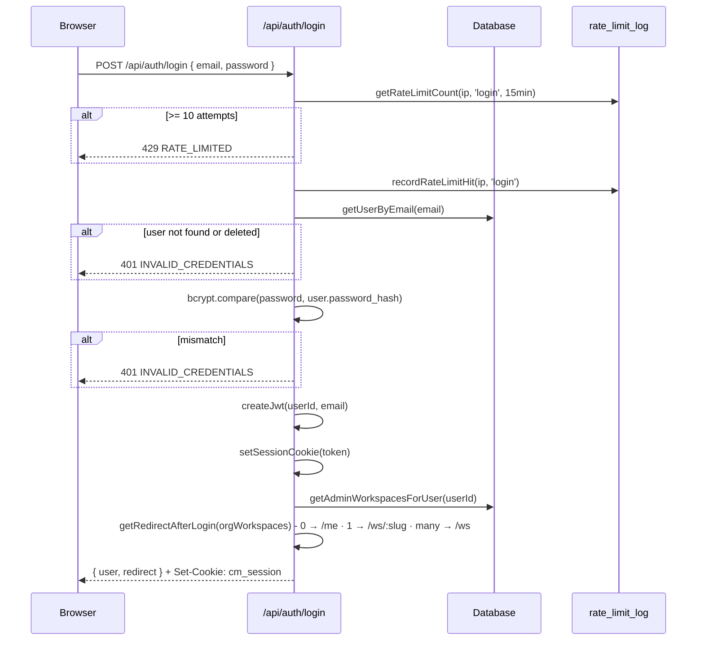
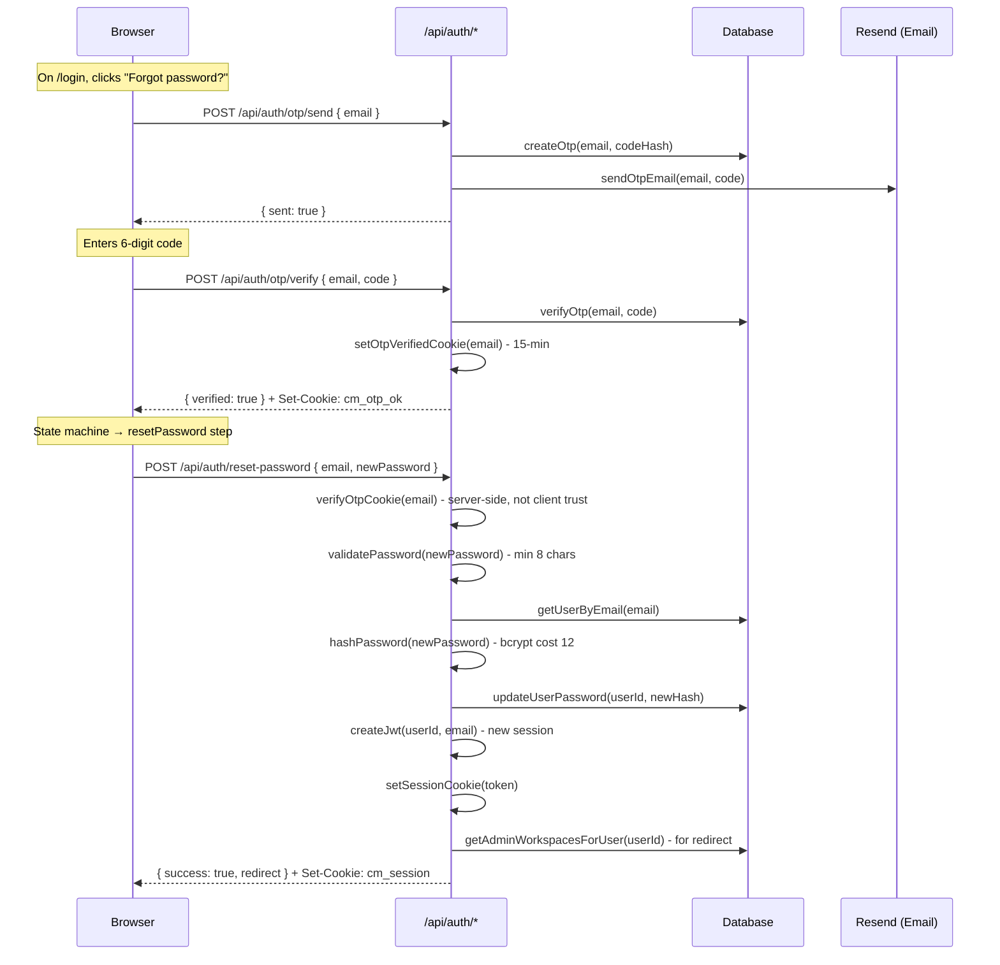
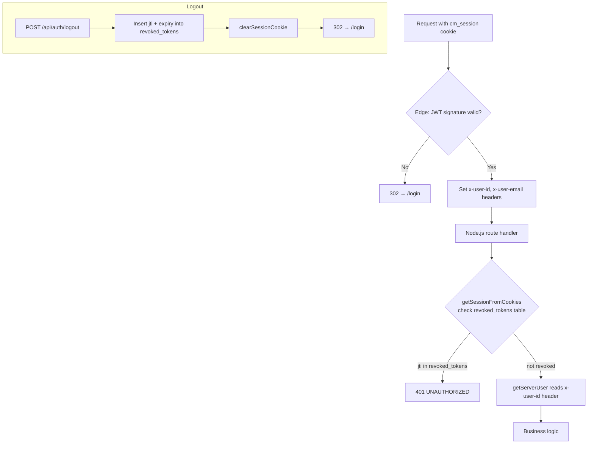
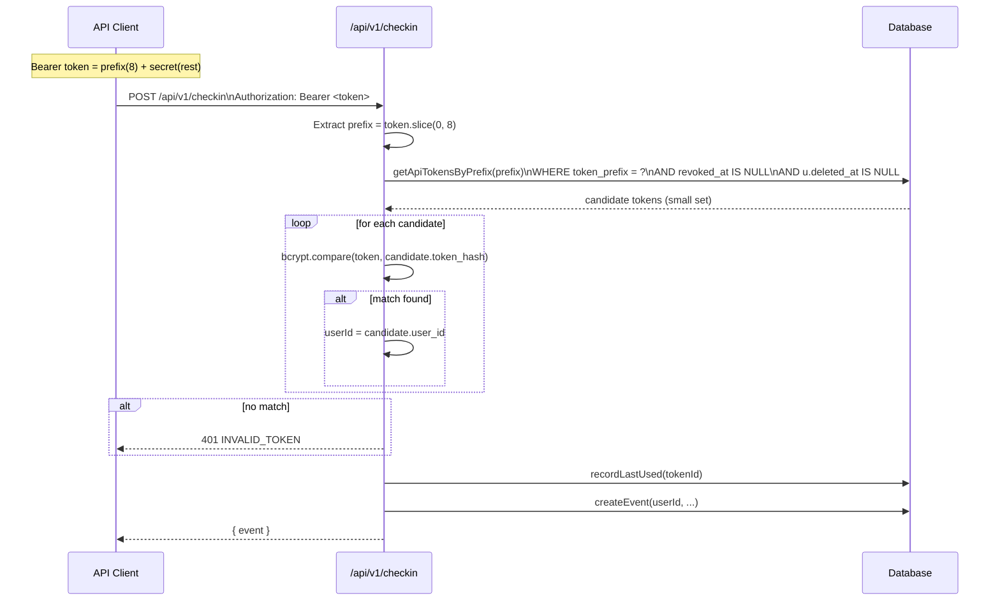

# Authentication & Session Flows

> Last updated: 2026-08-31

---

## 1. Login / Registration State Machine

The login page (`/login`) is a single client-side state machine with 8 states:


```mermaid
stateDiagram-v2
  [*] --> email : page load

  email --> password : email exists
  email --> otp : new email

  password --> redirect : credentials valid
  password --> forgotPassword : "Forgot password?" clicked

  otp --> accountType : OTP verified (new user)
  otp --> resetPassword : OTP verified (reset flow)
  otp --> forgotPassword : Back (reset flow)
  otp --> email : Back (new user)

  forgotPassword --> otp : code sent

  accountType --> personal : Personal
  accountType --> org : Organisation

  personal --> redirect : account created
  org --> redirect : account + workspace created

  resetPassword --> redirect : password set + session issued

  redirect --> [*]
```

---

## 2. New User Registration - Full Sequence

```mermaid
sequenceDiagram
  participant U as Browser
  participant A as /api/auth/*
  participant DB as Database
  participant E as Resend (Email)

  U->>A: POST /api/auth/check-email { email }
  A->>DB: getUserByEmail(email)
  DB-->>A: null
  A-->>U: { exists: false }

  U->>A: POST /api/auth/otp/send { email }
  A->>DB: countRecentOtps(email, 15) - max 3 per 15 min
  A->>DB: createOtp({ email, code, purpose: 'signup', expiresAt })
  A->>E: sendOtpEmail(email, code)
  A-->>U: { sent: true, expiresIn: 600 }

  Note over U: User enters 6-digit code

  U->>A: POST /api/auth/otp/verify { email, code }
  A->>DB: getLatestUnusedOtp(email, 'signup') - attempts >= 5 → 429
  A->>DB: getValidOtp(email, code, 'signup') - else incrementOtpAttempts
  A->>DB: markOtpUsed(otp.id)
  A->>A: setOtpVerifiedCookie(email) - 15-min httpOnly JWT
  A-->>U: { verified: true } + Set-Cookie: cm_otp_ok

  Note over U: Chooses Personal or Organisation

  U->>A: POST /api/auth/register { email, fullName, password, accountType, ... }
  A->>A: verifyOtpCookie(email) - validates cm_otp_ok server-side
  A->>A: hashPassword(password) - bcrypt cost 12
  A->>DB: createUser(email, hash, name)
  A->>DB: linkUserToMemberRecord(email, userId) - claims pending invites
  A->>DB: getVerifiedDomainsForEmail(email) - auto-enrol as role='member'
  alt accountType === 'org'
    A->>DB: createWorkspace({ slug, name, creatorUserId, creatorEmail, domains })
    Note over DB: ONE transaction:<br/>INSERT workspaces → seedSystemRoles() → INSERT member role='owner'
  end
  A->>A: createJwt(userId, email) - 30-day, unique jti
  A->>A: setSessionCookie(token) - httpOnly; SameSite=Lax; Secure
  A->>A: clearOtpCookie()
  A-->>U: { user, redirect } + Set-Cookie: cm_session
```

---

## 3. Existing User Login


```mermaid
sequenceDiagram
  participant U as Browser
  participant A as /api/auth/login
  participant DB as Database
  participant RL as rate_limit_log

  U->>A: POST /api/auth/login { email, password }
  A->>RL: getRateLimitCount(ip, 'login', 15min)
  alt >= 10 attempts
    A-->>U: 429 RATE_LIMITED
  end
  A->>RL: recordRateLimitHit(ip, 'login')
  A->>DB: getUserByEmail(email)
  alt user not found or deleted
    A-->>U: 401 INVALID_CREDENTIALS
  end
  A->>A: bcrypt.compare(password, user.password_hash)
  alt mismatch
    A-->>U: 401 INVALID_CREDENTIALS
  end
  A->>A: createJwt(userId, email)
  A->>A: setSessionCookie(token)
  A->>DB: getAdminWorkspacesForUser(userId)
  A->>A: getRedirectAfterLogin(orgWorkspaces)  - 0 → /me · 1 → /ws/:slug · many → /ws
  A-->>U: { user, redirect } + Set-Cookie: cm_session
```

> The redirect is keyed on which workspaces grant **org-surface access**
> (`hasAnyOrgAccess`), not on holding the `admin` role. A custom role with an
> entirely empty grid is legal, and that person must land on `/me` rather than a
> stripped `/ws` shell with no navigation.

---

## 4. Forgot Password / Reset Flow


```mermaid
sequenceDiagram
  participant U as Browser
  participant A as /api/auth/*
  participant DB as Database
  participant E as Resend (Email)

  Note over U: On /login, clicks "Forgot password?"

  U->>A: POST /api/auth/otp/send { email }
  A->>DB: createOtp(email, codeHash)
  A->>E: sendOtpEmail(email, code)
  A-->>U: { sent: true }

  Note over U: Enters 6-digit code

  U->>A: POST /api/auth/otp/verify { email, code }
  A->>DB: verifyOtp(email, code)
  A->>A: setOtpVerifiedCookie(email) - 15-min
  A-->>U: { verified: true } + Set-Cookie: cm_otp_ok

  Note over U: State machine → resetPassword step

  U->>A: POST /api/auth/reset-password { email, newPassword }
  A->>A: verifyOtpCookie(email) - server-side, not client trust
  A->>A: validatePassword(newPassword) - min 8 chars
  A->>DB: getUserByEmail(email)
  A->>A: hashPassword(newPassword) - bcrypt cost 12
  A->>DB: updateUserPassword(userId, newHash)
  A->>A: createJwt(userId, email) - new session
  A->>A: setSessionCookie(token)
  A->>DB: getAdminWorkspacesForUser(userId) - for redirect
  A-->>U: { success: true, redirect } + Set-Cookie: cm_session
```

---

## 5. Session & Revocation


```mermaid
flowchart TD
  A[Request with cm_session cookie] --> B{Edge: JWT signature valid?}
  B -->|No| C[302 → /login]
  B -->|Yes| D[Set x-user-id, x-user-email headers]
  D --> E[Node.js route handler]
  E --> F{getSessionFromCookies\ncheck revoked_tokens table}
  F -->|jti in revoked_tokens| G[401 UNAUTHORIZED]
  F -->|not revoked| H[getServerUser reads x-user-id header]
  H --> I[Business logic]

  subgraph Logout
    L1[POST /api/auth/logout] --> L2[Insert jti + expiry into revoked_tokens]
    L2 --> L3[clearSessionCookie]
    L3 --> L4[302 → /login]
  end
```

**Cookie properties:**
```
cm_session: httpOnly; SameSite=Lax; Secure (prod); Path=/; Max-Age=2592000 (30 days)
cm_otp_ok:  httpOnly; SameSite=Lax; Secure (prod); Path=/; Max-Age=900 (15 min)
```

**Why SameSite=Lax (not Strict):** `Strict` caused session loss when users opened the PWA from the home screen on iOS/Android - the OS treats the home-screen-to-browser navigation as cross-origin. `Lax` still blocks cross-site POST mutations; only top-level GET navigations carry the cookie.

---

## 6. API Token Authentication (V1 Checkin)


```mermaid
sequenceDiagram
  participant C as API Client
  participant R as /api/v1/checkin
  participant DB as Database

  Note over C: Bearer token = prefix(8) + secret(rest)

  C->>R: POST /api/v1/checkin\nAuthorization: Bearer <token>
  R->>R: Extract prefix = token.slice(0, 8)
  R->>DB: getApiTokensByPrefix(prefix)\nWHERE token_prefix = ?\nAND revoked_at IS NULL\nAND u.deleted_at IS NULL
  DB-->>R: candidate tokens (small set)
  loop for each candidate
    R->>R: bcrypt.compare(token, candidate.token_hash)
    alt match found
      R->>R: userId = candidate.user_id
    end
  end
  alt no match
    R-->>C: 401 INVALID_TOKEN
  end
  R->>DB: recordLastUsed(tokenId)
  R->>DB: createEvent(userId, ...)
  R-->>C: { event }
```

**O(1) prefix lookup:** The `token_prefix` column is indexed (`idx_api_tokens_prefix`). The prefix query returns a tiny candidate set. bcrypt runs only on those candidates - not over all active tokens.

---

## 7. OTP Security Properties

| Property | Value |
|----------|-------|
| Code length | 6 digits |
| Expiry | 10 minutes (`expires_at`, checked in SQL) |
| Max attempts | 5 per code — checked against `getLatestUnusedOtp()` **before** comparing, then `incrementOtpAttempts()` on a miss |
| Rate limit | `countRecentOtps(email, 15) >= 3` → refused |
| Single use | `markOtpUsed()` sets `used = 1`; every lookup filters `used = 0` |
| Purpose-scoped | `otp_codes.purpose` — `'signup'`, `'transfer_ownership'`, … A code issued for one purpose cannot satisfy another |
| Cookie proof | `cm_otp_ok` is a 15-min signed JWT — the server never trusts `otpVerified: true` from the client |

> ⚠️ **Codes are stored in plaintext.** `otp_codes.code` holds the 6-digit code
> as-is; `getValidOtp()` matches with `AND code = ?` in SQL. There is no
> `code_hash` column and bcrypt is not involved. Earlier revisions of this
> document claimed otherwise. The mitigations that do exist are the short
> expiry, single use, the 5-attempt cap and the 3-per-15-min send limit — but
> anyone with read access to the database can read a live code.
