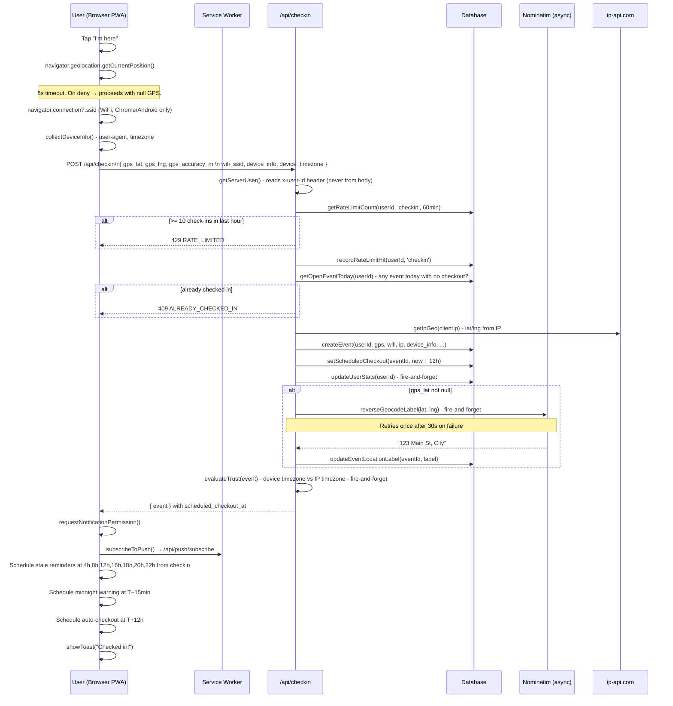
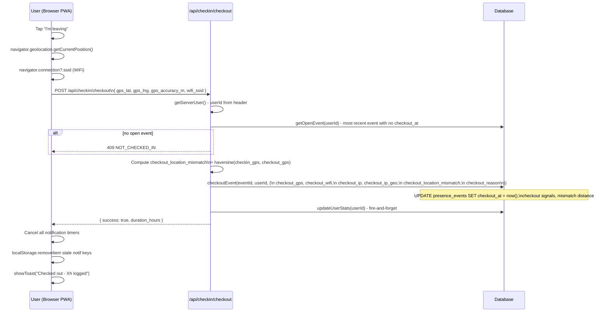
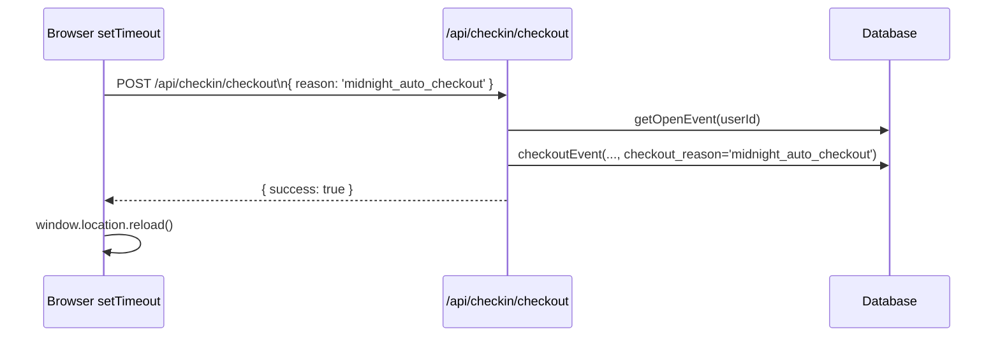
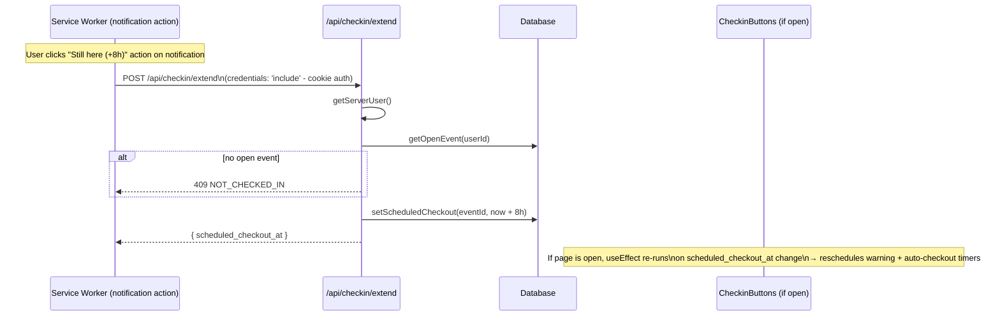
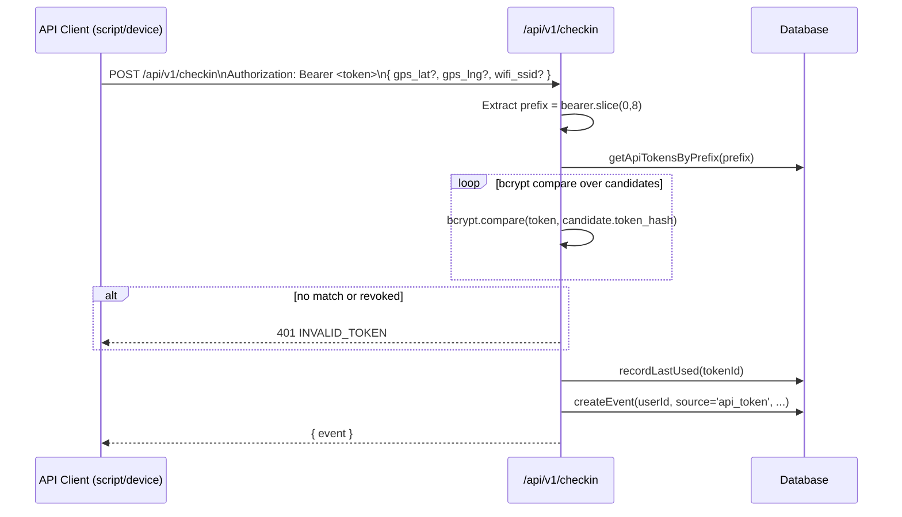

# Check-in & Checkout Flows

---

## 1. Check-in - Full Sequence



---

## 2. Checkout - Full Sequence



---

## 3. Notification Timer Scheduling (Client-Side)

```mermaid
gantt
  title Client-side timer schedule from T=0 (check-in)
  dateFormat HH:mm
  axisFormat %Hh

  section Stale Reminders
  4h reminder     :milestone, 04:00, 0m
  8h reminder     :milestone, 08:00, 0m
  12h reminder    :milestone, 12:00, 0m
  16h reminder    :milestone, 16:00, 0m
  18h reminder    :milestone, 18:00, 0m
  20h reminder    :milestone, 20:00, 0m
  22h reminder    :milestone, 22:00, 0m

  section Auto-checkout
  15-min warning  :milestone, 11:45, 0m
  Auto-checkout   :milestone, 12:00, 0m
```



These timers are scheduled in a `useEffect` on `activeEvent` - they are re-scheduled on page reload using the persisted `checkin_at` and `scheduled_checkout_at` from the server. Timer IDs stored in a `useRef<number[]>` and cancelled on checkout.

---

## 4. Auto-Checkout (Client-Triggered)



`checkout_reason` is stored in `presence_events` - admins can see it was an automatic checkout, not a manual one.

---

## 5. Extend Auto-Checkout (+8 Hours)



---

## 6. V1 API Check-in (Programmatic)

For devices/scripts that can't use the browser PWA:



---

## 7. What Gets Stored Per Check-in

```
presence_events row:
  id                       UUID
  user_id                  FK → users
  event_type               'checkin' | 'wfh' | 'leave'
  checkin_at               UTC timestamp
  checkout_at              UTC timestamp (null until checkout)
  scheduled_checkout_at    UTC timestamp (T+12h from checkin)
  checkout_reason          null | 'midnight_auto_checkout' | 'maximum_hours_exceeded'
  
  # Check-in signals
  gps_lat, gps_lng         float | null
  gps_accuracy_m           int | null
  wifi_ssid                string | null (raw SSID - user's own data)
  ip_address               string | null
  ip_geo_lat, ip_geo_lng   float | null
  
  # Checkout signals (collected again at checkout)
  checkout_gps_lat/lng     float | null
  checkout_gps_accuracy_m  int | null
  checkout_wifi_ssid       string | null
  checkout_ip_*            float | null
  checkout_location_mismatch  metres (float) | null
  
  # Metadata
  location_label           "123 Main St" (async, may be null)
  device_info              JSON string
  device_timezone          IANA timezone string
  note                     string (only field editable after insert)
  source                   'user_app' | 'api_token'
  api_token_id             FK | null
```
