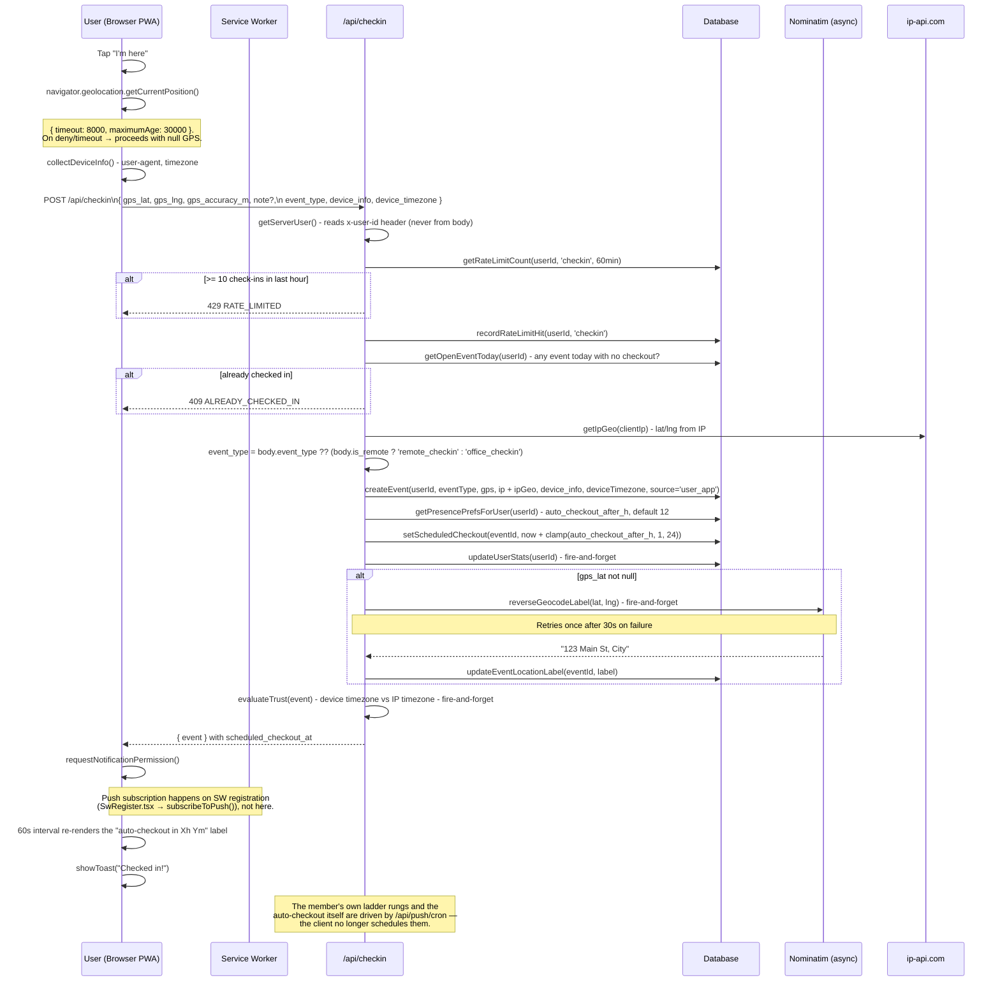
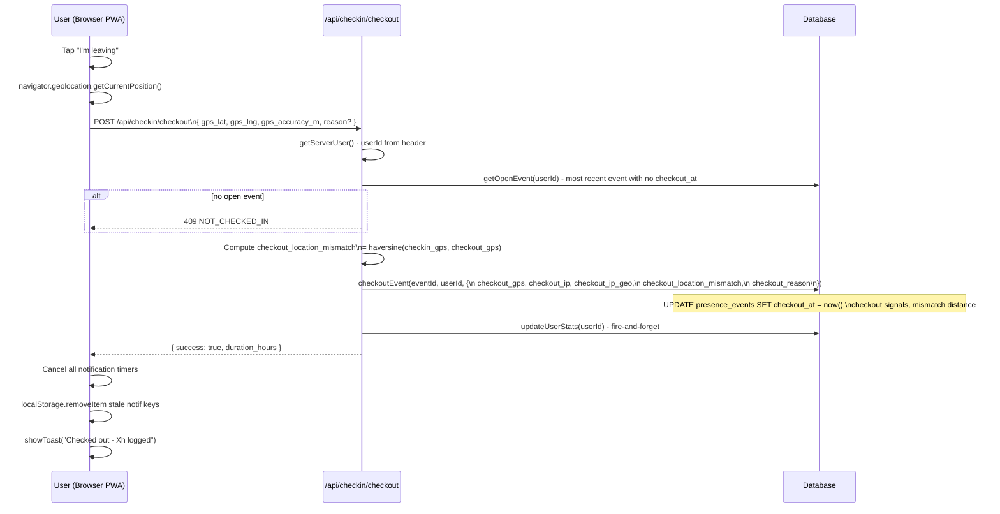
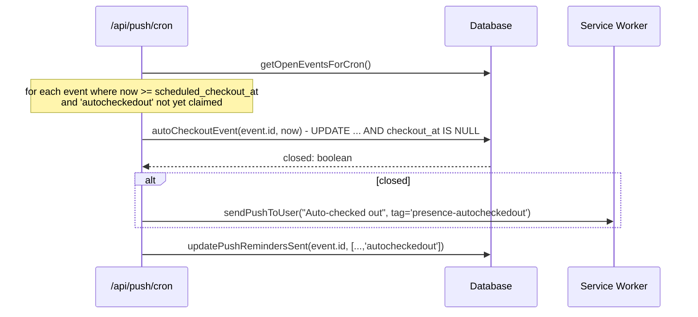
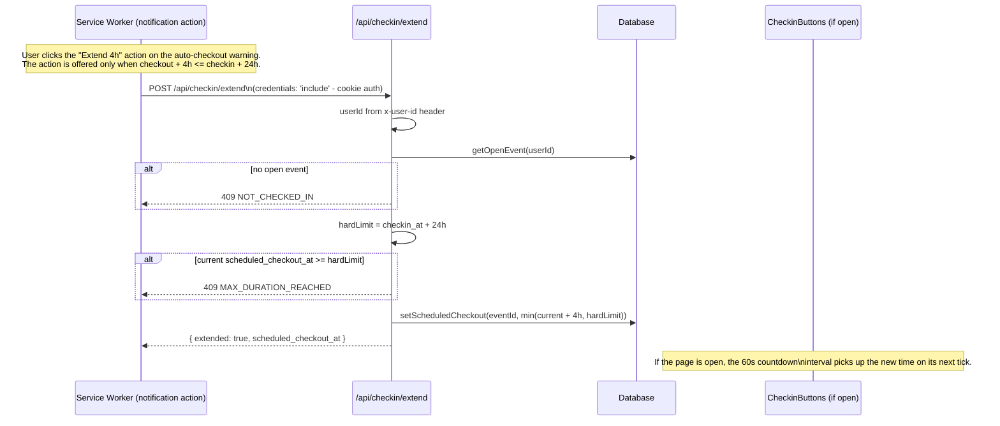
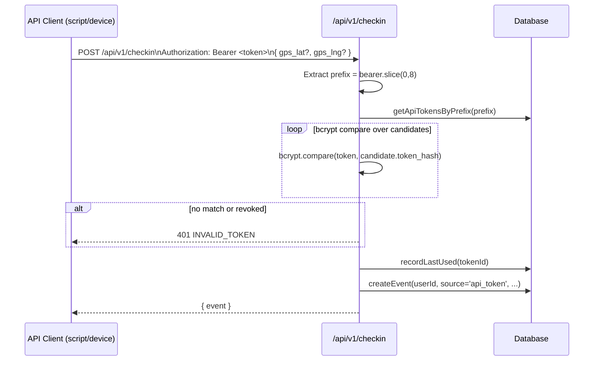

# Check-in & Checkout Flows

> Last updated: 2026-09-12
>
> **WiFi is gone.** No SSID is collected on check-in or checkout, and no signal
> config can be WiFi any more. The `wifi_ssid` / `checkout_wifi_ssid` columns
> remain in `presence_events` but are never written.

---

## 1. Check-in - Full Sequence


```mermaid
sequenceDiagram
  participant U as User (Browser PWA)
  participant SW as Service Worker
  participant API as /api/checkin
  participant DB as Database
  participant Nom as Nominatim (async)
  participant IPAPI as ip-api.com

  U->>U: Tap "I'm here"
  U->>U: navigator.geolocation.getCurrentPosition()
  Note over U: { timeout: 8000, maximumAge: 30000 }.<br/>On deny/timeout → proceeds with null GPS.
  U->>U: collectDeviceInfo() - user-agent, timezone

  U->>API: POST /api/checkin\n{ gps_lat, gps_lng, gps_accuracy_m, note?,\n  event_type, device_info, device_timezone }

  API->>API: getServerUser() - reads x-user-id header (never from body)
  API->>DB: getRateLimitCount(userId, 'checkin', 60min)
  alt >= 10 check-ins in last hour
    API-->>U: 429 RATE_LIMITED
  end
  API->>DB: recordRateLimitHit(userId, 'checkin')
  API->>DB: getOpenEventToday(userId) - any event today with no checkout?
  alt already checked in
    API-->>U: 409 ALREADY_CHECKED_IN
  end

  API->>IPAPI: getIpGeo(clientIp) - lat/lng from IP
  API->>API: event_type = body.event_type ?? (body.is_remote ? 'remote_checkin' : 'office_checkin')
  API->>DB: createEvent(userId, eventType, gps, ip + ipGeo, device_info, deviceTimezone, source='user_app')

  API->>DB: getPresencePrefsForUser(userId) - auto_checkout_after_h, default 12
  API->>DB: setScheduledCheckout(eventId, now + clamp(auto_checkout_after_h, 1, 24))
  API->>DB: updateUserStats(userId) - fire-and-forget

  alt gps_lat not null
    API->>Nom: reverseGeocodeLabel(lat, lng) - fire-and-forget
    Note over API, Nom: Retries once after 30s on failure
    Nom-->>API: "123 Main St, City"
    API->>DB: updateEventLocationLabel(eventId, label)
  end

  API->>API: evaluateTrust(event) - device timezone vs IP timezone - fire-and-forget

  API-->>U: { event } with scheduled_checkout_at

  U->>U: requestNotificationPermission()
  Note over U,SW: Push subscription happens on SW registration<br/>(SwRegister.tsx → subscribeToPush()), not here.
  U->>U: 60s interval re-renders the "auto-checkout in Xh Ym" label
  U->>U: showToast("Checked in!")
  Note over API: The member's own ladder rungs and the<br/>auto-checkout itself are driven by /api/push/cron —<br/>the client no longer schedules them.
```

---

## 2. Checkout - Full Sequence


```mermaid
sequenceDiagram
  participant U as User (Browser PWA)
  participant API as /api/checkin/checkout
  participant DB as Database

  U->>U: Tap "I'm leaving"
  U->>U: navigator.geolocation.getCurrentPosition()

  U->>API: POST /api/checkin/checkout\n{ gps_lat, gps_lng, gps_accuracy_m, reason? }

  API->>API: getServerUser() - userId from header

  API->>DB: getOpenEvent(userId) - most recent event with no checkout_at
  alt no open event
    API-->>U: 409 NOT_CHECKED_IN
  end

  API->>API: Compute checkout_location_mismatch\n= haversine(checkin_gps, checkout_gps)

  API->>DB: checkoutEvent(eventId, userId, {\n  checkout_gps, checkout_ip, checkout_ip_geo,\n  checkout_location_mismatch,\n  checkout_reason\n})
  Note over DB: UPDATE presence_events SET checkout_at = now(),\ncheckout signals, mismatch distance

  API->>DB: updateUserStats(userId) - fire-and-forget
  API-->>U: { success: true, duration_hours }

  U->>U: Cancel all notification timers
  U->>U: localStorage.removeItem stale notif keys
  U->>U: showToast("Checked out - Xh logged")
```

---

## 3. The schedule from T=0 — the member's, not a constant

`scheduled_checkout_at` is **member-set**. `POST /api/checkin` reads
`auto_checkout_after_h` from that member's `member_presence_prefs` row and
schedules the close that many hours out; the rungs in between come from the same
row and are expanded by the cron, not stored on the event.


```mermaid
gantt
  title Server-driven schedule from T=0 (check-in), evaluated by /api/push/cron
  dateFormat HH:mm
  axisFormat %Hh

  section A member who has configured nothing
  no pushes at all            :milestone, 00:00, 0m
  auto-checkout (default 12h) :milestone, 12:00, 0m

  section An example configured ladder
  half_day_after_h = 5    :milestone, 05:00, 0m
  full_day_after_h = 9    :milestone, 09:00, 0m
  repeat_every_h = 1      :milestone, 10:00, 0m
  repeat                  :milestone, 11:00, 0m
  auto_checkout_after_h = 12 :milestone, 12:00, 0m
```

**A member who has never opened the settings screen is silent and still closed on
time.** The three rung columns are nullable and default to NULL, so
`resolveLadder()` returns an empty list; `auto_checkout_after_h` is
`NOT NULL DEFAULT 12`, which is exactly what this route hardcoded before the
table existed, so the deploy changed nobody's close time — only their ability to
change it themselves.

That asymmetry is the design. The rungs are NUDGES and a member may switch them
all off; **auto-checkout is a MECHANIC.** An open `presence_events` row is what
the day's attendance is computed from, and invariant 4 means it can never be
repaired by editing it, so a session that never closes leaves that day wrong for
the member and for every workspace they belong to until somebody fixes it by
hand. The column refuses to express an off value.

Three guards around that hour, in the order they apply:

| Guard | Where | Why |
|---|---|---|
| Validation of the whole ladder object | `/api/me/presence-prefs` | The rungs constrain each other — a repeat is meaningless without a full-day mark, and no rung may sit at or past auto-checkout — so the write takes the complete object, never a patch |
| `clamp(h, MIN_AUTO_CHECKOUT_H, MAX_AUTO_CHECKOUT_H)` = `[1, 24]` | `POST /api/checkin` | The route is not the only thing that could ever write the column — a migration, a support fix, an importer all reach it directly. A stored `0` closes the session the instant it opens; a stored `10000` leaves it open past `CRON_MAX_EVENT_AGE_H`, which means never closed at all |
| A failed preference read falls back to the default | `POST /api/checkin` | Recording presence is the product. A member standing in the office must not be unable to say so because of a preferences table they may have no row in |

`MAX_AUTO_CHECKOUT_H = 24` is the **same** ceiling `POST /api/checkin/extend`
enforces when it clamps an extension to `checkin_at + 24h`. It lives in the pure
`src/lib/presence-ladder.ts` so the check-in route, the extend route and the
`/me/settings` form read one definition — before that it was three literals in
three files, which is the arrangement where one gets raised and the other two
silently disagree.

These are evaluated by the cron every 30 minutes, not by browser timers, so they
fire with the app closed. Dedupe is the `presence_events.push_reminders_sent`
JSON array, read through `normaliseLadderKey()` so a session opened under the old
`'5h'` / `'10h'` names is not re-nudged under the new ones. A rung more than
`LADDER_WINDOW_H` (1.5h) past its hour is **claimed without being sent** — see
[`notification-flow.md`](./notification-flow.md#5-the-session-ladder-cron-pass-1).

The **wall-clock** "time to check in / check out" reminders are a completely
separate mechanism, configured per member per workspace — see
[`reminders.md`](./reminders.md).

---

## 4. Auto-Checkout (Cron-Triggered)


```mermaid
sequenceDiagram
  participant C as /api/push/cron
  participant DB as Database
  participant SW as Service Worker

  C->>DB: getOpenEventsForCron()
  Note over C: for each event where now >= scheduled_checkout_at<br/>and 'autocheckedout' not yet claimed
  C->>DB: autoCheckoutEvent(event.id, now) - UPDATE ... AND checkout_at IS NULL
  DB-->>C: closed: boolean
  alt closed
    C->>SW: sendPushToUser("Auto-checked out", tag='presence-autocheckedout')
  end
  C->>DB: updatePushRemindersSent(event.id, [...,'autocheckedout'])
```

**The mechanic runs first and unconditionally**, and obeys no notification
preference: a session must close whether or not anybody is told. It is not one of
the member's configurable rungs and it is not subject to the ladder's staleness
ceiling — unlike a nudge, what it reports is still true whenever it arrives.

**The push is conditional on the write having done something.** The UPDATE
carries `AND checkout_at IS NULL` and `autoCheckoutEvent()` returns whether it
changed a row, because announcing "we closed your session" to somebody who closed
it themselves seconds earlier is announcing a thing that did not happen. The
dedupe key is claimed either way — the event is resolved, and leaving it
unclaimed would re-run this branch on every future tick.

A user can also check out from a notification action, which posts
`{ reason: 'push_action_checkout' }`. `checkout_reason` is stored on the event,
so admins can tell an automatic checkout from a manual one.

---

## 5. Extend Auto-Checkout


```mermaid
sequenceDiagram
  participant SW as Service Worker (notification action)
  participant API as /api/checkin/extend
  participant DB as Database
  participant Client as CheckinButtons (if open)

  Note over SW: User clicks the "Extend 4h" action on the auto-checkout warning.<br/>The action is offered only when checkout + 4h <= checkin + 24h.
  SW->>API: POST /api/checkin/extend\n(credentials: 'include' - cookie auth)
  API->>API: userId from x-user-id header
  API->>DB: getOpenEvent(userId)
  alt no open event
    API-->>SW: 409 NOT_CHECKED_IN
  end
  API->>API: hardLimit = checkin_at + 24h
  alt current scheduled_checkout_at >= hardLimit
    API-->>SW: 409 MAX_DURATION_REACHED
  end
  API->>DB: setScheduledCheckout(eventId, min(current + 4h, hardLimit))
  API-->>SW: { extended: true, scheduled_checkout_at }

  Note over Client: If the page is open, the 60s countdown\ninterval picks up the new time on its next tick.
```

**+4 hours, not +8**, and never past **24 hours from check-in** — the hard limit
is enforced server-side in `/api/checkin/extend`, and the cron only offers the
`Extend 4h` notification action when the extension would still fit inside it.

---

## 6. V1 API Check-in (Programmatic)

For devices/scripts that can't use the browser PWA:


```mermaid
sequenceDiagram
  participant C as API Client (script/device)
  participant API as /api/v1/checkin
  participant DB as Database

  C->>API: POST /api/v1/checkin\nAuthorization: Bearer <token>\n{ gps_lat?, gps_lng? }

  API->>API: Extract prefix = bearer.slice(0,8)
  API->>DB: getApiTokensByPrefix(prefix)
  loop bcrypt compare over candidates
    API->>API: bcrypt.compare(token, candidate.token_hash)
  end
  alt no match or revoked
    API-->>C: 401 INVALID_TOKEN
  end
  API->>DB: recordLastUsed(tokenId)
  API->>DB: createEvent(userId, source='api_token', ...)
  API-->>C: { event }
```

---

## 7. What Gets Stored Per Check-in

```
presence_events row (columns verified against sqlite3 .schema):
  id                       TEXT PK
  user_id                  FK → users
  event_type               'office_checkin' | 'remote_checkin'
  checkin_at               TEXT, SQLite datetime ('YYYY-MM-DD HH:MM:SS')
  checkout_at              TEXT, null until checkout
  scheduled_checkout_at    TEXT, T + the member's auto_checkout_after_h
                                 (default 12h, clamped to [1,24]; extendable)
  checkout_reason          null | 'push_action_checkout' | 'midnight_auto_checkout' | ...

  # Check-in signals
  gps_lat, gps_lng         REAL | null
  gps_accuracy_m           INTEGER | null
  ip_address               TEXT, NOT NULL
  ip_geo_lat, ip_geo_lng   REAL | null

  # Checkout signals (collected again at checkout)
  checkout_gps_lat/lng          REAL | null
  checkout_gps_accuracy_m       INTEGER | null
  checkout_ip_address           TEXT | null
  checkout_ip_geo_lat/lng       REAL | null
  checkout_location_mismatch    INTEGER (metres) | null

  # Metadata
  location_label           "123 Main St" - async via Nominatim, may be null
  checkout_location_label  same, for the checkout position
  device_info              JSON string
  device_timezone          IANA timezone string
  trust_flags              JSON, written by evaluateTrust()
  push_reminders_sent      JSON array - cron dedupe keys
  note                     the only field a user may edit after insert
  source                   'user_app' | 'api_token'
  api_token_id             FK → user_api_tokens | null
  deleted_at               soft delete

  # LEGACY - present in the schema, never written any more
  wifi_ssid, checkout_wifi_ssid
```

**No `workspace_id`.** Verification is computed per workspace at query time; a
multi-workspace user has one event stream, evaluated separately by each
workspace's signal config.
