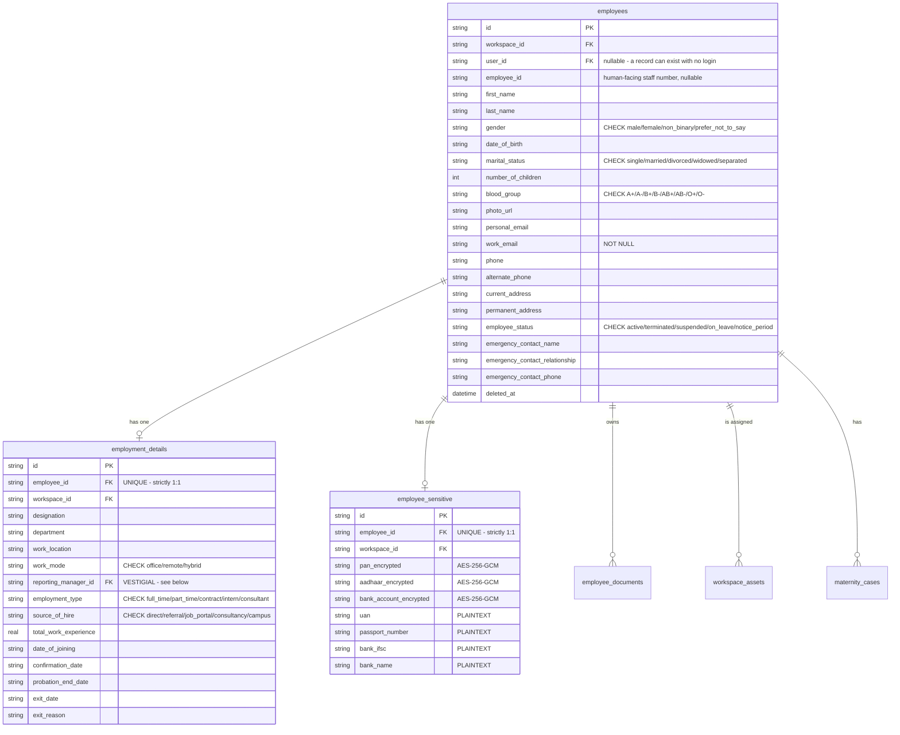
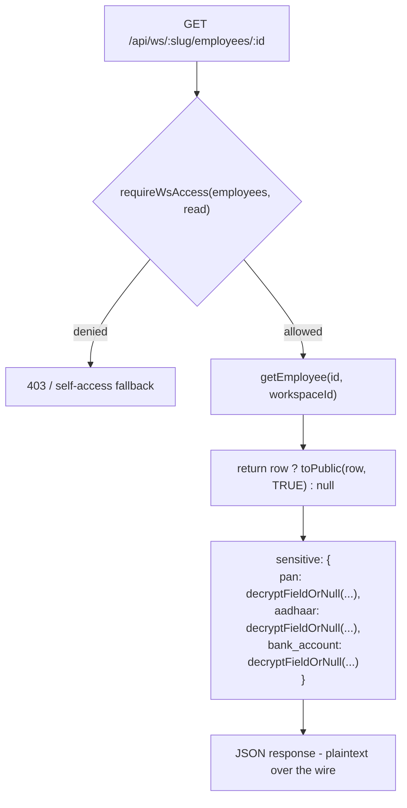

# Employee Records

> Last updated: 2026-08-31
>
> Source of truth: `src/lib/db/queries/employees.ts`, `src/lib/encryption.ts`,
> `src/lib/types/employees.ts`, and the routes under
> `/api/ws/[slug]/employees*`, `/api/me/ws/[slug]/employee`.

The HR record behind a person in the directory at **`/ws/:slug/people`**.
(There is no longer a separate `/ws/:slug/employees` screen — it merged into
People. See CLAUDE.md, "People — one tab, not two".)

Still distinct from **membership** (`workspace_members`, `Resource.Members`): an
employee record can exist with no linked login at all, because `employees.user_id`
is nullable and the add-employee flow creates the record *before* the invitation
goes out. For the length of an open invitation the record is found by work email,
and `claimEmployeeForUser()` attaches the account the moment one appears.

### `reporting_manager_id` is vestigial

`employment_details.reporting_manager_id` still exists and the write path still
accepts it, but **nothing reads it as the reporting line.** That moved to
`workspace_members.manager_user_id`, because a hierarchy keyed on employee
records would only contain the people HR has filled in — one row out of 34 in the
live workspace. Do not start reading it again.

---

## 1. The three-table split



Why three tables rather than one wide row:

- **`employees`** is what every list query reads. Keeping the identity columns
  narrow keeps the directory scan cheap.
- **`employment_details`** carries the columns the org filters and groups on —
  it holds seven of the module's indexes (`department`, `date_of_joining`,
  `work_location`, `reporting_manager_id`, `employment_type`, `exit_date`).
- **`employee_sensitive`** isolates the statutory identifiers so they are not
  dragged through every join and so `SELECT *` on the directory never touches
  them.

Both child tables use `employee_id ... UNIQUE REFERENCES employees(id) ON
DELETE CASCADE`, so the relationship is strictly 1:1.

### Uniqueness and soft deletes

```sql
idx_employees_ws_work_email  UNIQUE (workspace_id, work_email)  WHERE deleted_at IS NULL
idx_employees_ws_emp_id      UNIQUE (workspace_id, employee_id) WHERE deleted_at IS NULL
                                    -- and employee_id IS NOT NULL
```

`employees.deleted_at` is a soft delete (`archiveEmployee` / `restoreEmployee`
/ `softDeleteEmployee`). The partial indexes mean an archived record frees its
work email and staff number for reuse.

### Assembly

`toPublic(row, includeSensitive)` folds the joined row into one
`EmployeePublic` with nested `employment` and `sensitive` objects and a derived
`age`. Reads go through two shared SQL fragments so every query returns the same
shape:

```
EMPLOYMENT_JOIN  = LEFT JOIN employment_details ed ... LEFT JOIN employee_sensitive es ...
EMPLOYMENT_COLS  = ed.* (13 cols) + es.pan_encrypted, es.aadhaar_encrypted, es.uan,
                   es.passport_number, es.bank_account_encrypted, es.bank_ifsc, es.bank_name
```

Writes are driven by three `FieldMap` tables (`EMPLOYEE_FIELDS`,
`EMPLOYMENT_FIELDS`, `SENSITIVE_FIELDS`) so `createEmployee` and
`updateEmployee` cannot disagree about which column a request field lands in.
`createEmployee` inserts all three rows inside one `db.transaction`.

---

## 2. Field-level encryption

`src/lib/encryption.ts` — AES-256-GCM, one field at a time.

```
storage format:  "<iv_base64>:<authTag_base64>:<ciphertext_base64>"
algorithm:       aes-256-gcm
iv:              12 random bytes, fresh per encryption
key:             FIELD_ENCRYPTION_KEY — 64-char hex string (32 bytes)
```

`resolveKey()` throws if the env var is missing or not exactly 64 characters,
so a misconfigured deployment fails loudly on the first encrypt/decrypt rather
than silently storing plaintext. Generate one with:

```bash
node -e "console.log(require('crypto').randomBytes(32).toString('hex'))"
```

`encryptFieldOrNull` / `decryptFieldOrNull` treat `null`, `undefined` and `''`
as `null`. GCM's auth tag means a tampered ciphertext throws on decrypt rather
than returning garbage.

### Exactly three fields are encrypted

| Field | Column | At rest |
|-------|--------|---------|
| PAN | `pan_encrypted` | **AES-256-GCM** |
| Aadhaar | `aadhaar_encrypted` | **AES-256-GCM** |
| Bank account number | `bank_account_encrypted` | **AES-256-GCM** |
| UAN | `uan` | **plaintext** |
| Passport number | `passport_number` | **plaintext** |
| Bank IFSC | `bank_ifsc` | **plaintext** |
| Bank name | `bank_name` | **plaintext** |

All seven live in the same `employee_sensitive` table. The `_encrypted` suffix
on a column name is the only signal that a value is protected — there is no
enforcement making a new "sensitive" column encrypted, so anything added to
`SENSITIVE_FIELDS` without a transform lands in the clear next to the three
that do not.

Audit logs must never include decrypted values.

---

## 3. Known design gap — `employees:read` decrypts

**Any holder of `employees:read` gets fully decrypted PAN, Aadhaar and bank
account numbers. There is no separate sensitive-data permission.**

The gap is structural, not a bug in one route:



`getEmployee`, `findEmployeeByEmployeeId`, `findEmployeeByWorkEmail` and
`findEmployeeByUserId` **all hard-code `toPublic(row, true)`**. The
`includeSensitive` parameter exists and defaults to `false`, but no read path in
the codebase passes `false`. So the encryption protects against a stolen
database file or a leaked backup — it does not narrow who inside the workspace
can see the values.

Consequences worth stating explicitly:

- A custom role granted only `employees:read` (say, a receptionist role built to
  look up desk phone numbers) can read every employee's Aadhaar.
- `Resource.Documents` is a separate catalogue row, so document *files* can be
  withheld from a role that can nonetheless read the identifiers inside them.
- The `/me` self-access fallback in `employees/[id]/route.ts` returns the caller
  their **own** record with sensitive fields decrypted, which is intended — but
  it flows through the same `toPublic(row, true)`, so tightening the admin path
  must not break it.

The shape of the fix, when it is taken: either add a `Resource` row (e.g.
`employees.sensitive` with `read`) and thread `can(...)` into a
`getEmployee(id, ws, { includeSensitive })` argument, or keep one resource and
gate on `employees:write`. Until then, treat `employees:read` as equivalent to
"may see statutory identifiers" when designing a custom role.

---

## 4. Routes

| Endpoint | Gate | Notes |
|----------|------|-------|
| `GET /api/ws/[slug]/employees` | `employees:read` | directory list |
| `POST /api/ws/[slug]/employees` | `employees:write` | creates all three rows in one transaction |
| `GET /api/ws/[slug]/employees/[id]` | `employees:read`, **else** `requireWsMember` self-access | the fallback returns `404`, not `403`, so it cannot be used to probe which ids exist |
| `PATCH /api/ws/[slug]/employees/[id]` | `employees:write` | partial; validated by `_validate.ts` (`validateEmployeeFields`) |
| `DELETE /api/ws/[slug]/employees/[id]` | `employees:delete` | archive (soft) |
| `POST /api/ws/[slug]/employees/[id]/restore` | — | un-archive |
| `GET /api/ws/[slug]/members/[memberId]/employee` | — | employee record for a membership row |
| `GET /api/me/ws/[slug]/employee` | `requireWsMember` | the caller's own record, resolved from the session user id |

Directory listing, filtering and aggregate queries live in a separate file,
`src/lib/db/queries/employees-list.ts`, alongside `getDepartmentBreakdown()` and
`getUpcomingCelebrations()` (birthdays / work anniversaries) in `employees.ts`.

---

## 5. Data residency

Turso is hosted in `aws-ap-south-1`, so employee records — including the
encrypted PAN, Aadhaar and bank-account values and the document blobs described
in [`assets-and-documents.md`](./assets-and-documents.md) — sit in India. That
matters here specifically because PAN and Aadhaar are **Indian statutory
identifiers**; keeping them in-region is a deliberate constraint on where the
data may be moved, not an incidental deployment detail.
