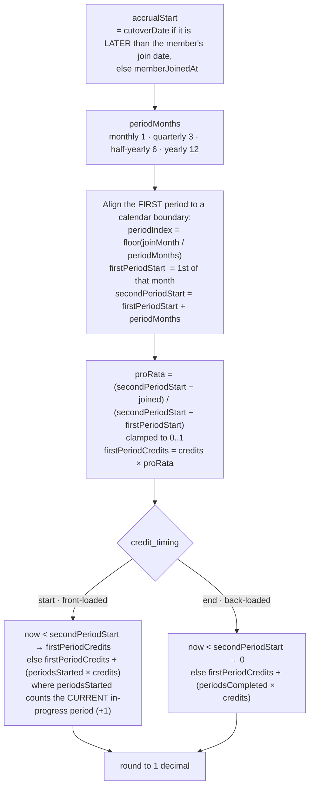
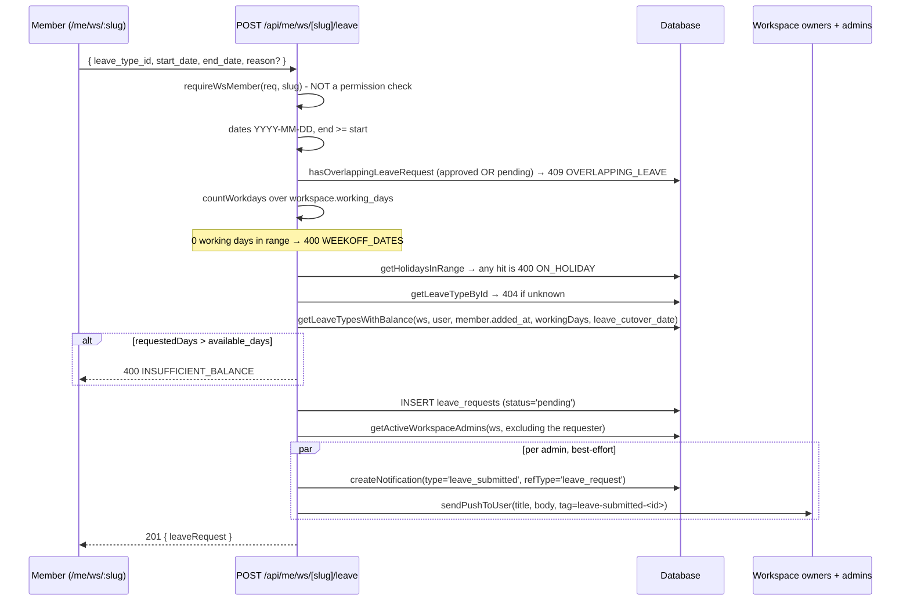
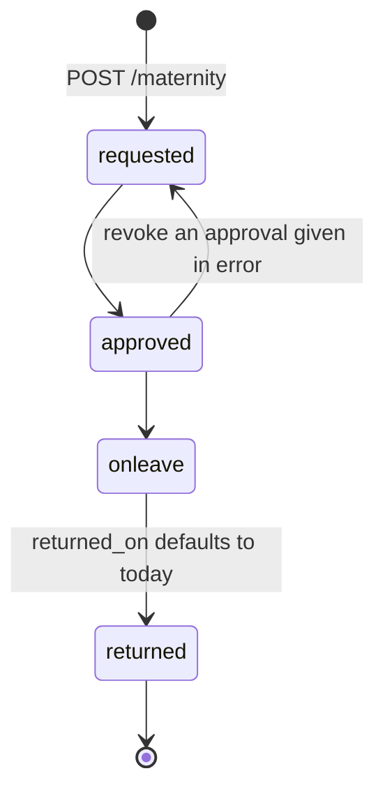

# Leave, Holidays & Maternity

> Last updated: 2026-09-01
>
> Source of truth: `src/lib/db/queries/leaves.ts`, `holidays.ts`, `maternity.ts`,
> `src/lib/approvals.ts`, and the routes under `/api/ws/[slug]/leave*`,
> `/api/ws/[slug]/holidays*`, `/api/ws/[slug]/maternity*`,
> `/api/me/ws/[slug]/leave*`.

Three related but deliberately separate systems:

| System | Table(s) | Shape |
|--------|----------|-------|
| Leave | `workspace_leave_types`, `leave_requests`, `leave_opening_balances` | immutable request rows booked against a **computed** balance |
| Holidays | `workspace_holidays` | a per-workspace calendar; blocks leave and reminders |
| Maternity | `maternity_cases` | a **mutable case** an admin walks through a lifecycle |

All three are gated on `Resource.Leaves` / `Resource.Holidays` via
`requireWsAccess` — maternity deliberately reuses `Resource.Leaves` rather than
adding a catalogue row.

---

## 1. Leave types

```sql
workspace_leave_types (
  id, workspace_id, name,
  accrual_frequency TEXT NOT NULL DEFAULT 'monthly',
  accrual_credits   INTEGER NOT NULL DEFAULT 1,
  credit_timing     TEXT NOT NULL DEFAULT 'start',
  created_at, deleted_at
)
-- partial unique index: (workspace_id, name) WHERE deleted_at IS NULL
```

`accrual_frequency` accepts **four** values — `monthly` | `quarterly` |
`half-yearly` | `yearly` (`VALID_FREQUENCIES` in the route; anything else falls
back to `monthly`). `credit_timing` is `start` | `end`; anything but the literal
`'end'` falls back to `'start'`. `accrual_credits` is floored and clamped to
`>= 1`.

Soft-deleted only. Existing requests are unaffected by a delete.

| Endpoint | Permission | Behaviour |
|----------|-----------|-----------|
| `GET /api/ws/[slug]/leave-types` | `leaves:read` | active types |
| `POST /api/ws/[slug]/leave-types` | `leaves:write` | create; `409 DUPLICATE` on a case-insensitive name clash |
| `DELETE /api/ws/[slug]/leave-types/[id]` | `leaves:delete` | soft delete |
| `GET /api/me/ws/[slug]/leave-types` | member | types **with `available_days`** for the caller |

---

## 2. Balance — always computed, never stored

`getLeaveTypesWithBalance(workspaceId, userId, memberJoinedAt, workingDays, cutoverDate)`

```
opening_balance = leave_opening_balances.balance_days  (0 when absent)
total_accrued   = computeTotalAccrued(accrualStart, frequency, credits, timing)
used_days       = Σ countWorkdays(start_date, end_date, –, workingDays)
                  over status='approved' requests of this type
available_days  = max(0, opening_balance + total_accrued − used_days)
```

Three things the older docs got wrong and are worth stating plainly:

1. **`used_days` counts working days, not calendar days.** It calls
   `countWorkdays()` from `attendance-summary.ts` with the workspace's
   `working_days`, so a Fri–Mon leave costs 2 days, not 4.
2. **Opening balances exist** and are added on top of accrual, independently of
   the cutover rule.
3. **Accrual is pro-rata and calendar-aligned**, not a flat "complete periods
   since join date".

### `computeTotalAccrued` — the arithmetic



Calendar alignment means quarterly periods start Jan/Apr/Jul/Oct, half-yearly
Jan/Jul, yearly Jan — a member joining 20 Feb on a quarterly type gets the
Jan–Mar period pro-rated from 20 Feb, then a full credit each quarter.

`now < joined` returns 0.

### Cutover

`workspaces.leave_cutover_date` is the date Venzio takes over leave accounting
from whatever system came before. When it is **later** than the member's join
date it replaces the join date as the accrual start **for all leave types**.
Opening balance is deliberately independent of that rule — it is what the old
system said the person had left.

### Opening balances

`leave_opening_balances` is unique on `(workspace_id, user_id, leave_type_id)`
(`idx_lob_ws_user_type`). `upsertOpeningBalance` does a read-then-update/insert.

| Endpoint | Permission |
|----------|-----------|
| `GET /api/ws/[slug]/leave-balances` | `leaves:read` |
| `POST /api/ws/[slug]/leave-balances/import` | `leaves:write` — multipart `file`, `.csv`/`.xlsx`, ≤ 2 MB, columns `email`, `leave_type`, `opening_balance`; valid rows upserted, bad rows returned in `errors[]` |
| `GET /api/ws/[slug]/members/[memberId]/leave-balances` | `leaves:read` |

---

## 3. Request → approval

Leave requests are **no longer instantly approved**. `createLeaveRequest()`
inserts with `status = 'pending'` and there is a real approval step.



Notification failure is caught and swallowed — it must never block the response.
`getActiveWorkspaceAdmins()` selects `role IN ('owner','admin')`, so a custom
role holding `approvals:write` is **not** notified of a new request today.

### Approve / reject

Two equivalent endpoints exist and behave identically for leave:

- `PATCH /api/ws/[slug]/approvals/[kind]/[id]` with `kind = leave` — gated on
  `approvals:write`
- `PATCH /api/ws/[slug]/leaves/[id]` — gated on `leaves:write`

Both call `actionLeaveRequest()`:

```sql
UPDATE leave_requests
   SET status = ?, actioned_by_user_id = ?, rejection_reason = ?
 WHERE id = ? AND workspace_id = ? AND status = 'pending'
```

The `AND status = 'pending'` **is** the concurrency control: `changes === 0`
means the row is gone (`404 NOT_FOUND`) or someone else already actioned it
(`409 ALREADY_ACTIONED`). Rejection requires a non-empty `rejection_reason`
(`422`).

On success the handler notifies the requester **inline**, in the same request —
an in-app `notifications` row plus a push, wrapped in `Promise.allSettled` so
one failing does not lose the other:

| Action | `notifications.type` |
|--------|----------------------|
| approve | `leave_approved` |
| reject | `leave_rejected` |

`status` therefore reaches `approved` | `rejected`; the column default is still
`'approved'` at the DB level, but no code path uses the default.

**Rows are never modified after being actioned and never deleted** — same
principle as `presence_events`.

### The approvals feed

`getPendingApprovalItems(workspaceId, { limit, leavesEnabled })` in
`src/lib/approvals.ts` is the single source of truth for "pending approvals",
reused by the Overview widget, the Approvals page and the People page so the
three can never disagree. It merges three kinds:

```
kind: 'leave'          ← getPendingLeaveRequests        (skipped when leaves_enabled is off)
kind: 'regularization' ← getPendingRegularizationRequests
kind: 'doc'            ← getPendingDocuments            (employee uploads awaiting verification)
```

Document items take the person's name from the **employee record**, not `users`
— a document can belong to an employee with no linked login yet.

---

## 4. Holidays

```sql
workspace_holidays (id, workspace_id, name, date, description,
                    created_by, created_at, updated_at, deleted_at)
-- partial unique index on (workspace_id, name, date) WHERE deleted_at IS NULL
```

The partial unique index is the race-free duplicate guard; the route's
`findHolidayByNameAndDate` pre-check just produces a friendlier `409 DUPLICATE`.

| Endpoint | Permission | Notes |
|----------|-----------|-------|
| `GET /api/ws/[slug]/holidays?year=YYYY` | `holidays:read` | omit `year` for all |
| `POST` (JSON `{name, date, description?}`) | `holidays:write` | single create; `date` is `YYYY-MM-DD` |
| `POST` (multipart `file`) | `holidays:write` | `.csv`/`.xlsx`, ≤ 2 MB; columns `name`, `date`, `description` (case-insensitive); bad rows skipped into `errors[]` |
| `PATCH /[id]` | `holidays:write` | partial; at least one of name/date/description |
| `DELETE /[id]` | `holidays:delete` | soft delete |
| `GET /api/me/ws/[slug]/holidays?year=YYYY` | member (`requireWsMember`) | read-only, defaults to the current year |

One `POST` route serves both shapes — it branches on `content-type`.

Holidays feed three places: leave submission (`ON_HOLIDAY`), the attendance
summary (a holiday day is `holiday`, not `absent`), and the reminder pass
(gate 3 skips the whole workspace).

---

## 5. Maternity lifecycle

`maternity_cases` is deliberately **not** modelled on `leave_requests`. A
maternity case spans months, its dates shift as the due date moves, and it has a
lifecycle an admin walks it through. Forcing that into an immutable table would
mean deleting and re-creating rows, which those tables forbid.

```sql
maternity_cases (
  id, workspace_id, employee_id,          -- keyed by EMPLOYEE, not user
  due_date, start_date, end_date,
  weeks INTEGER NOT NULL DEFAULT 26,
  status TEXT NOT NULL DEFAULT 'requested'
    CHECK(status IN ('requested','approved','onleave','returned')),
  returned_on, notes, deleted_at, created_at, updated_at
)
```



`ALLOWED_TRANSITIONS` in `queries/maternity.ts` is the machine — it lives in the
query file so the API and any future job runner agree on what a legal move is.
Forward-only, one step at a time, so a case cannot jump `requested → returned`
and leave no record of the leave ever starting. The single backward edge
`approved → requested` exists because an approval given in error must be
revocable before the leave begins. An illegal move returns `409
INVALID_TRANSITION`.

Other rules verified in the route/query layer:

- `weeks` must be an integer in `1..104`.
- `end_date` before `start_date` → `422` with `fields.end_date = 'BEFORE_START'`.
- Entering `returned` with no `returned_on` defaults it to today, because a case
  without a return date looks open in every date-based report.
- Soft-deleted via `deleted_at`; every statement scoped by `workspace_id`.

#### An open case may not lose its dates

`PATCH /maternity/[id]` **rejects clearing `start_date` or `end_date` while the
case is not `returned`** — `422 VALIDATION_ERROR` with
`fields.<field> = 'REQUIRED_WHILE_OPEN'`. Dates may be *moved* while a case is
open (that is the whole reason this is a mutable case and not a leave request);
they may not be nulled. Only `returned` — where the case is history and no gate
looks at it any more — may hold nulls.

This exists because the reminder gate reads **dates, not status**:
`getActiveMaternityUserIds()` matches `start_date <= today <= end_date`. Nulling
`end_date` on an `onleave` case therefore used to drop the person silently out of
the gate while the case still read as open, and the daily check-in reminder
resumed nagging someone who is on maternity leave. The check runs against the
*resulting* status (`input.status ?? existing.status`), so it cannot be dodged by
clearing a date in the same PATCH that moves the case forward.

#### One open case per employee, enforced at the DB

`findOpenCaseForEmployee()` (status `!= 'returned'`) rejects a second concurrent
case with `409 CASE_OPEN`; an employee may have a history of closed ones. That
read is a **courtesy**, not the guarantee — it and the insert are not one atomic
step. The real enforcement is a partial unique index:

```sql
CREATE UNIQUE INDEX idx_maternity_cases_one_open
  ON maternity_cases(workspace_id, employee_id)
  WHERE deleted_at IS NULL AND status IN ('requested','approved','onleave');
```

`createMaternityCase()` recognises that collision and throws
`MaternityCaseOpenError`, which the route turns into **the same** `409 CASE_OPEN`
— so a caller cannot tell whether it lost a race or simply arrived second.
`OPEN_MATERNITY_STATUSES` in `queries/maternity.ts` is derived from
`MATERNITY_STATUSES` minus `returned` and **must stay in step with that index**:
the index enforces the rule, and the constant is what the reads use to agree
with it.

### Why maternity needs its own reminder gate

```ts
getActiveMaternityUserIds(workspaceId, date)  // → Set<user_id>
```

Maternity lives in its own table keyed by `employee_id`, so the
`leave_requests` gate in the reminder pass **cannot see it** — without this
second lookup, someone on maternity leave gets nagged to check in every working
day of it.

It matches **both** `approved` and `onleave`: the lifecycle expects an admin to
flip `approved → onleave` when the leave actually starts, but if they forget,
someone on day one would still be reminded. Dates are the source of truth here;
the status flag is not. Employees with no linked `user_id` are skipped — there
is nobody to push to. See [`reminders.md`](./reminders.md).
