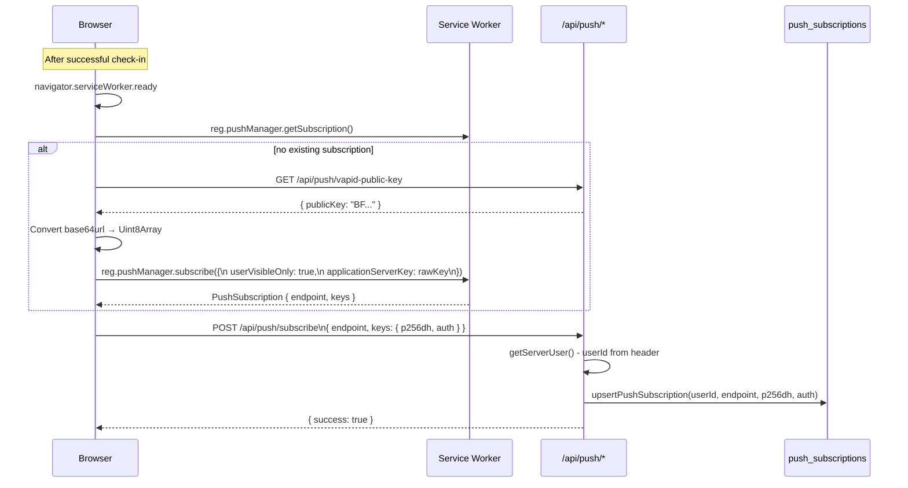
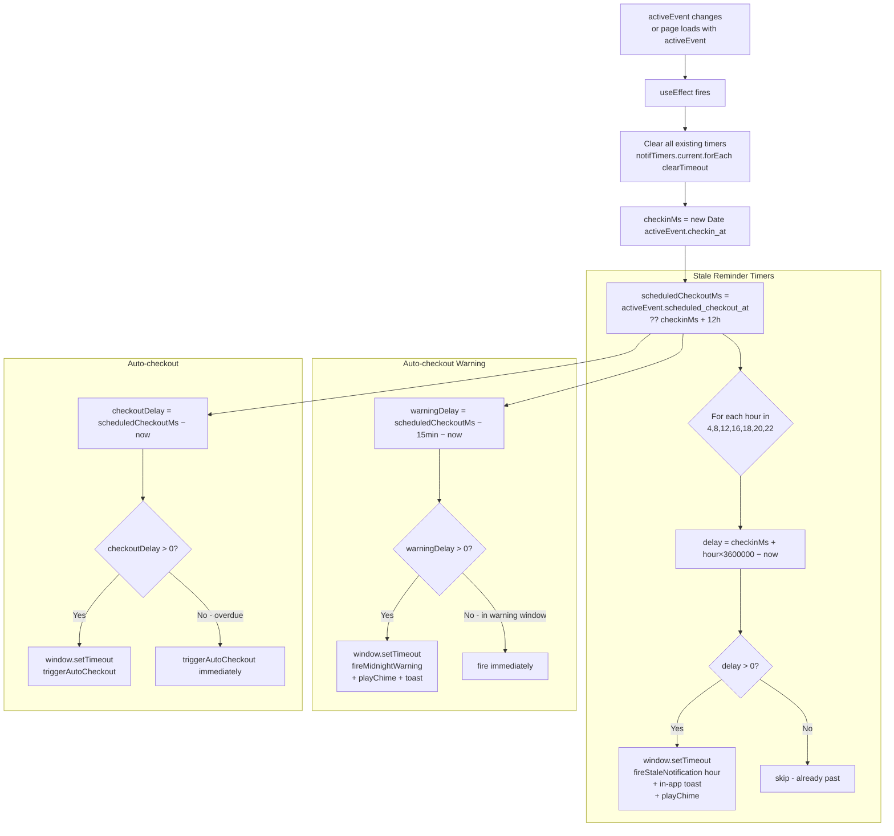
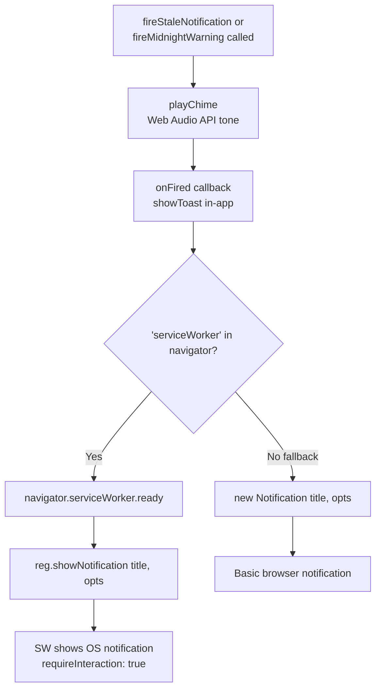
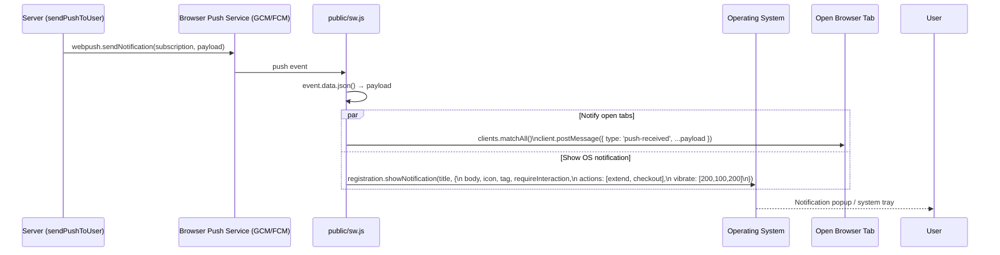
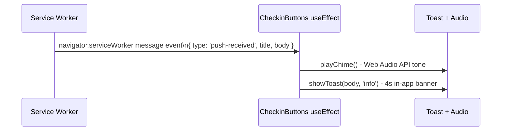
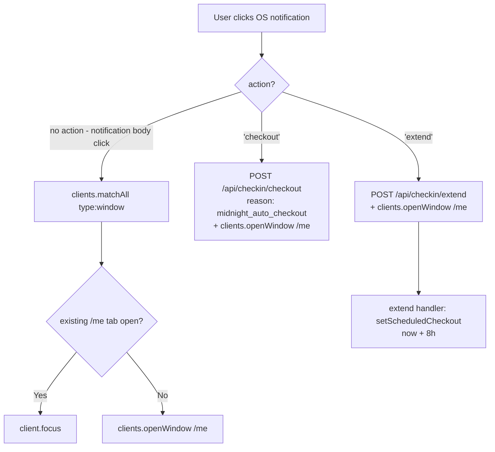

# Notification & Push Flow

---

## 1. Overview

Venzio sends two categories of notifications:

| Category | Trigger | Mechanism |
|----------|---------|-----------|
| Stale reminders | 4h, 8h, 12h, 16h, 18h, 20h, 22h from check-in | Client `setTimeout` + SW `showNotification` |
| Auto-checkout warning | T−15 min before `scheduled_checkout_at` | Client `setTimeout` + SW `showNotification` |
| Auto-checkout | At `scheduled_checkout_at` (T+12h) | Client `setTimeout` → `POST /api/checkin/checkout` |
| Server push (future) | Cron / admin-triggered | `sendPushToUser()` → VAPID → SW |

When the app is **open**: `showNotification()` fires + `playChime()` sounds + in-app toast appears.
When the app is **closed**: SW receives the push event → OS notification popup.

---

## 2. Push Subscription Setup



---

## 3. Client-Side Notification Scheduling



---

## 4. Notification Display - Browser/SW Path



**requireInteraction: true** - notification stays visible until user interacts. Without this, notifications auto-dismiss in a few seconds on some platforms.

**Why notifications might appear only in notification center (not as popups):** Chrome's per-site "quiet notifications" setting. Users can change this at `chrome://settings/content/notifications → [site] → Allow popups`.

---

## 5. Service Worker Push Handler



---

## 6. In-App Notification (When Page is Open)

When the service worker sends a `postMessage` to open tabs, `CheckinButtons` listens:



This means even if the OS notification is silenced, the app always shows a visible + audible alert when it's open.

---

## 7. Notification Click - Service Worker Handler



---

## 8. Sound - Web Audio API Chime

No audio file needed. Generates a pure-tone chime at runtime:

```typescript
function playChime(): void {
  const ctx = new AudioContext()
  const osc = ctx.createOscillator()
  const gain = ctx.createGain()
  osc.connect(gain)
  gain.connect(ctx.destination)
  osc.type = 'sine'
  // Three-tone sequence: 880Hz → 1100Hz → 880Hz
  osc.frequency.setValueAtTime(880, ctx.currentTime)
  osc.frequency.setValueAtTime(1100, ctx.currentTime + 0.15)
  osc.frequency.setValueAtTime(880, ctx.currentTime + 0.3)
  gain.gain.setValueAtTime(0.25, ctx.currentTime)
  gain.gain.exponentialRampToValueAtTime(0.001, ctx.currentTime + 0.7)
  osc.start()
  osc.stop(ctx.currentTime + 0.7)
}
```

Plays regardless of OS notification settings (it's direct audio output, not tied to the notification system).

---

## 9. Notification Deduplication

Each notification type uses a unique `tag`:

| Notification | Tag | requireInteraction |
|-------------|-----|-------------------|
| Stale reminder | `venzio-stale` | `true` |
| Auto-checkout warning | `venzio-midnight-warning` | `true` |
| Check-in confirmation | `venzio-checkin-confirm` | `false` |

Using the same `tag` replaces the previous notification with the same tag - no notification spam. The stale reminder at 4h replaces itself at 8h, 12h, etc.

---

## 10. Push Subscription Cleanup

When a push delivery fails with HTTP 410 (Gone - subscription expired), the endpoint is automatically removed:

```typescript
// In lib/push.ts
.catch(async (err: { statusCode?: number }) => {
  if (err.statusCode === 410) {
    await deletePushSubscription(userId, sub.endpoint)
  }
})
```
