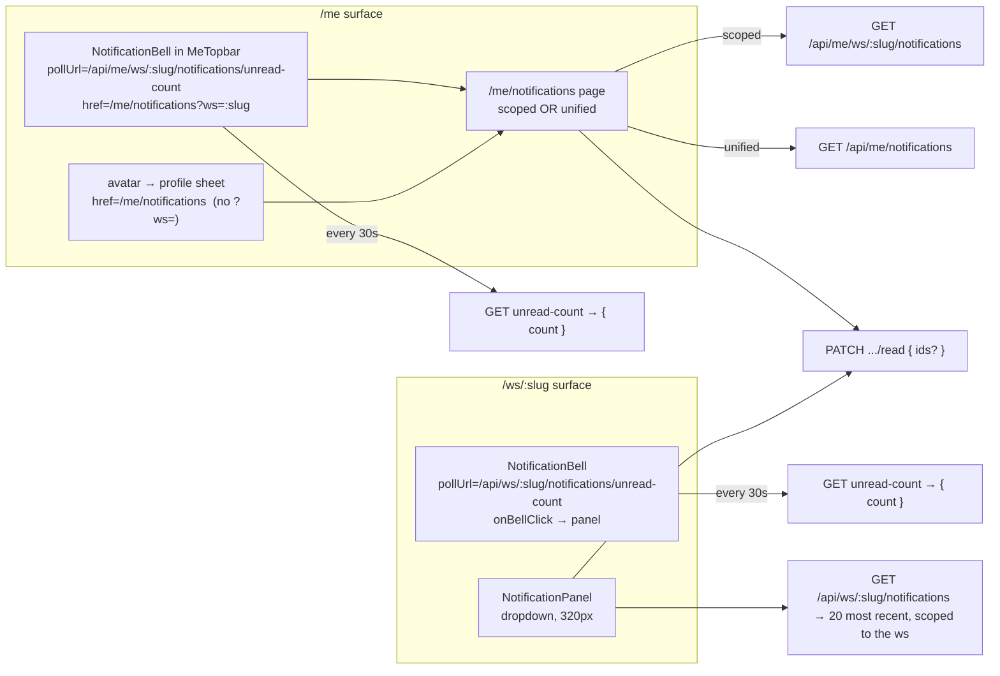
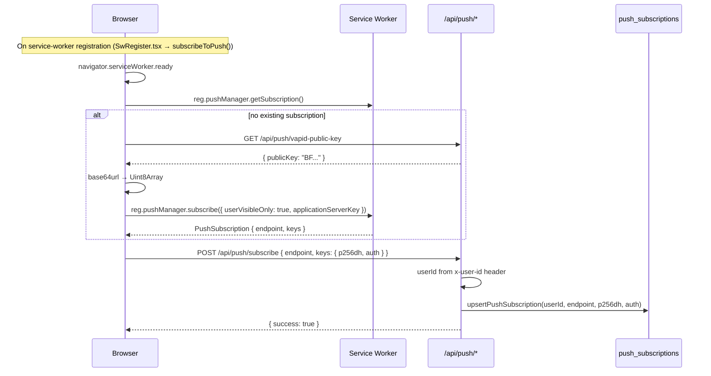
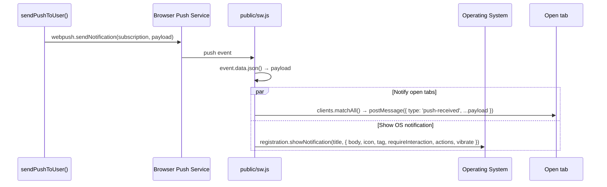
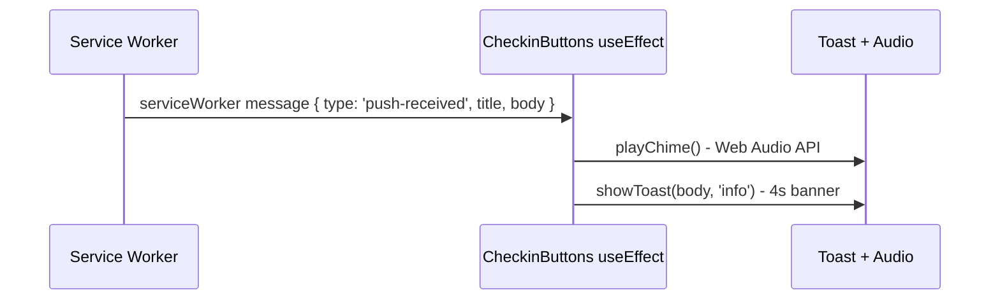
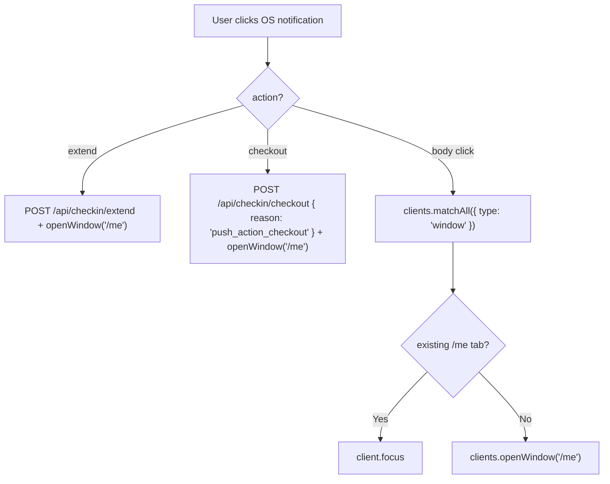

# Notification & Push Flow

> Last updated: 2026-09-01
>
> Source of truth: `src/lib/db/queries/notifications.ts`, `src/lib/push.ts`,
> `src/lib/workspace-color.ts`, `src/components/notifications/*`,
> `src/components/user/MeTopbar.tsx`, `src/app/me/notifications/*`,
> `public/sw.js`, `src/app/api/push/*`, `src/app/api/me/notifications/*`,
> `src/app/api/me/ws/[slug]/notifications/*`,
> `src/app/api/ws/[slug]/notifications/*`.

---

## 1. Overview - four delivery paths

| Category | Trigger | Mechanism | Doc |
|----------|---------|-----------|-----|
| **In-app feed** | any server-side event worth telling someone about | `notifications` table + bell polling | §2 |
| **Approval / submission** | a mutation, sent inline in the handler | `createNotification()` + `sendPushToUser()` | [`reminders.md`](./reminders.md#1-why-approvals-notify-reliably) |
| **Scheduled reminders** | wall-clock time in the workspace timezone | cron → `runReminderPass()` | [`reminders.md`](./reminders.md) |
| **Presence milestones / auto-checkout** | elapsed hours since `checkin_at` | cron pass 1 (server only - the old client timers are gone) | §4, §5 |

The cron endpoint requires `Authorization: Bearer ${CRON_SECRET}` and is
**disabled** (401) if `CRON_SECRET` is unset in the runtime environment. The
bundled workflow (`.github/workflows/push-reminders.yml`) runs `0,30 * * * *`
and is gated on both `CRON_SECRET` and `APP_URL` being configured as repo
secrets.

When the app is **open**: an in-app toast + `playChime()` + the OS notification.
When the app is **closed**: the SW receives the push event → OS notification.

---

## 2. The in-app notification feed

```sql
notifications (
  id, user_id, workspace_id NULLABLE, type, title, body,
  ref_id, ref_type, read_at, created_at
)
-- idx_notifications_user_list   (user_id, created_at DESC)
-- idx_notifications_user_unread (user_id, read_at, created_at DESC)
-- idx_notifications_workspace   (workspace_id, created_at DESC)
```

`workspace_id` is nullable so a purely personal notification is expressible, and
reads `LEFT JOIN workspaces` to attach `workspace_slug` (for linking) and
`workspace_name` (for the badge on the unified `/me` view).

### `NotificationType` — the closed set

```ts
| 'leave_submitted' | 'leave_approved' | 'leave_rejected'
| 'regularization_submitted' | 'regularization_approved' | 'regularization_rejected'
| 'checkin_reminder' | 'checkout_reminder'   // ref_id = 'YYYY-MM-DD', ref_type = 'reminder'
```

Nothing else writes to the table. Milestone and auto-checkout pushes from the
event-anchored cron pass are **push-only** — they leave no feed row.

### Surfaces


```mermaid
flowchart LR
  subgraph ME["/me surface"]
    MB["NotificationBell in MeTopbar\npollUrl=/api/me/ws/:slug/notifications/unread-count\nhref=/me/notifications?ws=:slug"]
    MA["avatar → profile sheet\nhref=/me/notifications  (no ?ws=)"]
    MP["/me/notifications page\nscoped OR unified"]
  end
  subgraph WS["/ws/:slug surface"]
    WB["NotificationBell\npollUrl=/api/ws/:slug/notifications/unread-count\nonBellClick → panel"]
    WP["NotificationPanel\ndropdown, 320px"]
  end

  MB -->|"every 30s"| API1["GET unread-count → { count }"]
  WB -->|"every 30s"| API2["GET unread-count → { count }"]
  MB --> MP
  MA --> MP
  MP -->|"scoped"| API3["GET /api/me/ws/:slug/notifications"]
  MP -->|"unified"| API4["GET /api/me/notifications"]
  WP --> API5["GET /api/ws/:slug/notifications → 20 most recent, scoped to the ws"]
  MP --> API6["PATCH .../read  { ids? }"]
  WP --> API6
```

| Route | Scoping |
|-------|---------|
| `GET /api/me/notifications` | `x-user-id` only — every workspace |
| `GET /api/me/notifications/unread-count` | `x-user-id` only |
| `PATCH /api/me/notifications/read` | `x-user-id`; `ids?` in the body, or mark-all |
| `GET /api/me/ws/[slug]/notifications` | `requireWsMember` — 50 most recent, `AND workspace_id = ?`; returns `{ notifications, unread_count }` |
| `GET /api/me/ws/[slug]/notifications/unread-count` | `requireWsMember`, workspace-scoped |
| `PATCH /api/me/ws/[slug]/notifications/read` | `requireWsMember`, workspace-scoped; `ids?`, or mark-all *within that workspace* |
| `GET /api/ws/[slug]/notifications` | `requireWsMember` — 20 most recent, `AND workspace_id = ?` |
| `GET /api/ws/[slug]/notifications/unread-count` | `requireWsMember`, workspace-scoped |
| `PATCH /api/ws/[slug]/notifications/read` | `requireWsMember`, workspace-scoped |

Every workspace-scoped route uses `requireWsMember`, **not** `requireWsAccess` —
a notification is addressed to a person, not governed by a permission, so every
active member can read their own regardless of role. All three `/me/ws/[slug]/*`
routes answer `403 FORBIDDEN` when membership does not resolve.

### The `/me` split — one bell per workspace, one unified list

The `/me` bell is **workspace-scoped**: it polls the active workspace's
unread-count and its badge matches the workspace the top-bar pill is pointing
at. That is the whole reason the `/api/me/ws/[slug]/notifications` trio exists —
the unscoped `/me` count would have shown another workspace's news under this
workspace's pill. `PATCH .../read` with no `ids` is likewise a mark-all *within
one workspace*, so clearing the bell here cannot silently clear another
workspace's unread badge.

`MeTopbar` picks the pair from the active workspace (the pill's selection, else
the first membership), falling back to the unscoped routes for a user who
belongs to no workspace at all — that is where a pending invitation shows up,
which is exactly the notification such a user needs:

| | Active workspace | No workspace at all |
|---|---|---|
| Bell poll | `/api/me/ws/:slug/notifications/unread-count` | `/api/me/notifications/unread-count` |
| Bell href | `/me/notifications?ws=:slug` | `/me/notifications` |

`/me/notifications` is one page in two modes, decided by `?ws=`:

- **no `?ws=`** → the **unified**, cross-workspace view, reached from the
  **avatar profile sheet**. Backed by `GET /api/me/notifications`.
- **`?ws=<slug>`** → that workspace only, which is where the bell lands. Backed
  by `GET /api/me/ws/[slug]/notifications`.

**The slug is resolved server-side.** `page.tsx` matches `?ws=` against the
caller's own active memberships (`getUserWorkspaces` → `getWorkspacesByIds`,
`archived_at` rejected) and passes the validated slug down as a prop; the client
component never reads the query string. A hand-typed
`?ws=someone-elses-company` falls back to the unified view rather than erroring
— and even if it did not, the route re-checks membership on every request, so
nothing leaks either way. The component is `key`ed on the mode so switching
between the two remounts rather than leaving one workspace's rows on screen
under the other's heading.

#### Workspace badges, and why the colour is not arbitrary

Only the **unified** view badges its rows (`showWorkspace`, default false): the
scoped views already name the workspace in the heading, so a per-row badge there
is repetition on every line.

The badge is tinted with `swatchColor()` from `src/lib/workspace-color.ts` — the
same helper the top-bar workspace pill uses, extracted out of `MeTopbar` for
exactly that reason. Two copies would drift the moment either palette was
touched, and a badge whose colour disagrees with the pill is worse than no badge
at all: it teaches the wrong association. It is seeded on the workspace **`id`**,
never the slug, because a workspace can be renamed and re-slugged but its id is
stable — so its colour is too.

A notification with a NULL `workspace_id` gets a neutral **"Personal"** badge
(muted text, `--surface-2` fill, no tint): tinting it would invent a workspace
that does not exist. `workspace_id` is nullable in the schema so an
account-level event is expressible, but **nothing writes one today** — every
`NotificationType` above is workspace-scoped, so in practice the column is 100%
populated. The client also guards the row's click target on `workspace_slug`,
without which a personal row navigated to the literal `/me/ws/null`.

`markNotificationsRead()` always carries `AND read_at IS NULL`, so re-marking
never rewrites an existing timestamp.

The bell renders `9+` above nine and nothing at zero. Polling is a plain
30-second `setInterval` — there is no websocket or SSE for the feed.

---

## 3. Push Subscription Setup


```mermaid
sequenceDiagram
  participant U as Browser
  participant SW as Service Worker
  participant API as /api/push/*
  participant DB as push_subscriptions

  Note over U: On service-worker registration (SwRegister.tsx → subscribeToPush())

  U->>U: navigator.serviceWorker.ready
  U->>SW: reg.pushManager.getSubscription()
  alt no existing subscription
    U->>API: GET /api/push/vapid-public-key
    API-->>U: { publicKey: "BF..." }
    U->>U: base64url → Uint8Array
    U->>SW: reg.pushManager.subscribe({ userVisibleOnly: true, applicationServerKey })
    SW-->>U: PushSubscription { endpoint, keys }
  end
  U->>API: POST /api/push/subscribe { endpoint, keys: { p256dh, auth } }
  API->>API: userId from x-user-id header
  API->>DB: upsertPushSubscription(userId, endpoint, p256dh, auth)
  API-->>U: { success: true }
```

`push_subscriptions.endpoint` is `UNIQUE`, so one row per device.

### `sendPushToUser(userId, payload)`

```ts
PushPayload = { title, body, tag?, requireInteraction?, actions?, data? }
```

Reads every subscription for the user, sends in parallel under
`Promise.allSettled`, and **deletes any endpoint that returns HTTP 410 (Gone)**.
Throws if `VAPID_PUBLIC_KEY` / `VAPID_PRIVATE_KEY` are unset — callers wrap it in
`allSettled` so a push failure never takes down the request that produced it.

---

## 4. What the client actually schedules

**Almost nothing, any more.** The stale-reminder / auto-checkout `setTimeout`
ladder that older revisions of this document described has been removed from
`CheckinButtons.tsx`. The cron is now the sole authority for milestones, the
auto-checkout warning and the auto-checkout itself, which is what makes them
work with the app closed.

What the client still does:

| Behaviour | Where |
|-----------|-------|
| A 60-second `setInterval` that re-renders the "auto-checkout in Xh Ym" label from `activeEvent.scheduled_checkout_at` | `CheckinButtons.tsx` |
| `navigator.serviceWorker` `message` listener for `{ type: 'push-received' }` → `playChime()` + in-app toast | `CheckinButtons.tsx` |
| `Notification.requestPermission()` when permission is still `default` | `CheckinButtons.tsx` |
| Subscribe to push and `POST /api/push/subscribe` | `src/lib/push-client.ts` |

Consequence worth knowing: with the tab open but push permission denied, the
user gets **no** milestone or auto-checkout warning at all — the in-app toast is
driven by the SW `postMessage`, which only fires when a push actually arrives.

## 5. Server-side presence pushes (cron pass 1)

`POST /api/push/cron` iterates `presence_events WHERE checkout_at IS NULL AND
deleted_at IS NULL` and, per event:

| # | Condition | Push |
|---|-----------|------|
| 1 | `hoursElapsed >= h` for `h ∈ {4,8,12,16,18,20,22}` | "Still working?" · tag `milestone-<h>h` |
| 2 | `scheduled_checkout_at` is 0–60 min away | "Auto-checkout soon" · `requireInteraction` · actions `Extend 4h` (only if `checkout + 4h <= checkin + 24h`) and `Checkout Now` |
| 3 | `now >= scheduled_checkout_at` | `autoCheckoutEvent()` then "Auto-checked out" |

Dedupe is the `presence_events.push_reminders_sent` JSON array — keys `"4h"`,
`"warn_<yyyy-mm-ddThh:mm>"`, `"autocheckedout"` — written back once per event
with `updatePushRemindersSent()`. A per-event `try/catch` keeps one bad row from
aborting the run.

Pass 2, the wall-clock workspace pass, runs after this in its own `try/catch` so
a failure there cannot discard pass 1's work. See [`reminders.md`](./reminders.md).

---

## 6. Service Worker Push Handler


```mermaid
sequenceDiagram
  participant Server as sendPushToUser()
  participant PS as Browser Push Service
  participant SW as public/sw.js
  participant OS as Operating System
  participant Page as Open tab

  Server->>PS: webpush.sendNotification(subscription, payload)
  PS->>SW: push event
  SW->>SW: event.data.json() → payload
  par Notify open tabs
    SW->>Page: clients.matchAll() → postMessage({ type: 'push-received', ...payload })
  and Show OS notification
    SW->>OS: registration.showNotification(title, { body, icon, tag, requireInteraction, actions, vibrate })
  end
```

**`requireInteraction: true`** keeps a notification visible until the user acts.
Without it some platforms auto-dismiss after a few seconds.

If notifications appear only in the notification centre rather than as popups,
that is Chrome's per-site "quiet notifications" setting
(`chrome://settings/content/notifications`).

---

## 7. In-App Notification (page open)


```mermaid
sequenceDiagram
  participant SW as Service Worker
  participant CK as CheckinButtons useEffect
  participant UI as Toast + Audio

  SW->>CK: serviceWorker message { type: 'push-received', title, body }
  CK->>UI: playChime() - Web Audio API
  CK->>UI: showToast(body, 'info') - 4s banner
```

Even if the OS notification is silenced, the app shows a visible and audible
alert while it is open.

---

## 8. Notification click - service worker


```mermaid
flowchart TD
  A[User clicks OS notification] --> B{action?}
  B -->|extend| C["POST /api/checkin/extend  + openWindow('/me')"]
  B -->|checkout| D["POST /api/checkin/checkout { reason: 'push_action_checkout' } + openWindow('/me')"]
  B -->|body click| E["clients.matchAll({ type: 'window' })"]
  E --> F{existing /me tab?}
  F -->|Yes| G[client.focus]
  F -->|No| H["clients.openWindow('/me')"]
```

---

## 9. Sound - Web Audio API chime

No audio file. A pure-tone chime generated at runtime, 880 → 1100 → 880 Hz over
~0.7 s with an exponential gain ramp. It plays as direct audio output, so it is
not tied to the OS notification system.

---

## 10. Deduplication by tag

Every tag below is grepped from source. `public/sw.js` falls back to the
literal `'venzio'` when a payload carries no tag, and sets `renotify: true`.

| Notification | Tag | Emitted by |
|-------------|-----|-----------|
| Milestone ("Still working?") | `milestone-<h>h` | `api/push/cron` |
| Auto-checkout warning | `auto-checkout-warning` | `api/push/cron` |
| Auto-checked out | `auto-checked-out` | `api/push/cron` |
| Leave submitted (to admins) | `leave-submitted-<requestId>` | `api/me/ws/[slug]/leave` |
| Regularization submitted (to admins) | `regularization-submitted-<requestId>` | `api/me/ws/[slug]/regularizations` |
| Leave approved / rejected | `leave-<notifType>-<requestId>` | `approvals/[kind]/[id]`, `leaves/[id]` |
| Regularization approved / rejected | `regularization-<notifType>-<requestId>` | `approvals/[kind]/[id]` |
| Scheduled check-in reminder | `checkin-reminder-<YYYY-MM-DD>` | `lib/reminders.ts` |
| Scheduled check-out reminder | `checkout-reminder-<YYYY-MM-DD>` | `lib/reminders.ts` |

Reusing a tag replaces the previous notification instead of stacking. The
date-suffixed reminder tags mean today's reminder never replaces yesterday's
history, while the `reminder_log` row is what actually guarantees one send per
person per kind per day.

---

## 11. Push subscription cleanup

```ts
// lib/push.ts
.catch(async (err: { statusCode?: number }) => {
  if (err.statusCode === 410) await deletePushSubscription(userId, sub.endpoint)
})
```

Expired endpoints are pruned on the next failed delivery. Other status codes are
swallowed — see the gaps section in [`reminders.md`](./reminders.md#4-known-remaining-gaps).
