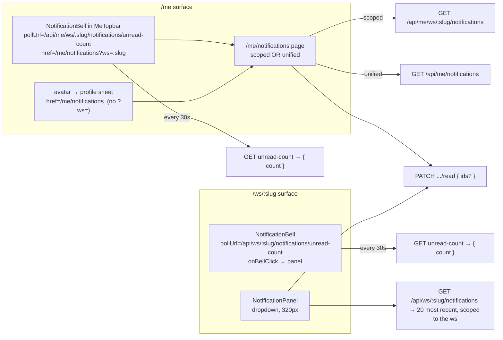
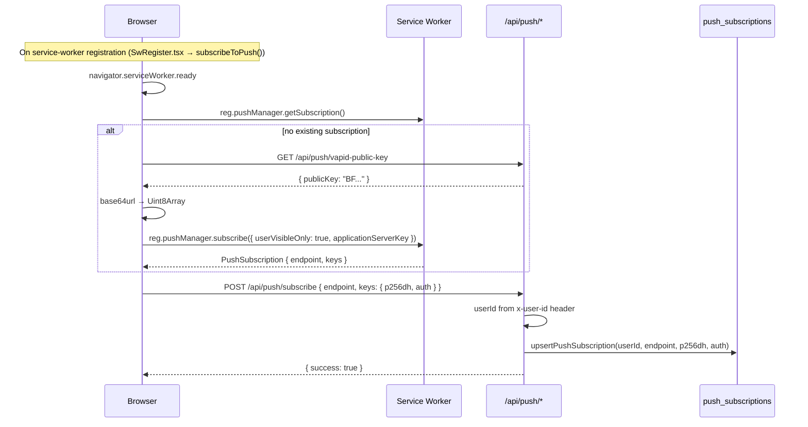
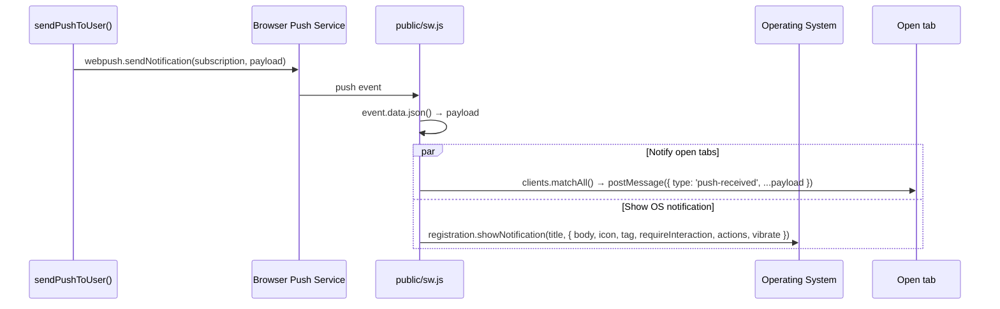
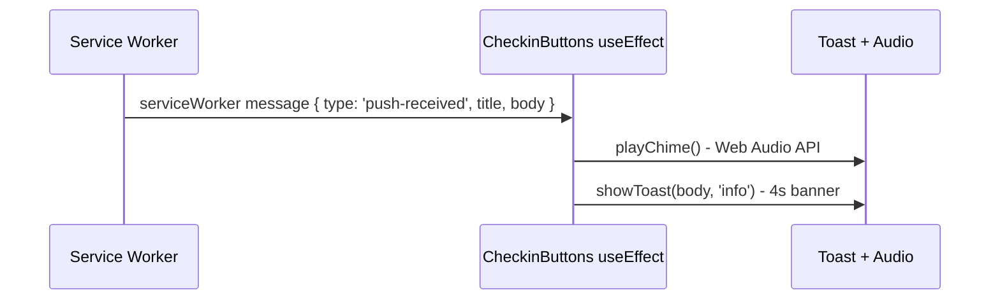
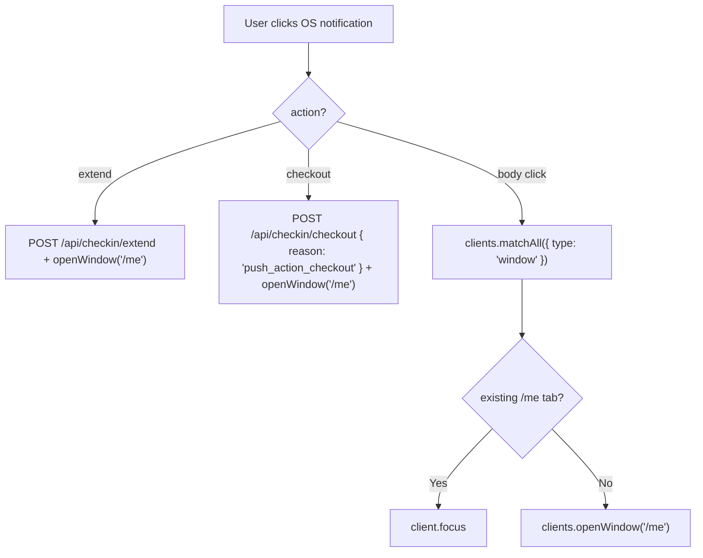

# Notification & Push Flow

> Last updated: 2026-09-12
>
> Source of truth: `src/lib/notifications/categories.ts`, `src/lib/notify.ts`,
> `src/lib/presence-ladder.ts`, `src/lib/db/queries/notifications.ts`,
> `src/lib/db/queries/notification-prefs.ts`,
> `src/lib/db/queries/presence-prefs.ts`, `src/lib/db/queries/reminders.ts`,
> `src/lib/push.ts`, `src/lib/workspace-color.ts`,
> `src/components/notifications/*`, `src/components/user/MeTopbar.tsx`,
> `src/app/me/notifications/*`, `public/sw.js`, `src/app/api/push/*`,
> `src/app/api/me/notifications/*`, `src/app/api/me/ws/[slug]/notifications/*`,
> `src/app/api/ws/[slug]/notifications/*`, and the `member_reminder_prefs` /
> `member_presence_prefs` / `notification_prefs` blocks in `scripts/migrate.js`.

---

## 1. Overview - four delivery paths, two of which write nothing down

| Path | Trigger | Mechanism | Feed row? | Doc |
|------|---------|-----------|-----------|-----|
| **In-app feed** | any server-side event worth telling someone about | `notifications` table + bell polling | — | §2 |
| **Approval / announcement** | a mutation, sent inline in the handler | `notify()` → row + push | **yes** | [`reminders.md`](./reminders.md#1-why-approvals-notify-reliably) |
| **Wall-clock reminders** | a **member's** configured time, in the workspace timezone | cron → `runReminderPass()` | **no — push only** | [`reminders.md`](./reminders.md) |
| **Session ladder / auto-checkout** | elapsed hours since `checkin_at`, against the **member's** rungs | cron pass 1 (server only - the old client timers are gone) | **no — push only** | §4, §5 |

The cron endpoint requires `Authorization: Bearer ${CRON_SECRET}` and is
**disabled** (401) if `CRON_SECRET` is unset in the runtime environment. The
bundled workflow (`.github/workflows/push-reminders.yml`) runs `0,30 * * * *`
and is gated on both `CRON_SECRET` and `APP_URL` being configured as repo
secrets.

When the app is **open**: an in-app toast + `playChime()` + the OS notification.
When the app is **closed**: the SW receives the push event → OS notification.

### The seam, and the two paths that legitimately bypass it

Everything that writes a `notifications` row goes through `notify()` in
`src/lib/notify.ts`, which resolves the notification's category, drops it
entirely if the workspace switched that category off, writes the row
**unconditionally**, and only then decides whether to push. The URL comes from
`notificationHref` rather than being rebuilt per call site, which is how the
announcement fan-out had already drifted to a hardcoded, unencoded slug.

The reminder pass and the ladder do **not** go through it, and they are
invariant 24's two sanctioned exceptions. Neither is skipping a check:

- **They write no feed row at all**, which `notify()` cannot express — writing it
  unconditionally is the whole point of its step 3. A nudge to check in, or to go
  home, is worthless an hour later, and a bell full of last Tuesday's "still
  checked in?" is a bell nobody opens.
- **They carry no category.** `checkin_reminder` and `checkout_reminder` have
  left `NotificationType`; the ladder never had one.
- **They resolve their schedule from one bulk read** —
  `getMemberReminderTimes(ws.id)` per workspace,
  `getPresenceLadderPrefs(userIds)` per cron batch — where `notify()` resolves
  per call, which for 500 open events is 500 lookups.

The preference check has not been bypassed; it has moved into the data. **Having
a time or a rung set at all is the opt-in**, so a member with no row generates
nothing to send and there is no switch left to forget to consult.

### Who configures what

Notification control is partitioned by **who the message is for**. The
organisation broadcasts **categories**; the member sets **schedules**. These are
different kinds of thing, not two halves of one switchboard.

| Screen | What it holds | Backed by |
|---|---|---|
| `/ws/[slug]/settings` › Notifications | the **entire** category catalogue: `approvals`, `announcements` | `workspaces.notification_categories_off` |
| `/me/settings` › Notifications | **no categories at all** — the reminder times for the active workspace (`GET|PATCH /api/me/ws/[slug]/reminder-times`, `requireWsMember`) and the account-level session ladder (`GET|PATCH /api/me/presence-prefs`, session user only) | `member_reminder_prefs`, `member_presence_prefs` |

Both categories are `workspaceSwitchable: true` and `memberMutable: false`.
`approvals` covers **both halves of an approval** — the request reaching an
approver and the answer reaching whoever filed it — so switching it off silences
both audiences at once; the admin-side copy says so outright. It cannot be muted
per member because a person is entitled to be told what happened to a request
they filed, and `announcements` cannot because it is the one message class that
cannot afford to be missed. Neither is *rendered* on `/me/settings`: a switch
nobody may throw still reads as a switch.

**Why the member's two are schedules and not categories.** A category is a class
of MESSAGE; a schedule is a TIME. Once the member has picked the time, a separate
boolean saying "and also, on" is a second source of truth for one fact — a member
with `muted = 0` and no time set is on by one and off by the other, and nothing
can arbitrate, because neither representation is wrong: they answer different
questions and were only ever assumed to agree. So the schedule **is** the switch.
`reminders` and `presence` were categories and are not any more; the rows naming
them were deleted by the migration, and `parseCategoriesOff()` would drop the
keys anyway.

Scopes differ for opposite structural reasons. `member_reminder_prefs` is keyed
`(user_id, workspace_id)` because everything gating a reminder belongs to the
workspace — the timezone the `'HH:MM'` is read in, `working_days`, the holiday
calendar, whether this member is on approved leave there — so a member of two
workspaces genuinely wants two schedules. `member_presence_prefs` is keyed on
`user_id` alone because `presence_events` carries **no `workspace_id`** and never
will: one member has one open session, and "which workspace's ladder applies to
it" has no answer.

`workspaces.checkin_reminder_at` / `checkout_reminder_at` are **vestigial** —
still written by `PATCH /api/ws/[slug]`, never read as the schedule, surviving
only as a pre-filled suggestion on the member's own screen.

The two `notification-prefs` routes (`/api/me/notification-prefs` and
`/api/me/ws/[slug]/notification-prefs`) are **deleted**: they existed to mute a
member-mutable category and there is none.

**Retained and unread:** `notification_prefs` (table and `muted` column),
`db/queries/notification-prefs.ts`, `notify()`'s step 4 and
`CategoryDef.defaultOn` / `lockedReason` have no live caller, because no category
is member-mutable. They are kept, not deleted — see **Notification preferences**
in `CLAUDE.md` for the two non-obvious things re-deriving them would cost.

---

## 1b. The cron was unreachable until 2026-09-02

`POST /api/push/cron` had never run in production. `src/proxy.ts` cookie-gates
every `/api/*` route not on `PUBLIC_API_ROUTES`, and `getSessionFromRequest`
reads only the session cookie, so the GitHub Action's `Authorization: Bearer`
request was refused by the middleware **before** the route's own — correct —
`CRON_SECRET` check. Every ladder push, auto-checkout itself and both wall-clock
reminders were therefore dead.

Two consequences worth carrying forward:

1. **Add any secret-authenticated endpoint to `PUBLIC_API_ROUTES`.** It does not
   make the route public; it makes it not *cookie*-gated.
2. **The outage left a backlog.** Measured in round 5: **2,060 open
   `presence_events` — 72% of all 2,878 events** — one per user per day, 43
   people, oldest 2026-04-21. Without a guard the first successful tick would
   have fired roughly **18,000 pushes** at the 33 people holding live
   subscriptions. Hence the permanent 48-hour age cutoff in
   `getOpenEventsForCron()` and `scripts/drain-open-events.js` (silent,
   `--apply`-gated).

   **The cutoff is the guard; the drain is cleanup.** The cutoff is computed as
   `now − 48h` on every tick, so the backlog is simply not selected and enabling
   the cron sends nothing. The drain exists because rows the cutoff excludes can
   never be auto-checked-out by cron either, so they would stay open forever.

   Why 48 and not 12: auto-checkout fires **at** `checkin + 12h` and extensions
   reach `checkin + 24h`, so any window under 24h would exclude a session before
   it could be closed — re-creating this backlog rather than preventing it.

3. **Nothing was ever auto-checked out, and it did not look that way.**
   `getOpenEventToday()` is bounded by `date(checkin_at) = date('now')`, so when
   the UTC date ticked the row stopped matching, the button flipped back to
   *Check in*, and yesterday's row was orphaned. From the outside this is
   indistinguishable from working auto-checkout. The fingerprint in the data:
   2,060 (user, day) groups, **zero** with more than one open event. Note
   `date('now')` is UTC, so that rollover happens at 05:30 IST, not local
   midnight — registered in `known-gaps.md`.

## 2. The in-app notification feed

```sql
notifications (
  id, user_id, workspace_id NULLABLE, type, title, body,
  ref_id, ref_type, read_at, created_at
)
-- idx_notifications_user_list   (user_id, created_at DESC)
-- idx_notifications_user_unread (user_id, read_at, created_at DESC)
-- idx_notifications_workspace   (workspace_id, created_at DESC)
```

`workspace_id` is nullable so a purely personal notification is expressible, and
reads `LEFT JOIN workspaces` to attach `workspace_slug` (for linking) and
`workspace_name` (for the badge on the unified `/me` view).

### `NotificationType` — the closed set

```ts
| 'leave_submitted' | 'leave_approved' | 'leave_rejected'
| 'regularization_submitted' | 'regularization_approved' | 'regularization_rejected'
| 'extension_submitted' | 'extension_approved' | 'extension_rejected'
| 'document_verified' | 'document_rejected'
| 'announcement'
```

**There are no reminder types here, and that is structural rather than an
omission.** Both member-facing paths — the wall-clock check-in / check-out
reminders and the session ladder — are **push-only**: they write no row, so they
have no type and no category. The two organisation categories are therefore the
only things in the product that write to this table.

`notificationHref()` still resolves the strings `'checkin_reminder'`,
`'checkout_reminder'` and `'presence_extend'`, and must keep doing so. It keys on
the type **string** and is deliberately not typed against `NotificationType`:
historical rows written before the split still carry the first two and still have
to open somewhere sensible, and the cron builds its push URLs through the same
resolver rather than writing `/me` and `/me?extend=1` as literals — which is
exactly how the announcement fan-out drifted.

### Surfaces


```mermaid
flowchart LR
  subgraph ME["/me surface"]
    MB["NotificationBell in MeTopbar\npollUrl=/api/me/ws/:slug/notifications/unread-count\nhref=/me/notifications?ws=:slug"]
    MA["avatar → profile sheet\nhref=/me/notifications  (no ?ws=)"]
    MP["/me/notifications page\nscoped OR unified"]
  end
  subgraph WS["/ws/:slug surface"]
    WB["NotificationBell\npollUrl=/api/ws/:slug/notifications/unread-count\nonBellClick → panel"]
    WP["NotificationPanel\ndropdown, 320px"]
  end

  MB -->|"every 30s"| API1["GET unread-count → { count }"]
  WB -->|"every 30s"| API2["GET unread-count → { count }"]
  MB --> MP
  MA --> MP
  MP -->|"scoped"| API3["GET /api/me/ws/:slug/notifications"]
  MP -->|"unified"| API4["GET /api/me/notifications"]
  WP --> API5["GET /api/ws/:slug/notifications → 20 most recent, scoped to the ws"]
  MP --> API6["PATCH .../read  { ids? }"]
  WP --> API6
```

| Route | Scoping |
|-------|---------|
| `GET /api/me/notifications` | `x-user-id` only — every workspace |
| `GET /api/me/notifications/unread-count` | `x-user-id` only |
| `PATCH /api/me/notifications/read` | `x-user-id`; `ids?` in the body, or mark-all |
| `GET /api/me/ws/[slug]/notifications` | `requireWsMember` — 50 most recent, `AND workspace_id = ?`; returns `{ notifications, unread_count }` |
| `GET /api/me/ws/[slug]/notifications/unread-count` | `requireWsMember`, workspace-scoped |
| `PATCH /api/me/ws/[slug]/notifications/read` | `requireWsMember`, workspace-scoped; `ids?`, or mark-all *within that workspace* |
| `GET /api/ws/[slug]/notifications` | `requireWsMember` — 20 most recent, `AND workspace_id = ?` |
| `GET /api/ws/[slug]/notifications/unread-count` | `requireWsMember`, workspace-scoped |
| `PATCH /api/ws/[slug]/notifications/read` | `requireWsMember`, workspace-scoped |

Every workspace-scoped route uses `requireWsMember`, **not** `requireWsAccess` —
a notification is addressed to a person, not governed by a permission, so every
active member can read their own regardless of role. All three `/me/ws/[slug]/*`
routes answer `403 FORBIDDEN` when membership does not resolve.

### The `/me` split — one bell per workspace, one unified list

The `/me` bell is **workspace-scoped**: it polls the active workspace's
unread-count and its badge matches the workspace the top-bar pill is pointing
at. That is the whole reason the `/api/me/ws/[slug]/notifications` trio exists —
the unscoped `/me` count would have shown another workspace's news under this
workspace's pill. `PATCH .../read` with no `ids` is likewise a mark-all *within
one workspace*, so clearing the bell here cannot silently clear another
workspace's unread badge.

`MeTopbar` picks the pair from the active workspace (the pill's selection, else
the first membership), falling back to the unscoped routes for a user who
belongs to no workspace at all — that is where a pending invitation shows up,
which is exactly the notification such a user needs:

| | Active workspace | No workspace at all |
|---|---|---|
| Bell poll | `/api/me/ws/:slug/notifications/unread-count` | `/api/me/notifications/unread-count` |
| Bell href | `/me/notifications?ws=:slug` | `/me/notifications` |

`/me/notifications` is one page in two modes, decided by `?ws=`:

- **no `?ws=`** → the **unified**, cross-workspace view, reached from the
  **avatar profile sheet**. Backed by `GET /api/me/notifications`.
- **`?ws=<slug>`** → that workspace only, which is where the bell lands. Backed
  by `GET /api/me/ws/[slug]/notifications`.

**The slug is resolved server-side.** `page.tsx` matches `?ws=` against the
caller's own active memberships (`getUserWorkspaces` → `getWorkspacesByIds`,
`archived_at` rejected) and passes the validated slug down as a prop; the client
component never reads the query string. A hand-typed
`?ws=someone-elses-company` falls back to the unified view rather than erroring
— and even if it did not, the route re-checks membership on every request, so
nothing leaks either way. The component is `key`ed on the mode so switching
between the two remounts rather than leaving one workspace's rows on screen
under the other's heading.

#### Workspace badges, and why the colour is not arbitrary

Only the **unified** view badges its rows (`showWorkspace`, default false): the
scoped views already name the workspace in the heading, so a per-row badge there
is repetition on every line.

The badge is tinted with `swatchColor()` from `src/lib/workspace-color.ts` — the
same helper the top-bar workspace pill uses, extracted out of `MeTopbar` for
exactly that reason. Two copies would drift the moment either palette was
touched, and a badge whose colour disagrees with the pill is worse than no badge
at all: it teaches the wrong association. It is seeded on the workspace **`id`**,
never the slug, because a workspace can be renamed and re-slugged but its id is
stable — so its colour is too.

A notification with a NULL `workspace_id` gets a neutral **"Personal"** badge
(muted text, `--surface-2` fill, no tint): tinting it would invent a workspace
that does not exist. `workspace_id` is nullable in the schema so an
account-level event is expressible, but **nothing writes one today** — every
`NotificationType` above is workspace-scoped, so in practice the column is 100%
populated. The client also guards the row's click target on `workspace_slug`,
without which a personal row navigated to the literal `/me/ws/null`.

`markNotificationsRead()` always carries `AND read_at IS NULL`, so re-marking
never rewrites an existing timestamp.

The bell renders `9+` above nine and nothing at zero. Polling is a plain
30-second `setInterval` — there is no websocket or SSE for the feed.

---

## 3. Push Subscription Setup


```mermaid
sequenceDiagram
  participant U as Browser
  participant SW as Service Worker
  participant API as /api/push/*
  participant DB as push_subscriptions

  Note over U: On service-worker registration (SwRegister.tsx → subscribeToPush())

  U->>U: navigator.serviceWorker.ready
  U->>SW: reg.pushManager.getSubscription()
  alt no existing subscription
    U->>API: GET /api/push/vapid-public-key
    API-->>U: { publicKey: "BF..." }
    U->>U: base64url → Uint8Array
    U->>SW: reg.pushManager.subscribe({ userVisibleOnly: true, applicationServerKey })
    SW-->>U: PushSubscription { endpoint, keys }
  end
  U->>API: POST /api/push/subscribe { endpoint, keys: { p256dh, auth } }
  API->>API: userId from x-user-id header
  API->>DB: upsertPushSubscription(userId, endpoint, p256dh, auth)
  API-->>U: { success: true }
```

`push_subscriptions.endpoint` is `UNIQUE`, so one row per device.

### `sendPushToUser(userId, payload)`

```ts
PushPayload = { title, body, tag?, requireInteraction?, actions?, data? }
```

Reads every subscription for the user, sends in parallel under
`Promise.allSettled`, and **deletes any endpoint that returns HTTP 410 (Gone)**.
Throws if `VAPID_PUBLIC_KEY` / `VAPID_PRIVATE_KEY` are unset — callers wrap it in
`allSettled` so a push failure never takes down the request that produced it.

---

## 4. What the client actually schedules

**Almost nothing, any more.** The stale-reminder / auto-checkout `setTimeout`
ladder that older revisions of this document described has been removed from
`CheckinButtons.tsx`. The cron is the sole authority for every ladder rung and
for the auto-checkout itself, which is what makes them work with the app closed.
It is also what lets the ladder be the member's own: a client timer would have to
be handed the member's four hour counts and would stop the moment the tab did.

What the client still does:

| Behaviour | Where |
|-----------|-------|
| A 60-second `setInterval` that re-renders the "auto-checkout in Xh Ym" label from `activeEvent.scheduled_checkout_at` | `CheckinButtons.tsx` |
| `navigator.serviceWorker` `message` listener for `{ type: 'push-received' }` → `playChime()` + in-app toast | `CheckinButtons.tsx` |
| `Notification.requestPermission()` when permission is still `default` | `CheckinButtons.tsx` |
| Subscribe to push and `POST /api/push/subscribe` | `src/lib/push-client.ts` |

Consequence worth knowing: with the tab open but push permission denied, the
user gets **no** ladder rung and no auto-checkout notice at all — the in-app toast
is driven by the SW `postMessage`, which only fires when a push actually arrives.
Since neither path writes a feed row, nothing records that one was due. **The
mechanic is unaffected**: `autoCheckoutEvent()` runs on the server regardless, so
the session still closes on time. The `/me/settings` copy says so, because
otherwise a closed session with no notification anywhere reads as a bug.

## 5. The session ladder (cron pass 1)

`POST /api/push/cron` iterates the open, in-age `presence_events` batch from
`getOpenEventsForCron()` and, per event, expands **that member's own ladder**.

The four numbers come from `member_presence_prefs`, read for the whole batch in
one query (`getPresenceLadderPrefs`) — a per-event lookup would be up to
`CRON_EVENT_LIMIT` (500) round trips every thirty minutes to answer a question
about a handful of rows, since the ladder is opt-in and most of those members
have no row at all. **Members with no row are simply absent from the map**, so
the caller resolves every id against `DEFAULT_PRESENCE_PREFS` rather than
iterating what came back: for an opt-in feature the members who matter are
precisely the ones the table has no rows for, and iterating the result happens to
look right for the rungs (a default member earns none) and is wrong for
auto-checkout, which every member has whether they configured it or not.

`resolveLadder()` in the pure `src/lib/presence-ladder.ts` turns them into the
ordered list of pushes the session earns:

| Rung | Key | Set by | Opens |
|---|---|---|---|
| Half-day | `half` | `half_day_after_h` (null = never) | `/me` — nothing to decide yet |
| Full-day | `full` | `full_day_after_h` (null = never) | `/me?extend=1` — the last chance to act, and the only two honest answers need a screen |
| Overtime, repeating | `ot-1`, `ot-2`, … | `repeat_every_h` **and** a full-day mark | `/me?extend=1` |
| Auto-checkout | `autocheckedout` | `auto_checkout_after_h` — **NOT NULL** | `/me` |

Overtime rungs run until **strictly before** `auto_checkout_after_h`: a rung
landing exactly on it would tell the member "you are still checked in" and "we
checked you out" in the same breath. They are bounded by the session closing and
not by a rung count — that limit is one the member set themselves on the same
screen, so capping the count would mean silently ignoring half of what they
configured. Overtime needs **both** an interval and a full-day mark; anchoring it
on the half-day rung or on check-in would be the function inventing a schedule
nobody asked for.

### Three properties that are each a fixed bug

**A rung outside its window is claimed without being sent.** Past
`LADDER_WINDOW_H` (1.5h) after its hour, the dedupe key goes into
`push_reminders_sent` and no push leaves. GitHub Actions cron is best-effort and
during an outage does not run at all, so an event first seen thirteen hours old
had every rung due at once: the half-day push, the full-day push and the
auto-checkout notice landed within seconds of each other. Members reported that
as *"I got my 5-hour notification after I had already checked out"*, which is
precisely what it looked like from the phone. **Claiming rather than skipping is
the deliberate half** — a skipped rung stays unclaimed, so the next tick
re-evaluates it, finds it still stale, and skips it again for the life of the
session. Claiming records the truth that the rung's moment is over.

**`isEventOpen()` is re-read immediately before each push.** The batch is read in
one query and the loop has been awaiting pushes ever since, so a member who
checked out mid-loop was still being buzzed about a session they had closed. The
check is per rung, not per event, because the window spans the gap between rungs
too.

**Auto-checkout obeys no preference, and its notice is conditional on the write.**
`autoCheckoutEvent()` runs first and unconditionally: an open `presence_events`
row is what that day's attendance is computed from, and invariant 4 means it can
never be repaired by editing it afterwards. It is not one of the configurable
rungs and it is not subject to the staleness ceiling — unlike a nudge, what it
reports is still true whenever it arrives. But the UPDATE carries
`AND checkout_at IS NULL` and the function **returns whether it closed
anything**, so a member who checked out by hand first is not told we closed a
session we did not close. The key is claimed either way: the event is resolved,
and leaving it unclaimed re-runs the branch on every future tick.

### Dedupe

`presence_events.push_reminders_sent`, a JSON array, written back **after each
individual push** by `claim()` rather than once per event: GitHub Actions calls
this endpoint with `curl -m 30`, and a request cut off mid-flight leaves the
pushes on the wire with nothing recorded.

The array is **read through `normaliseLadderKey()`**, which maps the legacy `'5h'`
and `'10h'` onto `'half'` and `'full'`. Without it, a session already open at
deploy would find no modern key claimed and re-nudge somebody who was nudged
hours ago under the other names — the worst possible first impression of a
feature whose whole purpose is to nag less. Read-side only: nothing rewrites the
column, because a claimed key is claimed forever on that row. The shim is
deletable once no event predating the deploy can still be open, and the cron's
48-hour age cutoff (`CRON_MAX_EVENT_AGE_H`) is that horizon.

`scripts/drain-open-events.js` pre-claims the **union** of old and new keys, so a
drained row can never produce a push whichever ladder is deployed.

A per-event `try/catch` keeps one bad row from aborting the run. Pass 2, the
wall-clock pass, runs after this in its own `try/catch` so a failure there cannot
discard pass 1's work. See [`reminders.md`](./reminders.md).

---

## 6. Service Worker Push Handler


```mermaid
sequenceDiagram
  participant Server as sendPushToUser()
  participant PS as Browser Push Service
  participant SW as public/sw.js
  participant OS as Operating System
  participant Page as Open tab

  Server->>PS: webpush.sendNotification(subscription, payload)
  PS->>SW: push event
  SW->>SW: event.data.json() → payload
  par Notify open tabs
    SW->>Page: clients.matchAll() → postMessage({ type: 'push-received', ...payload })
  and Show OS notification
    SW->>OS: registration.showNotification(title, { body, icon, tag, requireInteraction, actions, vibrate })
  end
```

**`requireInteraction: true`** keeps a notification visible until the user acts.
Without it some platforms auto-dismiss after a few seconds.

If notifications appear only in the notification centre rather than as popups,
that is Chrome's per-site "quiet notifications" setting
(`chrome://settings/content/notifications`).

---

## 7. In-App Notification (page open)


```mermaid
sequenceDiagram
  participant SW as Service Worker
  participant CK as CheckinButtons useEffect
  participant UI as Toast + Audio

  SW->>CK: serviceWorker message { type: 'push-received', title, body }
  CK->>UI: playChime() - Web Audio API
  CK->>UI: showToast(body, 'info') - 4s banner
```

Even if the OS notification is silenced, the app shows a visible and audible
alert while it is open.

---

## 8. Notification click - service worker


```mermaid
flowchart TD
  A[User clicks OS notification] --> B{action?}
  B -->|extend| C["POST /api/checkin/extend  + openWindow('/me')"]
  B -->|checkout| D["POST /api/checkin/checkout { reason: 'push_action_checkout' } + openWindow('/me')"]
  B -->|body click| E["clients.matchAll({ type: 'window' })"]
  E --> F{existing /me tab?}
  F -->|Yes| G[client.focus]
  F -->|No| H["clients.openWindow('/me')"]
```

---

## 9. Sound - Web Audio API chime

No audio file. A pure-tone chime generated at runtime, 880 → 1100 → 880 Hz over
~0.7 s with an exponential gain ramp. It plays as direct audio output, so it is
not tied to the OS notification system.

---

## 10. Deduplication by tag

Every tag below is grepped from source. `public/sw.js` falls back to the
literal `'venzio'` when a payload carries no tag, and sets `renotify: true`.

| Notification | Tag | Emitted by |
|-------------|-----|-----------|
| Half-day rung | `presence-half` | `api/push/cron` |
| Full-day rung | `presence-full` | `api/push/cron` |
| Overtime rung *n* | `presence-ot-<n>` | `api/push/cron` |
| Auto-checked out | `presence-autocheckedout` | `api/push/cron` |
| Leave submitted (to admins) | `leave-submitted-<requestId>` | `api/me/ws/[slug]/leave` |
| Regularization submitted (to admins) | `regularization-submitted-<requestId>` | `api/me/ws/[slug]/regularizations` |
| Leave approved / rejected | `leave-<notifType>-<requestId>` | `approvals/[kind]/[id]` |
| Regularization approved / rejected | `regularization-<notifType>-<requestId>` | `approvals/[kind]/[id]` |
| Scheduled check-in reminder | `checkin-reminder-<YYYY-MM-DD>` | `lib/reminders.ts` |
| Scheduled check-out reminder | `checkout-reminder-<YYYY-MM-DD>` | `lib/reminders.ts` |

The ladder tag is the rung's dedupe key, so the tag and the claim cannot disagree
about which rung a push was. Sessions opened before the split still hold `'5h'` /
`'10h'` in `push_reminders_sent`; those are normalised on read and never written
again, so no push carries them as a tag.

Reusing a tag replaces the previous notification instead of stacking. The
date-suffixed reminder tags mean today's reminder never replaces yesterday's
history, while the `reminder_log` row is what actually guarantees one send per
person per kind per day — and since the reminder writes no feed row, that log row
is the **only** record on our side that it happened at all.

---

## 11. Push subscription cleanup

```ts
// lib/push.ts
.catch(async (err: { statusCode?: number }) => {
  if (err.statusCode === 410) await deletePushSubscription(userId, sub.endpoint)
})
```

Expired endpoints are pruned on the next failed delivery. Other status codes are
swallowed — see the gaps section in [`reminders.md`](./reminders.md#4-known-remaining-gaps).
