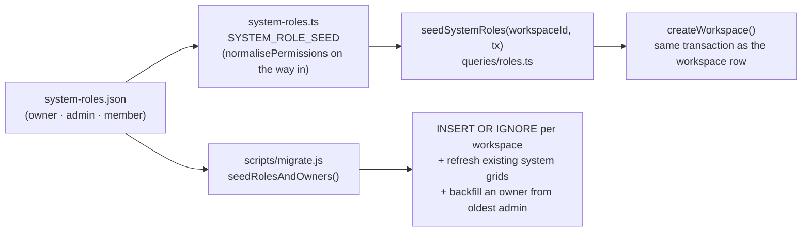
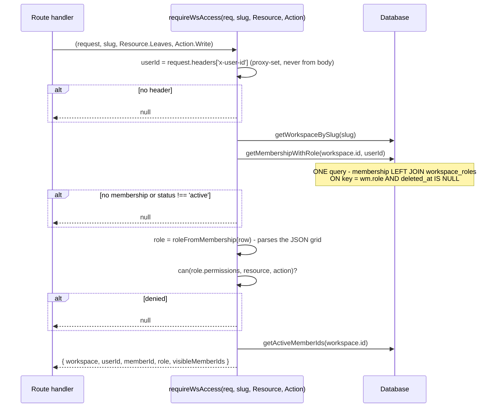
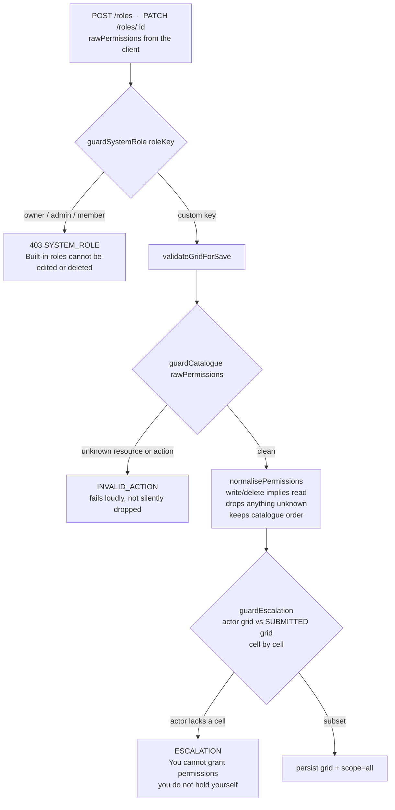
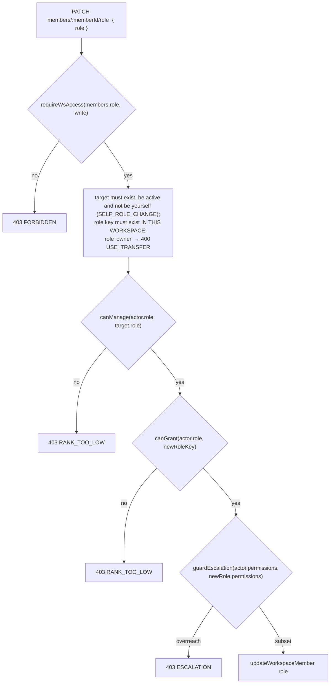

# Permissions & Roles

> Last updated: 2026-09-01
>
> Source of truth: `src/lib/permissions/` (`catalogue.ts`, `can.ts`, `guards.ts`,
> `ranks.ts`, `screens.ts`, `system-roles.json`, `system-roles.ts`) and
> `src/lib/ws-access.ts`.

`requireWsAdmin()` **no longer exists.** `src/lib/ws-admin.ts` still holds a
tombstone comment saying so, and keeps only `requireWsMember()` — which
authenticates an ordinary member for the `/me` surface and carries no
permission meaning. Every `/api/ws/[slug]/*` route is gated by
`requireWsAccess(request, slug, Resource, Action)`.

---

## 1. The two axes

Two independent questions have to be answered on the same action, and
conflating them is how privilege escalation gets in:

| Question | Answered by | Lives in |
|----------|-------------|----------|
| May this role touch this **kind of thing**? | `can(permissions, resource, action)` | `permissions/can.ts` |
| May this person act on **that person**? | `canManage()` / `canGrant()` | `permissions/ranks.ts` |

An admin holds `members:delete`, but must still not be able to remove the
owner. The grid alone cannot say that; rank alone cannot say the first.

---

## 2. The catalogue — resource × action

`Action` is an enum of three verbs: `read`, `write`, `delete`.
`Resource` is an enum whose **string values are persisted** inside the
`permissions` JSON column on `workspace_roles` — renaming one is a data
migration, not a rename.

A resource declares which actions are meaningful for it. Anything not declared
does not exist: you cannot "delete" a dashboard, so `dashboard` simply has no
delete action. `RESOURCE_DEFS` is keyed by `Resource` so the compiler enforces
exhaustiveness.

| Resource key | Label | Actions |
|--------------|-------|---------|
| `dashboard` | Dashboard | read |
| `analytics` | Analytics & insights | read |
| `activity` | Activity | read |
| `export` | Export | read |
| `members` | Members | read, write, delete |
| `employees` | Employee records | read, write, delete |

`employees` also gates the reporting hierarchy (`/api/ws/[slug]/hierarchy` and the
`/ws/:slug/org` chart). A `hierarchy` resource was written on `feat/ven-112` and
deliberately **not** ported: adding a Resource means rewriting every seeded role
grid in `system-roles.json`, which invariant 12 guards, for a distinction nobody
has asked for yet. Revisit when a customer wants an HR role that may hold a
record but not restructure the org.

| `assets` | Assets | read, write, delete |
| `documents` | Employee documents | read, write, delete |
| `holidays` | Holidays | read, write, delete |
| `leaves` | Leave | read, write, delete |
| `approvals` | Approvals | read, write |
| `signals` | Signal config | read, write, delete |
| `domains` | Domains | read, write, delete |
| `settings` | Workspace settings | read, write |
| `members.role` | Assign roles | write |
| `roles` | Roles | read, write, delete |
| `ownership` | Ownership & billing | write, delete |

`members.role` is split out from `members` deliberately: inviting someone and
changing someone's role are wildly different risk levels, and keeping them on
separate rows keeps the grid three columns wide instead of five.

`getResource()` looks up through a `Map`, not by indexing the object — it is fed
untrusted request keys, and a plain object would resolve `constructor` or
`toString` to something truthy off the prototype.

---

## 3. Scope

```ts
enum Scope { All = 'all', Self = 'self' }
```

`feat/ven-112` adds a third member, `Subtree`, so a role sees only its own
reports. It was **deliberately not merged** — it rewrites this invariant, changes
what every existing custom role can see in production, and is separable from the
reporting tree itself, which did land. `AccessContext.visibleMemberIds` is
therefore still every active member.

**Invariant: data scope is the surface, not the role.** `/me/*` is always
self-only, for every role, decided by the session user id with no role lookup at
all. So `Scope.Self` means *"no org surface at all"* — not "the org surface
filtered to your own rows" — and only the seeded `member` role carries it.

Every `/ws` role is therefore `Scope.All`, which is why the roles builder offers
no choice and both roles routes hard-code `const scope = Scope.All`
(`roles/route.ts:106`, `roles/[id]/route.ts:62`). `parseScope()` falls back to
`self` on an unrecognised stored value, so a corrupt column closes the org
surface rather than opening it.

---

## 4. The seeded system roles

`src/lib/permissions/system-roles.json` is the **one definition** of the seeded
grids. It is plain JSON because `scripts/migrate.js` is CommonJS and cannot
import TypeScript, so both the app (`system-roles.ts`) and the migration read
that same file. Never write a second copy — the app and the migration drifting
apart is exactly what shipped every new workspace with no roles.



| Role | Scope | Grid |
|------|-------|------|
| `owner` | all | Everything, **including `ownership: [write, delete]`** |
| `admin` | all | Same as owner **minus `ownership`** |
| `member` | self | `{}` — empty |

**Invariant: every workspace has its system roles.** Permissions resolve by
`workspace_members.role` → `workspace_roles` via a `LEFT JOIN`, so a workspace
with no rows in `workspace_roles` grants *nobody* anything, its creator
included. `createWorkspace()` calls `seedSystemRoles()` **before** the member
insert, inside the same `db.transaction`. Never insert a workspace by any other
path.

**Invariant: the workspace creator is the `owner`, not an `admin`.**
`createWorkspace()` inserts the creator with `role = 'owner'`. Only `owner`
holds `ownership`, so a workspace whose creator is an admin has nobody who can
transfer ownership, archive it, or change billing.

The migration's `seedRolesAndOwners()` also **refreshes** existing system-role
rows whose `permissions` differ from the seed — when Venzio adds a resource to
the catalogue, every workspace picks it up, not only ones created afterwards.
Custom roles are never touched (the update is scoped by `key`).

---

## 5. requireWsAccess — the single door



`null` becomes a 403 at the call site — `forbidden()` in `ws-access.ts` returns
the one canonical shape `{ error: 'Forbidden', code: 'FORBIDDEN' }`.

The `LEFT JOIN` is deliberate: a membership whose role key has no matching row
(a deleted custom role, or a pre-migration database) must still resolve — with
no permissions — rather than vanishing and reading as "not a member".

`getWsRole(workspaceId, userId)` resolves the caller's role **without**
asserting a permission, for pages that need to know who is asking in order to
decide what to render (the workspace layout, the People page).

`AccessContext.visibleMemberIds` is every active member for every role today —
scope narrowing is not enforced until a future reporting-tree phase. It is
threaded through now so routes written from here on already pass it.

### Route → permission map (verified in source)

| Route family | Resource | Actions used |
|--------------|----------|--------------|
| `/api/ws/[slug]/signals*` | `signals` | read, write, delete |
| `/api/ws/[slug]/employees*` | `employees` | read, write, delete |
| `/api/ws/[slug]/employees/[id]/documents*` | `documents` | read, write, delete |
| `/api/ws/[slug]/assets*` (incl. `/export`, `/assign`) | `assets` | read, write, delete |
| `/api/ws/[slug]/holidays*` | `holidays` | read, write, delete |
| `/api/ws/[slug]/leave-types*`, `/leaves*`, `/leave-balances*`, `/maternity*` | `leaves` | read, write, delete |
| `/api/ws/[slug]/approvals*` | `approvals` | read, write |
| `/api/ws/[slug]/roles*` | `roles` | read, write, delete |
| `/api/ws/[slug]/members/[id]/role` | `members.role` | write |
| `/api/ws/[slug]` (settings) | `settings` | read, write |
| `/api/ws/[slug]/transfer-ownership`, `/archive` | `ownership` | write |

Note `maternity` intentionally reuses `Resource.Leaves` (`const RESOURCE =
Resource.Leaves` at the top of both maternity routes) rather than adding a row
to the grid.

### A second gate below the door — the approvals feed

One permission per route is not always enough. `getPendingApprovalItems()` in
`src/lib/approvals.ts` is the single source of pending approvals shared by three
surfaces gated on three *different* permissions — the Overview widget
(`dashboard:read`), the Approvals page (`approvals:read`) and the People page.
None of those implies `documents:read`, yet a `kind: 'doc'` item carries an
employee's **name, work email, `employee_id` and the name of the file they
uploaded**. A role holding only `dashboard:read` was reading all of that off the
Overview widget.

So the helper takes an optional viewer and checks the permission itself:

```ts
getPendingApprovalItems(workspaceId, {
  leavesEnabled,
  viewer: ctx.role,          // ApprovalsViewer = { permissions: PermissionGrid | null | undefined }
})
// doc items included only when can(viewer.permissions, Resource.Documents, Action.Read)
```

Two properties are load-bearing:

- **Fail-closed.** `viewer` is optional in the *type* only — omitting it, or
  passing a null grid, hides the doc items rather than showing them. `can()`
  already denies on a missing grid, so "no viewer was passed" and "this role has
  nothing" collapse to the same answer. A caller that legitimately holds the
  permission passes `ctx.role`, which `requireWsAccess` already resolved.
- **Not fetched, rather than fetched and filtered.** `getPendingDocuments()` is
  simply not called when the viewer cannot read documents, so the returned `doc`
  array and `items` are the same shortened truth. That is what keeps the counts
  honest by construction: neither the Overview's `pendingApprovalsTotal` nor the
  Approvals page's `total` can badge a number that includes rows the caller is
  not allowed to see.

`ApprovalsViewer` is a structural type rather than `ResolvedRole` so
`lib/approvals.ts` stays out of the roles query layer; `ctx.role` satisfies it
as-is.

---

## 6. The screen registry

`src/lib/permissions/screens.ts` is the single list of pages on the org surface
and which permission each needs. It is DATA ONLY — imported by the sidebar (a
client component) as well as by server code. Icons live in the sidebar; labels
live in `src/locales/en.ts`, both keyed by the `Screen` enum.

**The `/me` surface has no screen registry: it is not permissioned.**

| Screen | Path (under `/ws/:slug`) | Group | Gated on `read` of | Feature switch |
|--------|--------------------------|-------|--------------------|----------------|
| `overview` | `` (root) | Workforce | `dashboard` | — |
| `employees` | `/employees` | Workforce | `employees` | — |
| `assets` | `/assets` | Workforce | `assets` | — |
| `attendance` | `/attendance` | Workforce | `dashboard` | — |
| `leave` | `/leaves` | Workforce | `leaves` | `leaves_enabled` |
| `holidays` | `/holidays` | Workforce | `holidays` | `leaves_enabled` |
| `approvals` | `/approvals` | Workforce | `approvals` | — |
| `people` | `/people` | Manage | `members` | — |
| `analytics` | `/insights` | Manage | `analytics` | — |
| `activity` | `/monthly` | Manage | `activity` | — |
| `reports` | `/reports` | Manage | `export` | — |
| `roles` | `/roles` | Manage | `roles` | — |
| `settings` | `/settings` | Manage | `settings` | — |

Two independent filters run in `visibleScreens()`: the workspace feature must be
on **and** the role must be able to read the resource.

```
Screen.Employees → /employees → employee RECORDS    → Resource.Employees
Screen.People    → /people    → workspace MEMBERSHIP → Resource.Members
```

Those two are easy to confuse and are deliberately different resources.

Hiding a tab is a **courtesy only** — the matching API route enforces the same
permission independently. `readableResources(permissions)` is serialised into
the workspace layout so the sidebar decides what to render without shipping the
grid or the permission logic to the browser.

---

## 7. The three escalation guards

The roles grid is the only surface in Venzio where a user writes permissions,
and therefore the only place privilege escalation is possible. Every guard is
enforced server-side; the UI mirrors them for a decent experience and nothing
relies on it having done so.



| Guard | Protects against | Where |
|-------|------------------|-------|
| `guardSystemRole(roleKey)` | Editing `owner`/`admin`/`member`. If an owner could untick `settings:write` on the owner role they would permanently lock every human out of their own workspace, with no recovery short of direct DB access. Lockedness is derived from the key — there is no `is_system` column. | `roles/[id]` PATCH + DELETE |
| `guardCatalogue(raw)` | A hand-crafted body naming a resource or action that does not exist. Without it, `normalisePermissions` would silently drop it and the save would look successful. | inside `validateGridForSave` |
| `guardEscalation(actorGrid, submittedGrid)` | Any role holding `roles:write` granting itself everything, which would make the whole model decorative. | role **create**, role **edit**, **and role assignment** |

### `validateGridForSave` — order matters

```
1. guardCatalogue(raw)        → shape first, so a malformed body reports the
                                malformation rather than an escalation it never
                                really attempted
2. normalisePermissions(raw)  → BEFORE the escalation check: write implies read,
                                and that IMPLIED read must itself be something
                                the actor holds
3. guardEscalation(actor, normalised)
→ { ok: true, permissions }
```

Deleting a custom role soft-deletes it and moves every holder back to `member`,
both inside one `db.transaction` (`deleteWorkspaceRole`).

---

## 8. Why rank alone is not a ceiling

```ts
ROLE_RANK = { owner: 100, admin: 50, member: 10 }
CUSTOM_ROLE_RANK = 20                 // EVERY custom role shares this number
```

`canManage(actor, target)` allows equal rank (one admin may manage another) but
**never** allows acting on the owner. `canGrant(actor, granted)` never allows
granting `owner` at all — ownership moves only through the OTP-gated transfer
flow, so no permission tick on any grid can turn someone into the owner.

The trap: **every custom role has rank 20.** So if `PATCH
/api/ws/[slug]/members/[memberId]/role` gated only on rank, a holder of a weak
custom role with `members.role:write` could hand out *any other custom role*,
however powerful — including one carrying `ownership` — because
`rankOf(actor) >= rankOf(granted)` is `20 >= 20`, which passes.

The route therefore runs **three** checks, all required:



The grid is the real ceiling: **you may only hand out a role whose permissions
you already hold.** Without check 3 on the assignment path, the roles builder's
escalation check is trivially bypassed by *assigning* the role instead of
writing it.

The same reasoning applies upward: an admin outranks a custom role, but an
admin does not hold `ownership` — so rank would let an admin assign a custom
role carrying a permission the admin lacks. `guardEscalation` is what stops it.

---

## 9. Other helpers worth knowing

| Function | Purpose |
|----------|---------|
| `canAny(grid, resource)` | any action at all on a resource |
| `hasAnyOrgAccess(grid)` | does this role grant *any* part of `/ws/:slug`? Drives the post-login redirect, the `/ws` picker and the workspace layout — an entirely empty grid is legal and must land on `/me`, not a stripped `/ws` shell |
| `readableResources(grid)` | every resource with `read`; serialised to the sidebar |
| `parsePermissions(raw)` | parse the stored JSON; **malformed JSON denies everything** |
| `isWorkspaceAdmin(key)` | `owner` OR `admin`. Every place that used to compare `role === 'admin'` must use this — a bare equality check silently stops matching the owner |
| `getRedirectAfterLogin(orgWorkspaces)` | 0 → `/me`, 1 → `/ws/:slug`, many → `/ws` |
| `roleKeyFromName(name)` | slugifies a display name into an immutable key (max 40 chars). Renaming a role changes `name` only, so `workspace_members.role` never needs rewriting. Collisions are caught by the partial unique index — the only race-free place to catch them |
