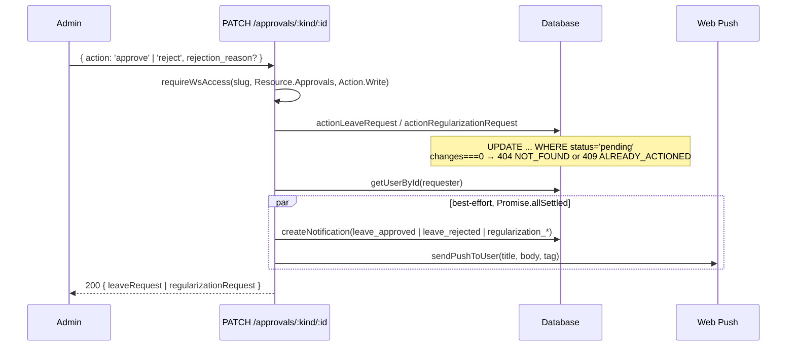
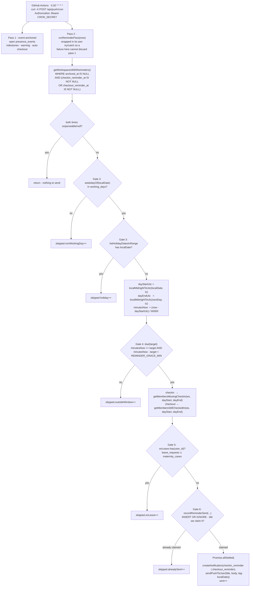

# Reminders — Event-driven vs Scheduled

> Last updated: 2026-09-01
>
> Source of truth: `src/lib/reminders.ts`, `src/lib/db/queries/reminders.ts`,
> `src/app/api/push/cron/route.ts`, `.github/workflows/push-reminders.yml`,
> `src/locales/en/ws-reminders.ts`.

Venzio has **two** notification mechanisms, and they fail in opposite ways.
Understanding why is most of this document.

| | Event-driven | Scheduled (wall-clock) |
|---|---|---|
| Trigger | a mutation someone just made | the clock |
| Sent from | inline, in the request handler | a cron pass |
| Anchored on | the row being changed | the **workspace** |
| Reliability | high — the work and the notify are the same request | best-effort — see the gaps at the end |
| Examples | leave approved/rejected, regularization approved/rejected, leave submitted | "time to check in", "time to check out" |

---

## 1. Why approvals notify reliably

There is no scheduler involved. `PATCH /api/ws/[slug]/approvals/[kind]/[id]`
does the state change and the notification in the same handler:



Three properties make this dependable:

1. **No time component.** Nothing has to guess when to fire.
2. **The user id is right there** on the row being updated.
3. **Two channels.** The in-app `notifications` row survives a failed or
   never-granted push subscription, and the bell polls it every 30 s.

Submission notifies in the same style: `POST /api/me/ws/[slug]/leave` fans out
to `getActiveWorkspaceAdmins()` after the insert.

---

## 2. Why scheduled reminders did not previously exist

The original cron (`POST /api/push/cron`) iterated:

```sql
SELECT id, user_id, checkin_at, scheduled_checkout_at, push_reminders_sent
  FROM presence_events
 WHERE checkout_at IS NULL AND deleted_at IS NULL
```

Three structural problems, none fixable inside that loop:

1. **It can only see people who are already checked in.** There is no row for
   somebody who never checked in, so the loop is *structurally incapable* of
   noticing them. The single most useful reminder — "you haven't checked in" —
   was the one it could never send.
2. **Everything was elapsed hours from `checkin_at`.** `MILESTONES_H = [4, 8,
   12, 16, 18, 20, 22]`, plus a T−60 min auto-checkout warning and the
   auto-checkout itself. Nothing in it was ever wall-clock, so "remind the team
   at 10:00" had no expressible form.
3. **The schedule was `0 * * * *`.** A UTC hour boundary **can never** land on
   10:00 IST, because India is UTC+05:30. Same for Iran (+3:30) and parts of
   Australia (+9:30 / +10:30). Even if the code had understood wall-clock time,
   the trigger could not have delivered it.

The elapsed-hours loop still exists and still does its job — milestones, the
auto-checkout warning with `extend` / `checkout` actions, and the auto-checkout
itself, deduped via the `presence_events.push_reminders_sent` JSON array. The
wall-clock pass was added **beside** it, not instead of it.

---

## 3. The workspace pass

`runReminderPass(now)` in `src/lib/reminders.ts` anchors on **workspaces**, not
events. For every workspace with a configured reminder time, work out whether
now is that time in the workspace's own timezone, then find who still owes a
check-in or a check-out.

Configuration lives on the workspace row:

```sql
workspaces.display_timezone      -- e.g. 'Asia/Kolkata'
workspaces.working_days          -- JSON array, 0 = Sunday, default '[1,2,3,4,5]'
workspaces.checkin_reminder_at   -- 'HH:MM' wall-clock, or NULL = off
workspaces.checkout_reminder_at  -- 'HH:MM' wall-clock, or NULL = off
```

Set via `PATCH /api/ws/[slug]` (gated `settings:write`); an empty string or
`null` turns the reminder off, and a malformed value is rejected rather than
stored — a validation error is kinder than a reminder that quietly does nothing.



Gate 1 is the query itself: **archived workspaces are excluded** and must not
notify anyone.

### The two member queries

`presence_events` carries no `workspace_id` — verification is always computed
per workspace — so **the `workspace_members` join is the `AND workspace_id = ?`
for these queries**:

```sql
-- missing check-in
FROM workspace_members wm JOIN users u ON u.id = wm.user_id
WHERE wm.workspace_id = ? AND wm.status = 'active' AND wm.user_id IS NOT NULL
  AND u.deleted_at IS NULL AND u.deactivated_at IS NULL
  AND NOT EXISTS (SELECT 1 FROM presence_events pe
                  WHERE pe.user_id = wm.user_id AND pe.deleted_at IS NULL
                    AND pe.checkin_at >= ? AND pe.checkin_at < ?)

-- still checked in: same, with EXISTS (... AND pe.checkout_at IS NULL ...)
```

`toSqliteDt()` normalises the ISO bounds to `'YYYY-MM-DD HH:MM:SS'` — range
predicates on that TEXT column are lexicographic, so a bound carrying `T` and
`Z` would compare wrong.

### The four skip gates

| # | Gate | Why it exists |
|---|------|---------------|
| 2 | **non-working day** | `working_days` is a JSON array of weekday numbers, 0 = Sunday. A reminder on a Sunday is how a user disables push |
| 3 | **workspace holiday** | `listHolidayDatesInRange(ws, localDate, localDate)`; skips the entire workspace, both kinds |
| 5a | **approved leave** | `getLeaveRequestsInRange(ws, localDate, localDate)` where `status = 'approved'` |
| 5b | **active maternity case** | `getActiveMaternityUserIds(ws, localDate)` — **maternity lives in its own table keyed by `employee_id`, so the leave gate cannot see it.** Missing this means reminding someone every working day of their maternity leave. It matches both `approved` and `onleave` because dates are the source of truth, not the status flag |

Gates 5a and 5b are gathered **once per workspace** and unioned into a single
`Set<user_id>` before the member loop.

Because gate 5b is a **date** match (`start_date <= localDate <= end_date`), the
maternity PATCH route now refuses to clear `start_date` or `end_date` while a
case is not `returned` (`422`, `fields.<field> = 'REQUIRED_WHILE_OPEN'`).
Nulling `end_date` used to drop the person out of this gate silently while the
case still read as open, and the reminders resumed. See
[`leave-flow.md`](./leave-flow.md#an-open-case-may-not-lose-its-dates).

Everything here is about **not nagging**. A reminder that fires on someone's
approved leave, on a public holiday or on a Sunday is how a user ends up
disabling push permanently — which would also cost them the approval
notifications that work today.

### `reminder_log` — the INSERT *is* the check

```sql
CREATE TABLE reminder_log (
  id, workspace_id, user_id,
  kind TEXT NOT NULL CHECK(kind IN ('checkin','checkout')),
  local_date TEXT NOT NULL, created_at
);
CREATE UNIQUE INDEX idx_reminder_log_once
  ON reminder_log(workspace_id, user_id, kind, local_date) WHERE kind IS NOT NULL;
```

```ts
const claimed = await recordReminderSent(ws.id, member.user_id, kind, localDate)
if (!claimed) { result.skipped.alreadySent++; continue }
// ...only now send
```

`recordReminderSent` is `INSERT OR IGNORE` and returns `changes > 0`. **Claiming
the slot before sending is the point.** A read-then-write would race: two
overlapping cron runs both read "not sent", both send, and the user gets two
pushes. With the insert as the check, exactly one run wins the unique index.

`hasReminderBeenSent()` exists as a read-only helper but is deliberately *not*
what the send path uses.

### `REMINDER_GRACE_MIN = 90`

The workflow ticks at `:00` and `:30`, so 30 minutes is the theoretical minimum
window. GitHub Actions cron is **best-effort** — runs are queued, not guaranteed,
and routinely start several minutes (occasionally much longer) after the
scheduled minute. 90 minutes absorbs a skipped tick plus that lag while still
refusing to deliver a 10:00 reminder in the afternoon, at which point it is no
longer a reminder, just a nag.

A wide window is only safe *because* `reminder_log` guarantees at most one
notification per person, per kind, per local day.

### `0,30 * * * *`

```yaml
- cron: '0,30 * * * *'
```

The half-hour tick is not cosmetic. India (UTC+5:30), Iran (+3:30) and parts of
Australia (+9:30 / +10:30) sit on half-hour offsets, so an hourly UTC schedule
lands at `:30` past their local hour and a reminder set for 10:00 IST could
never fire on time.

The job is gated on both `CRON_SECRET` and `APP_URL` being present as repo
secrets, and the route itself returns `401` unless `CRON_SECRET` is set in the
runtime environment **and** the `Authorization: Bearer` header matches.

### Result shape

```ts
{ workspaces, sent,
  skipped: { nonWorkingDay, holiday, onLeave, alreadySent, outsideWindow },
  errors }
```

Returned inside the cron response as `{ processed, reminders }`. One workspace's
bad timezone string or missing member is caught per-workspace, so it cannot
abort the run for every other workspace.

---

## 4. Known remaining gaps

Listed roughly by risk. None of these is a bug in the pass; they are the edges
of the current design.

### 4.1 No per-member opt-out — the biggest risk

Reminder configuration is a **workspace-level** setting. A member who finds the
daily reminder annoying has exactly one lever: revoke notification permission or
delete the push subscription in their browser. Doing so also loses them **leave
and regularization approval notifications**, which are the notifications that
actually matter.

The blast radius is asymmetric — a nagging reminder costs the user a
notification channel they wanted for something else. Until a per-member mute
exists, treat turning reminders on for a workspace as a decision that affects
everyone's approval notifications too.

### 4.2 Workspace-wide timezone and working days

`display_timezone` and `working_days` are single columns on `workspaces`. A
distributed team, or one where a subset works Sun–Thu, gets one setting for
everybody. The pass skips or fires for the whole workspace at once — gates 2 and
3 `return` out of `processWorkspaceReminders` rather than filtering members.

### 4.3 Overnight shifts are uncovered by the checkout pass

`getMembersStillCheckedIn` looks only inside **today's** local window
(`checkin_at >= dayStartUtc AND checkin_at < dayEndUtc`). Someone who checked in
at 22:00 yesterday and is still open is invisible to today's checkout reminder,
because their `checkin_at` falls in yesterday's window. The elapsed-hours pass
still catches them with milestone pushes and the T+12h auto-checkout, but the
wall-clock check-out reminder will not.

### 4.4 Push failures are swallowed after the log row is claimed

The order is: claim the `reminder_log` row, **then** send. If
`sendPushToUser()` fails — VAPID misconfigured, every subscription expired, the
push service down — the claim already exists and there is no retry. The send is
wrapped in `Promise.allSettled`, so a rejected push is not even surfaced as an
error; only an exception escaping the whole `try` increments `result.errors`.

Partial mitigation: `createNotification()` runs alongside the push in the same
`allSettled`, so the in-app feed row is usually still written and the bell will
show it. But a member relying solely on OS notifications can silently miss a
day, and the log row guarantees the pass will not try again.

---

## 5. Related

- Client-side timers, the service worker push handler and the in-app feed:
  [`notification-flow.md`](./notification-flow.md)
- The maternity gate and why it needs its own table lookup:
  [`leave-flow.md`](./leave-flow.md#why-maternity-needs-its-own-reminder-gate)
