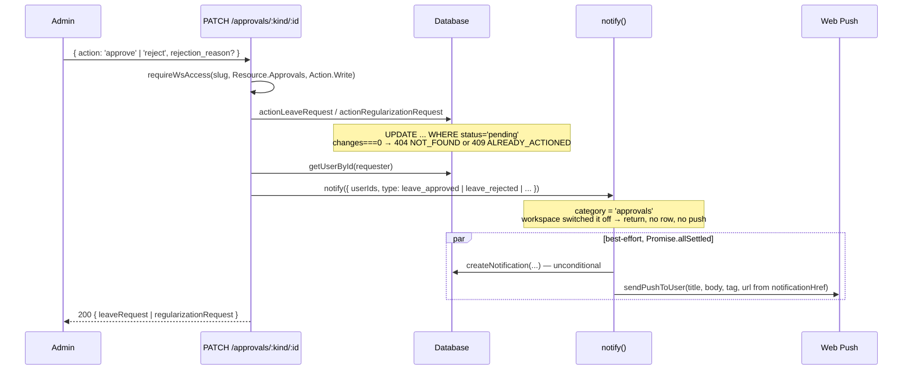
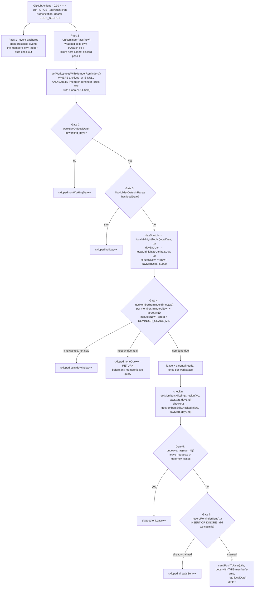

# Reminders — Event-driven vs Scheduled

> Last updated: 2026-09-12
>
> Source of truth: `src/lib/reminders.ts`, `src/lib/db/queries/reminders.ts`,
> `src/lib/presence-ladder.ts`, `src/lib/db/queries/presence-prefs.ts`,
> `src/app/api/push/cron/route.ts`, `.github/workflows/push-reminders.yml`,
> `src/locales/en/ws-reminders.ts`, and the `member_reminder_prefs` /
> `member_presence_prefs` blocks in `scripts/migrate.js`.

Venzio has **two** notification mechanisms, and they fail in opposite ways.
Understanding why is most of this document.

| | Event-driven | Scheduled (wall-clock) |
|---|---|---|
| Trigger | a mutation someone just made | the clock |
| Sent from | inline, in the request handler | a cron pass |
| Anchored on | the row being changed | the **workspace**, over its members' own times |
| Channel | feed row **and** push, via `notify()` | **push only** — no feed row at all |
| Configured by | the organisation, as a category | the **member**, as a time |
| Reliability | high — the work and the notify are the same request | best-effort — see the gaps at the end |
| Examples | leave approved/rejected, regularization approved/rejected, leave submitted, announcements | "time to check in", "time to check out" |

---

## 1. Why approvals notify reliably

There is no scheduler involved. `PATCH /api/ws/[slug]/approvals/[kind]/[id]`
does the state change and the notification in the same handler:



Four properties make this dependable:

1. **No time component.** Nothing has to guess when to fire.
2. **The user id is right there** on the row being updated.
3. **Two channels.** The in-app `notifications` row survives a failed or
   never-granted push subscription, and the bell polls it every 30 s. This is
   what the member-facing reminder and ladder paths deliberately do **not** have.
4. **One seam.** Everything here goes through `notify()`, so the category check,
   the unconditional row and the resolved URL are written once rather than at
   each call site.

The one thing that can silence it is the workspace itself: `approvals` switched
off makes `notify()` return at step 2, writing **nothing** — and because it is
one switch over both halves of an approval, that silences approvers *and*
employees awaiting an outcome.

Submission notifies in the same style: `POST /api/me/ws/[slug]/leave` fans out
to `getActiveWorkspaceAdmins()` after the insert.

---

## 2. Why scheduled reminders did not previously exist

The original cron (`POST /api/push/cron`) iterated:

```sql
SELECT id, user_id, checkin_at, scheduled_checkout_at, push_reminders_sent
  FROM presence_events
 WHERE checkout_at IS NULL AND deleted_at IS NULL
```

Three structural problems, none fixable inside that loop:

1. **It can only see people who are already checked in.** There is no row for
   somebody who never checked in, so the loop is *structurally incapable* of
   noticing them. The single most useful reminder — "you haven't checked in" —
   was the one it could never send.
2. **Everything was elapsed hours from `checkin_at`.** `MILESTONES_H = [4, 8,
   12, 16, 18, 20, 22]`, plus a T−60 min auto-checkout warning and the
   auto-checkout itself. Nothing in it was ever wall-clock, so "remind the team
   at 10:00" had no expressible form.
3. **The schedule was `0 * * * *`.** A UTC hour boundary **can never** land on
   10:00 IST, because India is UTC+05:30. Same for Iran (+3:30) and parts of
   Australia (+9:30 / +10:30). Even if the code had understood wall-clock time,
   the trigger could not have delivered it.

The elapsed-hours loop still exists and still does its job, deduped via the
`presence_events.push_reminders_sent` JSON array — but it is no longer a fixed
milestone list either. It expands **the member's own rungs** from
`member_presence_prefs` through the pure `resolveLadder()`, and a rung more than
`LADDER_WINDOW_H` (1.5h) past its hour is claimed without being sent, so a cron
outage can no longer fire a whole session's ladder in one burst. Auto-checkout
sits outside all of that: it is a mechanic, it runs unconditionally, and its
hour is the member's `auto_checkout_after_h` clamped to the same 24h ceiling
`/api/checkin/extend` enforces. See
[`notification-flow.md`](./notification-flow.md#5-the-session-ladder-cron-pass-1).
The wall-clock pass was added **beside** it, not instead of it.

---

## 3. The workspace pass

`runReminderPass(now)` in `src/lib/reminders.ts` anchors on **workspaces**, not
events. For every workspace where *some member* has asked for a reminder, work
out whose configured time is now in the workspace's own timezone, then find who
still owes a check-in or a check-out.

### The schedule belongs to the member, in one workspace

It used to be one pair of times on the workspace row, pushed at everybody. It is
now one pair per member per workspace:

```sql
member_reminder_prefs (
  id, user_id, workspace_id,
  checkin_at   TEXT,  -- 'HH:MM' in the WORKSPACE's display_timezone, NULL = off
  checkout_at  TEXT,  -- same
  created_at, updated_at
);
CREATE UNIQUE INDEX idx_member_reminder_prefs_one
  ON member_reminder_prefs(user_id, workspace_id);
CREATE INDEX idx_member_reminder_prefs_ws
  ON member_reminder_prefs(workspace_id);
```

**There is no `enabled` or `muted` column and there must never be one. THE TIME
IS THE SWITCH.** A row holding `checkin_at = '09:30'` beside a hypothetical
`enabled = 0` is a question no code in the system could answer, because neither
column would be wrong — they answer different questions and were only ever
assumed to agree. Two representations of one fact drift the moment one write path
touches one of them. NULL means that kind is off; no row at all means both are.

**One plain UNIQUE index here, where `notification_prefs` needs two partial
ones**, and the whole difference is that `workspace_id` is NOT NULL in this
table. SQLite treats NULLs as DISTINCT in a unique index, so a nullable column in
the key constrains nothing — the rows you most need to deduplicate are exactly
the ones it lets through. Forbidding the NULL is what makes the simple spelling
correct.

**Per-workspace, and that is not a convenience.** Everything the pass gates on
belongs to the workspace: the timezone the time is read in, `working_days`, the
holiday calendar, and whether this member is on approved leave *there*. A member
of two workspaces genuinely wants two schedules — 09:00 in `Asia/Kolkata`, 10:00
in `Europe/London` — and collapsing them to one account-level time would make the
second wrong every day. On `/me` the times are scoped to the top-bar workspace
pill like every other screen; no second picker may appear beside them.

The workspace still owns the context, just not the switch:

```sql
workspaces.display_timezone      -- e.g. 'Asia/Kolkata'
workspaces.working_days          -- JSON array, 0 = Sunday, default '[1,2,3,4,5]'
workspaces.checkin_reminder_at   -- VESTIGIAL - see below
workspaces.checkout_reminder_at  -- VESTIGIAL
```

> **`workspaces.checkin_reminder_at` / `checkout_reminder_at` are vestigial and
> must stay unread.** They are still written and validated by
> `PATCH /api/ws/[slug]` (gated `settings:write`; an empty string or `null` turns
> it off, a malformed value is rejected rather than stored), and nothing in
> `src/lib/reminders.ts` or `src/lib/db/queries/reminders.ts` selects them. They
> survive as a **pre-filled suggestion** on the member's own settings screen,
> phrased in the past tense — "this workspace used to remind everyone at 09:30" —
> so nobody reads them as a setting already covering them.
>
> They were deliberately **not backfilled** into `member_reminder_prefs`.
> Reminders are opt-in now, so silence until a member asks is the intended
> default rather than a gap: backfilling would start pushing to every member of
> every workspace that ever set an admin-side time, which is the nag that makes
> people revoke push permission and lose their approval notifications with it.
> Reading them as a delivery fallback is the first step back to pushing at
> everybody.

### The pass writes no feed row

`checkin_reminder` and `checkout_reminder` have left `NotificationType`. A
reminder is a nudge about the next five minutes; a feed row about it, read the
following afternoon, is litter. The consequence for this document is that
**`reminder_log` is now the only record on our side that a reminder happened** —
there is no row to notice and the push leaves no trace. That raises the stakes on
gate 6 (below) and is why the claim comes before the send.

It is also why the pass does not route through `notify()`, and it remains one of
invariant 24's two sanctioned exceptions — but for a different reason than it
once had. It is no longer that it filters mutes in bulk; there are no mutes. It
is that there is nothing for `notify()` to do: no feed row to write, no category
to resolve, and a body that differs per recipient because each member's own time
is in it.



Gate 1 is the query itself: **archived workspaces are excluded** and must not
notify anyone. The `EXISTS` over `member_reminder_prefs` is the other half of it —
a workspace nobody has configured a time in is never selected, and
`idx_member_reminder_prefs_ws` is what keeps that from scanning every schedule in
the product every thirty minutes.

### The two member queries

`presence_events` carries no `workspace_id` — verification is always computed
per workspace — so **the `workspace_members` join is the `AND workspace_id = ?`
for these queries**:

```sql
-- missing check-in
FROM workspace_members wm JOIN users u ON u.id = wm.user_id
WHERE wm.workspace_id = ? AND wm.status = 'active' AND wm.user_id IS NOT NULL
  AND u.deleted_at IS NULL AND u.deactivated_at IS NULL
  AND NOT EXISTS (SELECT 1 FROM presence_events pe
                  WHERE pe.user_id = wm.user_id AND pe.deleted_at IS NULL
                    AND pe.checkin_at >= ? AND pe.checkin_at < ?)

-- still checked in: same, with EXISTS (... AND pe.checkout_at IS NULL ...)
```

`toSqliteDt()` normalises the ISO bounds to `'YYYY-MM-DD HH:MM:SS'` — range
predicates on that TEXT column are lexicographic, so a bound carrying `T` and
`Z` would compare wrong.

They answer "who owes us a check-in", which is a **superset** of "who asked to be
reminded about it", so the send loop intersects each member against the due map
and skips anyone not in it.

### The five skip gates

The old gate **1b** (workspace `reminders` switch) and old gate **7** (member
mute) are **gone**, not inert. Neither is expressible any more: there is no
`reminders` category for a workspace to switch and no mute for a member to hold.
The absence of a configured time is the off state, and it is evaluated at gate 4
with everything else. `ReminderPassResult.skipped` lost `categoryOff` and `muted`
and gained `noneDue`.

| # | Gate | Why it exists |
|---|------|---------------|
| 2 | **non-working day** | `working_days` is a JSON array of weekday numbers, 0 = Sunday. A member chooses *when* they are reminded; they do not get to be reminded on a day the organisation does not work. Cheapest gate in the file — the column arrives with the workspace row — so it runs first |
| 3 | **workspace holiday** | `listHolidayDatesInRange(ws, localDate, localDate)`; skips the entire workspace, both kinds. Costs a query, hence after gate 2 |
| 4 | **nobody's configured time is now** | One indexed read of this workspace's schedules (`getMemberReminderTimes`), then a pure comparison per member. **No fallback to `ws.checkin_reminder_at`:** a member with no row and a member with a NULL column both get nothing, which is the entire point of moving the schedule. Two counters come out of it — `outsideWindow` for a *kind* somebody wants but not in this half hour, `noneDue` for a whole workspace with nothing to do on this tick |
| 5a | **approved leave** | `getLeaveRequestsInRange(ws, localDate, localDate)` where `status = 'approved'` |
| 5b | **active parental case** | `getActiveParentalUserIds(ws, localDate)` — **parental leave (maternity AND paternity) lives in its own table keyed by `employee_id`, so the leave gate cannot see it.** Missing this means reminding someone every working day of their parental leave. The function is deliberately blind to `case_type`; filtering it by type would let one kind of leave through. It matches both `approved` and `onleave` because dates are the source of truth, not the status flag |
| 6 | **already reminded today** | `reminder_log`, below |

**Gate 4 moved inside the workspace, and the loop still iterates workspaces.**
It used to be one comparison against the workspace's own time; it is now one per
member. The loop shape did not follow it, deliberately: the holiday lookup, the
leave lookup and the parental lookup are each keyed on the workspace and answer
the question once for every member of it. A member-anchored loop would re-read
all three per person — roughly 1500 extra round trips every thirty minutes for a
500-person workspace.

**Gate 4's early return is load-bearing for cost.** The two member queries are
the expensive ones in this file, each a `NOT EXISTS` / `EXISTS` over every active
member's presence events for the day, and on most of the 48 daily ticks nobody
here is due. Returning at that point means a quiet workspace costs one holiday
lookup and one schedule read and never touches `getMembersMissingCheckin` at all.
Gates 5a and 5b are read **after** gate 4 for the same reason — they are gathered
once per workspace and unioned into a single `Set<user_id>` before the member
loop, but only a workspace with somebody due ever pays for them.

Because gate 5b is a **date** match (`start_date <= localDate <= end_date`), the
maternity PATCH route refuses to clear `start_date` or `end_date` while a case is
not `returned` (`422`, `fields.<field> = 'REQUIRED_WHILE_OPEN'`). Nulling
`end_date` used to drop the person out of this gate silently while the case still
read as open, and the reminders resumed. See
[`leave-flow.md`](./leave-flow.md#an-open-case-may-not-lose-its-dates).

Everything here is about **not nagging**. A reminder that fires on someone's
approved leave, on a public holiday or on a Sunday is how a user ends up
disabling push permanently — which would also cost them the approval
notifications that work today.

### `reminder_log` — the INSERT *is* the check

```sql
CREATE TABLE reminder_log (
  id, workspace_id, user_id,
  kind TEXT NOT NULL CHECK(kind IN ('checkin','checkout')),
  local_date TEXT NOT NULL, created_at
);
CREATE UNIQUE INDEX idx_reminder_log_once
  ON reminder_log(workspace_id, user_id, kind, local_date) WHERE kind IS NOT NULL;
```

```ts
const claimed = await recordReminderSent(ws.id, member.user_id, kind, localDate)
if (!claimed) { result.skipped.alreadySent++; continue }
// ...only now send
```

`recordReminderSent` is `INSERT OR IGNORE` and returns `changes > 0`. **Claiming
the slot before sending is the point.** A read-then-write would race: two
overlapping cron runs both read "not sent", both send, and the user gets two
pushes. With the insert as the check, exactly one run wins the unique index.
That mattered before; it is now the *only* dedupe there is, because the pass
writes no feed row and the push leaves no trace on our side.

`hasReminderBeenSent()` exists as a read-only helper but is deliberately *not*
what the send path uses.

### `REMINDER_GRACE_MIN = 30`

The workflow ticks at `:00` and `:30`, so a 30-minute window is **exactly one
tick wide**: every minute-of-day is covered by exactly one tick — no minute is
unreachable and none is claimed twice — and the worst-case lateness is 29
minutes.

**The accepted cost is stated rather than hidden.** GitHub Actions cron is
best-effort, so a skipped or badly-delayed run now **drops** that person's
reminder for the day instead of delivering it stale. That is the intended trade.
The window was 90 minutes precisely so a missed tick could be caught up, and
catching up is the wrong thing to do here: a reminder to check in that lands an
hour and a half after the fact is not a reminder, it is a nag, and a nag is what
makes somebody revoke push permission outright. That permission is shared with
the approval notifications they actually want, so one over-late nudge costs every
notification that matters. A missed nudge costs nothing anybody will notice.

`reminder_log` still guarantees at most one delivery per person, per kind, per
local day whatever the window is — it is the dedupe, not this constant.

The `/me/settings` copy says both halves out loud: that delivery is approximate,
and that a reminder more than 30 minutes late is dropped rather than sent.
Without the second sentence that reads as a missing notification.

### `0,30 * * * *`

```yaml
- cron: '0,30 * * * *'
```

The half-hour tick is not cosmetic. India (UTC+5:30), Iran (+3:30) and parts of
Australia (+9:30 / +10:30) sit on half-hour offsets, so an hourly UTC schedule
lands at `:30` past their local hour and a reminder set for 10:00 IST could
never fire on time.

The job is gated on both `CRON_SECRET` and `APP_URL` being present as repo
secrets, and the route itself returns `401` unless `CRON_SECRET` is set in the
runtime environment **and** the `Authorization: Bearer` header matches.

### Result shape

```ts
{ workspaces, sent,
  skipped: { nonWorkingDay, holiday, onLeave, alreadySent, outsideWindow, noneDue },
  errors }
```

Returned inside the cron response as `{ processed, reminders }`. One workspace's
bad timezone string or missing member is caught per-workspace, so it cannot
abort the run for every other workspace. On a healthy run `noneDue` is by far the
largest number in the object: a workspace is due at most twice a day and this
pass looks at it 48 times.

---

## 3b. The pass did not run at all until 2026-09-02

Everything above describes logic that was correct and **never executed in
production**. `src/proxy.ts` cookie-gates every `/api/*` route that is not on
`PUBLIC_API_ROUTES`, and `getSessionFromRequest` reads only the session cookie —
never the `Authorization` header. `/api/push/cron` was not on that list, so the
GitHub Action's Bearer request was answered `401` by the middleware before the
route's own `CRON_SECRET` check ever ran.

Fixed by adding the route to `PUBLIC_API_ROUTES`. "Public" there means *not
cookie-gated*: the route still authenticates itself against `CRON_SECRET` as its
first act, and refuses outright when that env var is unset.

**Any future endpoint that authenticates by Bearer token or shared secret has to
be added to that list**, or it will fail the same silent way.

## 4. Known remaining gaps

Listed roughly by risk. None of these is a bug in the pass; they are the edges
of the current design.

### 4.1 ~~No per-member opt-out~~ — closed, and then closed differently

**This was the biggest risk in this document.** For the record of what it was:
reminder configuration was workspace-level only, so a member who found the daily
reminder annoying had exactly one lever — revoke notification permission or
delete the push subscription. That also cost them leave and regularization
approval notifications, and workspace announcements: the one message class that
cannot afford to be missed. The blast radius was asymmetric, a nag costing a
channel wanted for something else.

The first fix gave the member a **mute** on a `reminders` category. That is not
the shape any more, and the reason is worth keeping: **a mute beside a schedule
is a second source of truth for one fact.** A member with `muted = 0` and no time
set is on by the switch and off by the schedule; a member with a time set and
`muted = 1` is the reverse. Neither representation is wrong — they answer
different questions and were only ever assumed to agree — so nothing in the
system can arbitrate between them, and two representations of one fact drift.

So the schedule **is** the switch. The member's times live in
`member_reminder_prefs` and **having a time set is the opt-in**; a member who
wants no nudge stores no time, and there is nothing else to consult. The lever is
strictly better than the mute it replaced: it is per workspace, it says *when*
rather than only *whether*, and it cannot disagree with itself.

The blast-radius problem is closed by the same move. A member never has to reach
for the browser's push permission to stop a reminder, so the approval and
announcement notifications that share that permission are never collateral.
`approvals` and `announcements` remain non-mutable — a per-member switch for
those rebuilds the exact problem — and neither is rendered on `/me/settings` at
all.

See **Notification preferences** in `CLAUDE.md` for the two-category catalogue,
the schedules-are-not-categories argument in full, and what is retained but
unread (`notification_prefs`, `notify()`'s mute step, `CategoryDef.defaultOn`).

### 4.2 Workspace-wide timezone and working days

`display_timezone` and `working_days` are single columns on `workspaces`. A
distributed team, or one where a subset works Sun–Thu, gets one setting for
everybody. The pass skips or fires for the whole workspace at once — gates 2 and
3 `return` out of `processWorkspaceReminders` rather than filtering members.

### 4.3 Overnight shifts are uncovered by the checkout pass

`getMembersStillCheckedIn` looks only inside **today's** local window
(`checkin_at >= dayStartUtc AND checkin_at < dayEndUtc`). Someone who checked in
at 22:00 yesterday and is still open is invisible to today's checkout reminder,
because their `checkin_at` falls in yesterday's window. The elapsed-hours pass
still catches them with the member's own ladder rungs and their auto-checkout,
but the wall-clock check-out reminder will not.

### 4.4 Push failures are swallowed after the log row is claimed

The order is: claim the `reminder_log` row, **then** send. If the push does not
arrive — VAPID misconfigured, every subscription expired, the push service down —
the claim already exists and there is no retry.

`sendPushToUser()` wraps its per-subscription sends in `Promise.allSettled`, so a
rejected endpoint is not surfaced at all; only a failure of the call itself
(missing VAPID keys, a failed subscription read) throws, and the pass catches it
per member and increments `result.errors`. A member whose only live subscription
is dead therefore counts as `sent`.

**The mitigation this entry used to carry is gone.** It said the in-app feed row
was written alongside the push, so the bell would still show it. The pass writes
**no feed row at all** now, so a failed push means the reminder simply did not
happen — and the claimed `reminder_log` row guarantees the pass will not try
again that day. This is the largest cost of the push-only decision and is
accepted: a reminder is a nudge about the next five minutes, and one that failed
is not worth reconstructing hours later. It is not a silent failure for anything
with consequences — approvals and announcements still write rows and still go
through `notify()`.

---

## 5. Related

- Client-side timers, the service worker push handler and the in-app feed:
  [`notification-flow.md`](./notification-flow.md)
- The maternity gate and why it needs its own table lookup:
  [`leave-flow.md`](./leave-flow.md#why-maternity-needs-its-own-reminder-gate)
