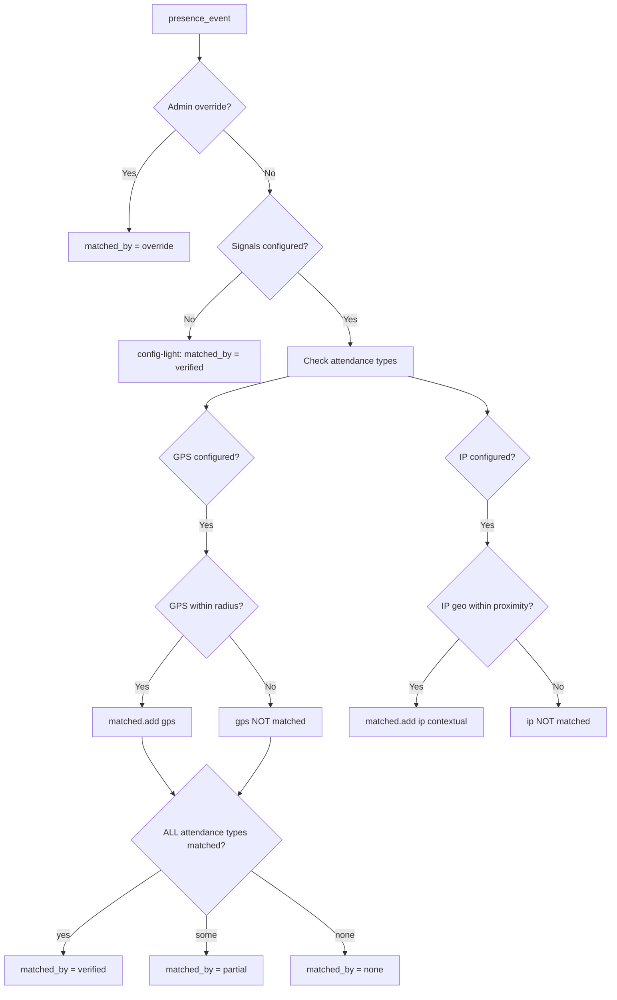

# Signal Matching - The Core USP

> This is the heart of Venzio. Read this before touching `lib/signals.ts`, any dashboard route, or analytics.

---

## 1. The Problem

Traditional attendance systems are easy to fake:
- Check in from home while pretending to be at the office
- Share login credentials with someone else to check in remotely
- Modify device GPS

Venzio's answer: **require ALL configured attendance signals to match simultaneously** (AND semantics), plus a separate **trust score** for fraud hints.

---

## 2. Signal Types

| Signal | How collected | Attendance (AND gate) | Trust / explainability |
|--------|--------------|----------------------|-------------------------|
| **GPS** | `navigator.geolocation` on check-in + checkout | Yes — Haversine ≤ radius (default 300m) | `mock_gps_suspected` if accuracy ≤ 1m |
| **WiFi** | Planned — client does not send SSID today | **Dormant** — DB columns exist; not in `lib/signals.ts` | Future BSSID match |
| **IP** | Server-side from request headers | **No** — not required for `verified` | Proximity in `matched_signals`; `vpn_suspected` etc. in `trust_flags` |
| **Device** | `device_info` JSON on check-in | No | Trust heuristics only |

Signals are collected on **both check-in AND checkout** (GPS/IP at checkout where applicable).

---

## 3. Two Layers

### Layer A — Attendance (`matched_by`)

Computed in `queryWorkspaceEvents()` per workspace. **Not stored** on `presence_events` (events are user-global).

| Value | Meaning | Counts as office? |
|-------|---------|------------------|
| `verified` | All **attendance** types matched (GPS today) | Yes |
| `partial` | Some signals matched, not all attendance types | No |
| `none` | No attendance signals matched | No (config-light: all `verified`) |
| `override` | Admin override | Yes |

### Layer B — Trust (`trust_score`, `trust_flags`)

Persisted on `presence_events`. Updated async by `src/lib/trust.ts` after check-in. Never blocks check-in.

| Score | UI band (`trustLevelFromScore`) |
|-------|----------------------------------|
| 80+ | verified |
| 50–79 | partial |
| <50 | suspicious → admin badge "Verification reduced" |

---

## 4. AND Semantics - The Rule

**IP does not participate in the `V` gate** — only `attendanceTypes` (GPS, future WiFi/BLE).

---

## 5. queryWorkspaceEvents()

File: `src/lib/signals.ts`

1. Plan history gate + member filter
2. `getEventsForUsers` + `getWorkspaceSignals` + `getOverrideEventIds`
3. Config-light: no signals → `verified` (except overrides)
4. Per event: GPS for attendance AND; IP for `matched_signals` only
5. Return `PresenceEventWithMatch[]`

---

## 6. Checkout Location Mismatch

When checkout GPS is far from check-in GPS, `checkout_location_mismatch` (metres) is stored. `eventCountsAsOfficePresence()` returns false if mismatch > 0 even when `matched_by === 'verified'`.

---

## 7. Admin Override

Overrides live in `admin_overrides`. `presence_events` rows are not rewritten. `queryWorkspaceEvents()` checks override set first → `matched_by = 'override'`.

---

## 8. Config-Light Mode

No active signals → all events `matched_by = 'verified'` (overrides still `override`).

---

## 9. WiFi SSID Privacy (planned)

When WiFi matching is re-enabled: admin config stores `wifi_ssid_hash` (bcrypt); never store raw SSID in workspace config. Client capture TBD (native BSSID preferred over SSID).

---

## 10. Performance Notes

- **GPS:** O(signals × events) Haversine
- **IP:** Same for contextual match; not in attendance AND set
- **Trust:** Async after check-in; external `ip-api.com` must not block the 300ms check-in response path
