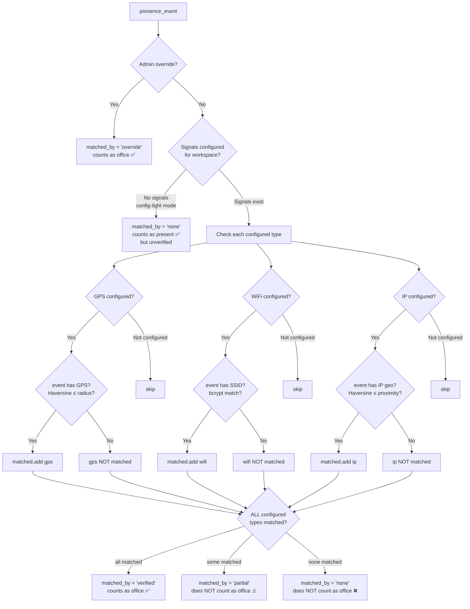
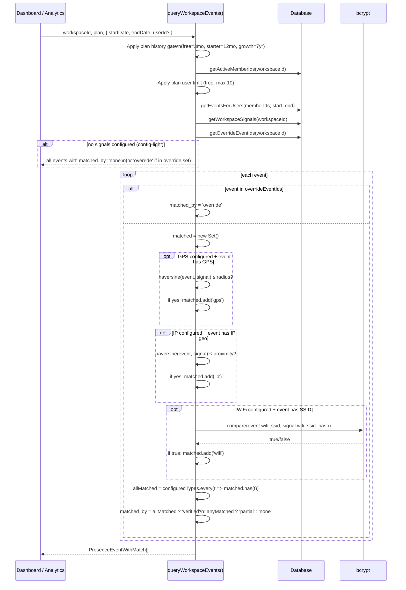
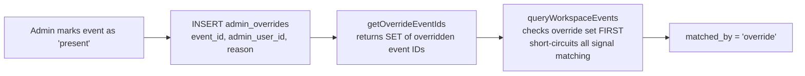
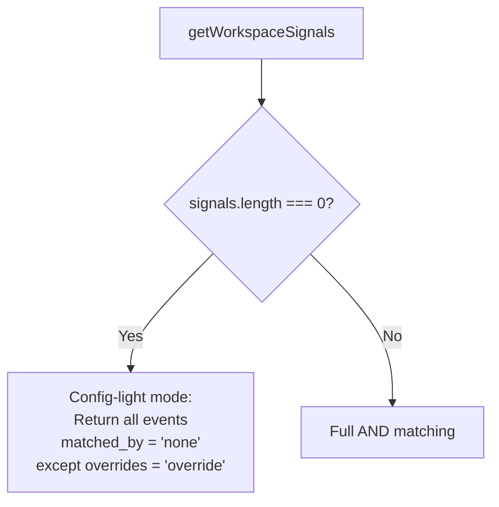

# Signal Matching - The Core USP

> This is the heart of Venzio. Read this before touching `lib/signals.ts`, any dashboard route, or analytics.

---

## 1. The Problem

Traditional attendance systems are easy to fake:
- Check in from home while pretending to be at the office
- Share login credentials with someone else to check in remotely
- Modify device GPS

Venzio's answer: **require ALL configured signals to match simultaneously**.

---

## 2. Signal Types

| Signal | How collected | How verified |
|--------|--------------|--------------|
| **GPS** | `navigator.geolocation` on check-in + checkout | Haversine distance ≤ configured radius (default 300m) |
| **WiFi** | `navigator.connection?.ssid` (Chrome/Android) | bcrypt.compare(event.wifi_ssid, config.wifi_ssid_hash) |
| **IP** | Server-side from request headers | Haversine distance ≤ configured proximity (default 500m) |
| **Device** | User-agent, timezone | Trust score only - not a signal type for AND matching |

Signals are collected on **both check-in AND checkout**.

---

## 3. AND Semantics - The Rule



---

## 4. MatchedBy Values

| Value | Meaning | Counts as office? |
|-------|---------|------------------|
| `verified` | All configured signal types matched | ✅ Yes |
| `partial` | Some but not all configured types matched | ❌ No |
| `none` | No signals matched (or config-light mode) | ❌ No (config-light: ✅) |
| `override` | Admin override applied - bypass matching | ✅ Yes |

**Important:** `partial` is NOT the same as `none`. It means the event happened - the signals just didn't all align. This is surfaced to admins so they can investigate (e.g. user checked in from home and happened to be on office VPN → IP matched but GPS didn't).

---

## 5. queryWorkspaceEvents() - The Core Function

File: `src/lib/signals.ts`



---

## 6. Checkout Location Mismatch

When a user checks out from a different location than check-in, the distance is recorded in `checkout_location_mismatch` (metres).

```typescript
// In checkout route: computed and stored
checkout_location_mismatch = haversine(checkin_gps, checkout_gps)

// In signals.ts: used to decide if hours count
export function eventCountsAsOfficePresence(event: PresenceEventWithMatch): boolean {
  if (event.matched_by !== 'verified' && event.matched_by !== 'override') return false
  if (event.checkout_location_mismatch !== null && event.checkout_location_mismatch > 0) return false
  return true
}
```

This prevents a scenario where someone checks in at the office but physically leaves (checkout GPS far from check-in GPS) - those hours don't count as verified office time.

---

## 7. Admin Override

Admin overrides are stored in `admin_overrides`, not in `presence_events`:



**Invariant:** `presence_events` rows are never modified for overrides. The override is additive. This preserves the full audit trail of what actually happened vs what was manually approved.

---

## 8. Config-Light Mode

No signals configured → all events from active members pass through:



This mode is for:
- New workspaces that haven't set up signal configs yet
- Small teams on the free plan who trust their employees without verification

---

## 9. WiFi SSID Privacy

WiFi SSIDs are **never stored in plaintext**:

```
Admin adds WiFi: "OfficeNetwork"
  → bcrypt.hash("OfficeNetwork", 12) → stored in workspace_signal_config.wifi_ssid_hash

User checks in with SSID: "OfficeNetwork"
  → bcrypt.compare("OfficeNetwork", stored_hash) → true/false
  → event.wifi_ssid stored as-is in presence_events (the raw SSID from user device)
  → but this is the user's own data - they already know their own SSID
```

The workspace config never reveals what SSID the admin configured - only that the check-in matched it.

---

## 10. Performance Notes

- **GPS + IP:** O(signals × events) Haversine - pure math, fast
- **WiFi:** O(wifi_configs × events) bcrypt comparisons - ~300ms each at cost 12
  - Bounded by `plan.maxLocations`: free/starter=1, growth=5
  - Acceptable at current scale
  - Future optimisation: replace bcrypt with HMAC-SHA256 for O(1) comparison at query time
