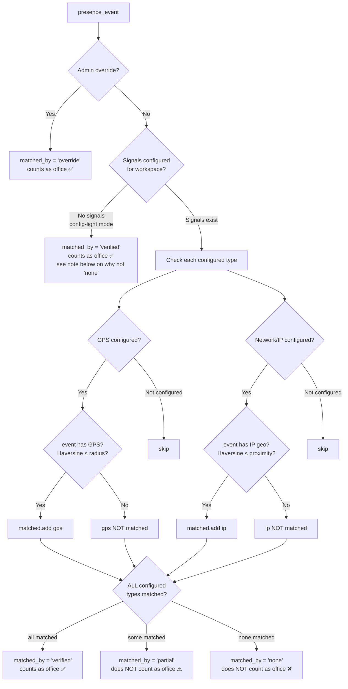
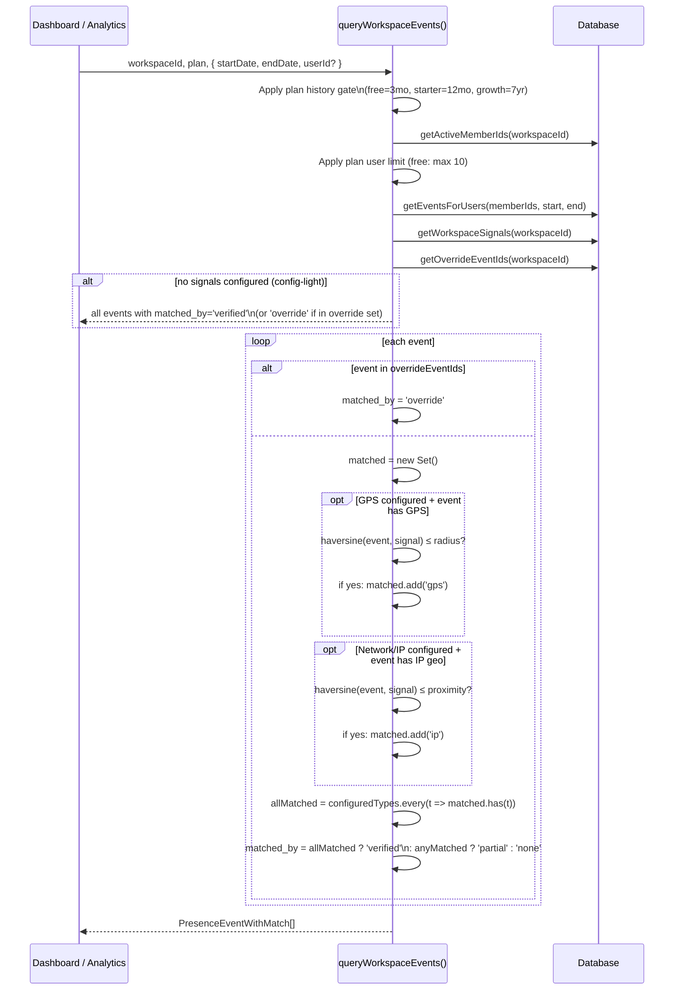
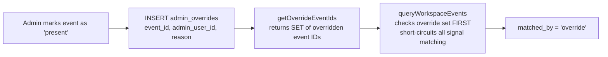
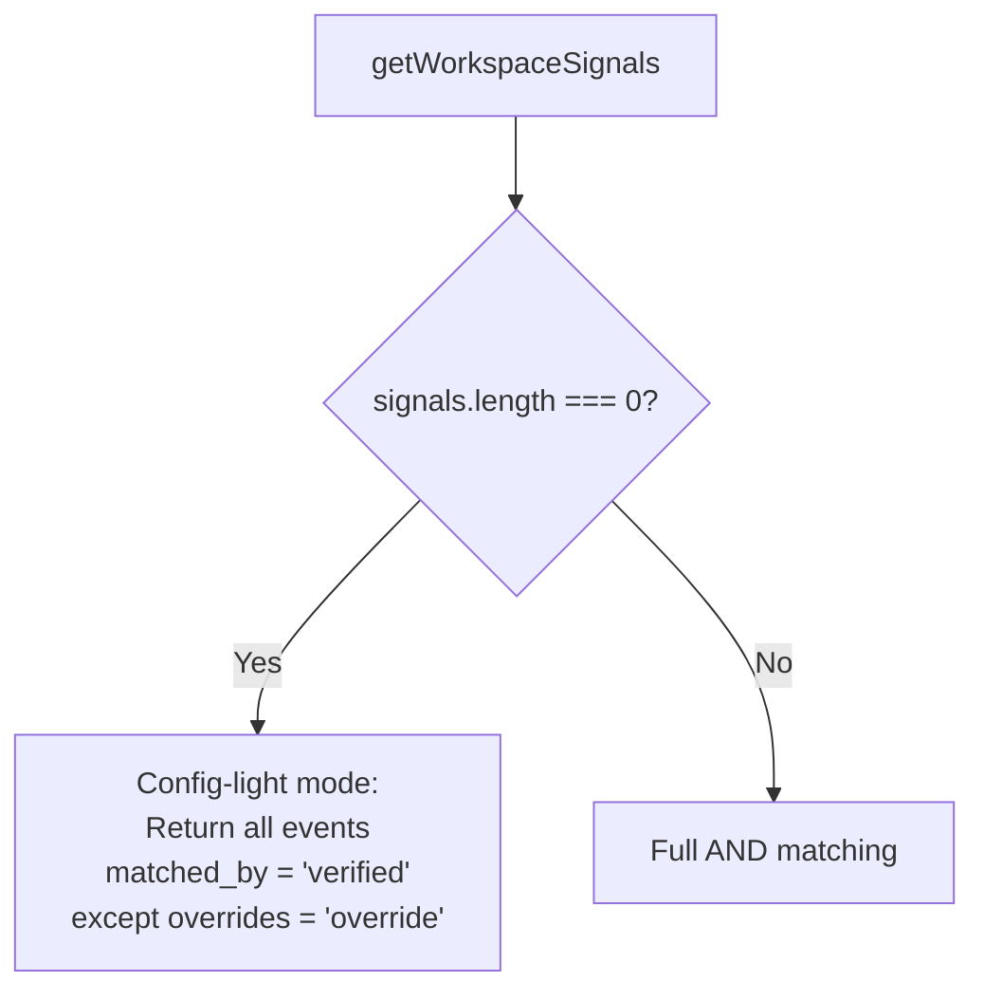

# Signal Matching - The Core USP

> This is the heart of Venzio. Read this before touching `lib/signals.ts`, any dashboard route, or analytics.

---

## 1. The Problem

Traditional attendance systems are easy to fake:
- Check in from home while pretending to be at the office
- Share login credentials with someone else to check in remotely
- Modify device GPS

Venzio's answer: **require ALL configured signals to match simultaneously**.

---

## 2. Signal Types

| Signal | Status | How collected | How verified |
|--------|--------|--------------|--------------|
| **GPS** | ✅ Live | `navigator.geolocation` on check-in + checkout | Haversine distance ≤ configured radius (default 300m) |
| **Network (`ip`)** | ✅ Live | Server-side IP geolocation via ip-api.com, both directions | Haversine distance ≤ configured proximity (default 500m) between the event's geolocated IP and an admin-registered reference point. **Not** a literal IP-string match — a residential/office IP changes on DHCP lease renewal, so this only works because it's geo-proximity, not equality. |
| **WiFi** | ⛔ Not implemented | — | No client captures SSID, no `wifi_ssid_hash` comparison exists in `src/lib/signals.ts`. `configuredTypes` in `queryWorkspaceEvents()` only ever contains `'gps'` and/or `'ip'`. Treat as roadmap. |
| **Device** | Informational only | User-agent, timezone | Trust score only - not a signal type for AND matching |

Signals are collected on **both check-in AND checkout** (GPS + Network only, today).

---

## 3. AND Semantics - The Rule


```mermaid
flowchart TD
  A[presence_event] --> B{Admin override?}
  B -->|Yes| OV[matched_by = 'override'\ncounts as office ✅]

  B -->|No| C{Signals configured\nfor workspace?}
  C -->|No signals\nconfig-light mode| CL[matched_by = 'verified'\ncounts as office ✅\nsee note below on why not 'none']

  C -->|Signals exist| D[Check each configured type]

  D --> G{GPS configured?}
  G -->|Yes| H{event has GPS?\nHaversine ≤ radius?}
  H -->|Yes| I[matched.add gps]
  H -->|No| J[gps NOT matched]
  G -->|Not configured| K[skip]

  D --> Q{Network/IP configured?}
  Q -->|Yes| R{event has IP geo?\nHaversine ≤ proximity?}
  R -->|Yes| S[matched.add ip]
  R -->|No| T[ip NOT matched]
  Q -->|Not configured| U[skip]

  I & S --> V{ALL configured\ntypes matched?}
  J & T --> V

  V -->|all matched| VF[matched_by = 'verified'\ncounts as office ✅]
  V -->|some matched| PF[matched_by = 'partial'\ndoes NOT count as office ⚠️]
  V -->|none matched| NF[matched_by = 'none'\ndoes NOT count as office ❌]
```

---

## 4. MatchedBy Values

| Value | Meaning | Counts as office? |
|-------|---------|------------------|
| `verified` | All configured signal types matched, **or** config-light mode (no signals configured for the workspace at all) | ✅ Yes |
| `partial` | Some but not all configured types matched | ❌ No |
| `none` | Signals are configured for the workspace, but none matched this event | ❌ No |
| `override` | Admin override applied - bypass matching | ✅ Yes |

> ⚠️ Config-light mode returns `matched_by='verified'`, not `'none'` — see `queryWorkspaceEvents()` in `src/lib/signals.ts`, the `if (signals.length === 0)` branch. `'none'` only happens when the workspace *has* signals configured and an event fails to match any of them.

**Important:** `partial` is NOT the same as `none`. It means the event happened - the signals just didn't all align. This is surfaced to admins so they can investigate (e.g. user checked in from home and happened to be on office VPN → IP matched but GPS didn't).

---

## 5. queryWorkspaceEvents() - The Core Function

File: `src/lib/signals.ts`


```mermaid
sequenceDiagram
  participant Caller as Dashboard / Analytics
  participant QWE as queryWorkspaceEvents()
  participant DB as Database

  Caller->>QWE: workspaceId, plan, { startDate, endDate, userId? }

  QWE->>QWE: Apply plan history gate\n(free=3mo, starter=12mo, growth=7yr)
  QWE->>DB: getActiveMemberIds(workspaceId)
  QWE->>QWE: Apply plan user limit (free: max 10)
  QWE->>DB: getEventsForUsers(memberIds, start, end)
  QWE->>DB: getWorkspaceSignals(workspaceId)
  QWE->>DB: getOverrideEventIds(workspaceId)

  alt no signals configured (config-light)
    QWE-->>Caller: all events with matched_by='verified'\n(or 'override' if in override set)
  end

  loop each event
    alt event in overrideEventIds
      QWE->>QWE: matched_by = 'override'
    else
      QWE->>QWE: matched = new Set()

      opt GPS configured + event has GPS
        QWE->>QWE: haversine(event, signal) ≤ radius?
        QWE->>QWE: if yes: matched.add('gps')
      end

      opt Network/IP configured + event has IP geo
        QWE->>QWE: haversine(event, signal) ≤ proximity?
        QWE->>QWE: if yes: matched.add('ip')
      end

      QWE->>QWE: allMatched = configuredTypes.every(t => matched.has(t))
      QWE->>QWE: matched_by = allMatched ? 'verified'\n: anyMatched ? 'partial' : 'none'
    end
  end

  QWE-->>Caller: PresenceEventWithMatch[]
```

There is no WiFi step - only `gps` and `ip` are ever in `configuredTypes`.

---

## 6. Checkout Location Mismatch

When a user checks out from a different location than check-in, the distance is recorded in `checkout_location_mismatch` (metres).

```typescript
// In checkout route: computed and stored
checkout_location_mismatch = haversine(checkin_gps, checkout_gps)

// In signals.ts: used to decide if hours count
export function eventCountsAsOfficePresence(event: PresenceEventWithMatch): boolean {
  if (event.matched_by !== 'verified' && event.matched_by !== 'override') return false
  if (event.checkout_location_mismatch !== null && event.checkout_location_mismatch > 0) return false
  return true
}
```

This prevents a scenario where someone checks in at the office but physically leaves (checkout GPS far from check-in GPS) - those hours don't count as verified office time.

---

## 7. Admin Override

Admin overrides are stored in `admin_overrides`, not in `presence_events`:


```mermaid
flowchart LR
  A[Admin marks event as 'present'] --> B[INSERT admin_overrides\nevent_id, admin_user_id, reason]
  B --> C[getOverrideEventIds\nreturns SET of overridden event IDs]
  C --> D[queryWorkspaceEvents\nchecks override set FIRST\nshort-circuits all signal matching]
  D --> E[matched_by = 'override']
```

**Invariant:** `presence_events` rows are never modified for overrides. The override is additive. This preserves the full audit trail of what actually happened vs what was manually approved.

---

## 8. Config-Light Mode

No signals configured → all events from active members pass through:


```mermaid
flowchart TD
  A[getWorkspaceSignals] --> B{signals.length === 0?}
  B -->|Yes| C[Config-light mode:\nReturn all events\nmatched_by = 'verified'\nexcept overrides = 'override']
  B -->|No| D[Full AND matching]
```

This mode is for:
- New workspaces that haven't set up signal configs yet
- Small teams on the free plan who trust their employees without verification

---

## 9. WiFi SSID Privacy (design for a not-yet-shipped feature)

⛔ **Not implemented.** The rest of this section describes the intended design if/when WiFi matching ships - none of it runs today. No SSID is collected by any check-in client, no `wifi_ssid_hash` column is written or read by `signals.ts`. Do not describe this as live in demos, pitch material, or admin-facing copy.

Intended design, preserved here so a future implementation doesn't regress the privacy property: WiFi SSIDs must **never be stored in plaintext**.

```
Admin adds WiFi: "OfficeNetwork"
  → bcrypt.hash("OfficeNetwork", 12) → stored in workspace_signal_config.wifi_ssid_hash

User checks in with SSID: "OfficeNetwork"
  → bcrypt.compare("OfficeNetwork", stored_hash) → true/false
  → event.wifi_ssid stored as-is in presence_events (the raw SSID from user device)
  → but this is the user's own data - they already know their own SSID
```

The workspace config never reveals what SSID the admin configured - only that the check-in matched it.

---

## 10. Performance Notes

- **GPS + Network(IP):** O(signals × events) Haversine - pure math, fast. This is the only matching cost that exists today.
- **WiFi (not implemented):** if it ships as bcrypt SSID comparison per the design in section 9, budget O(wifi_configs × events) at ~300ms each at cost 12, bounded by `plan.maxLocations` (free/starter=1, growth=5). Consider HMAC-SHA256 for O(1) comparison instead of bcrypt at query time, to avoid that cost entirely.
