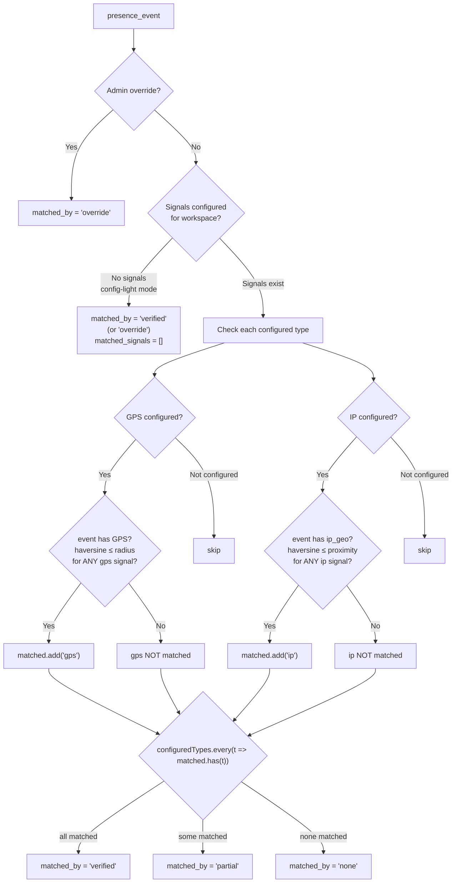
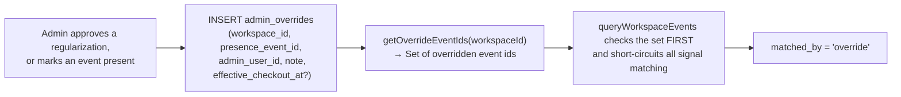
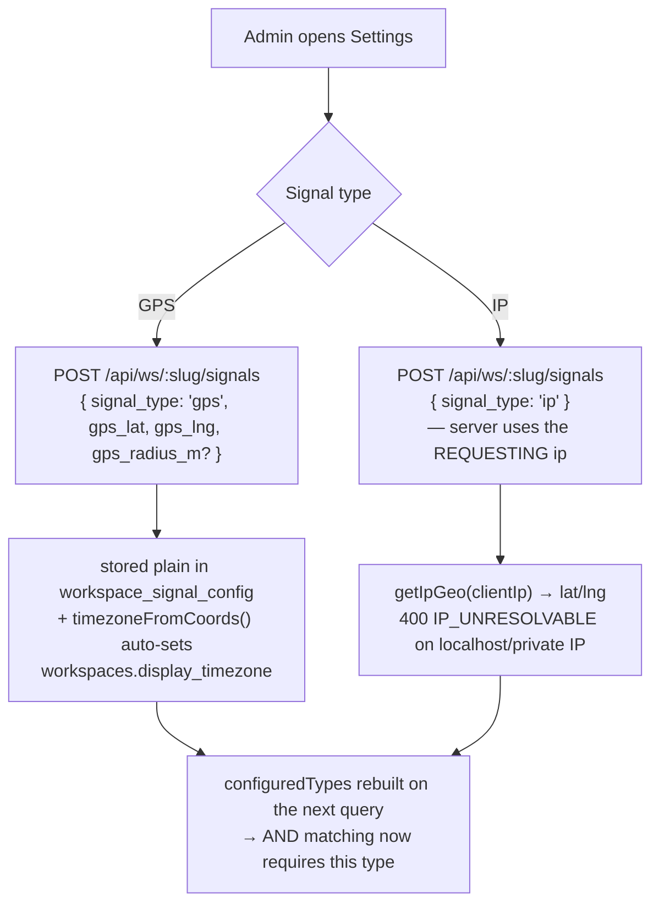

# Signal Matching - The Core USP

> Last updated: 2026-08-31
>
> Read this before touching `src/lib/signals.ts`, any dashboard route, or analytics.

---

## 1. The Problem

Traditional attendance systems are easy to fake:
- Check in from home while pretending to be at the office
- Share login credentials with someone else to check in remotely
- Modify device GPS

Venzio's answer: **require ALL configured signals to match simultaneously**.

---

## 2. Signal Types

**WiFi was removed** (commit `d0a0dca`). There are exactly **two** matchable
signal types today, and `POST /api/ws/[slug]/signals` rejects anything else:

```ts
if (!signalType || !['gps', 'ip'].includes(signalType)) → 400 INVALID_SIGNAL_TYPE
```

| Signal | How collected | How verified |
|--------|--------------|--------------|
| **GPS** | `navigator.geolocation` on check-in + checkout | Haversine distance ≤ configured radius (`gps_radius_m`, default 300 m) |
| **IP** | Server-side from request headers → `getIpGeo()` | Haversine distance ≤ configured proximity (`ip_proximity_m`, default 500 m) |
| **Device** | User-agent, timezone | Trust score only (`lib/trust.ts`) - **not** a signal type for AND matching |

### Leftovers from WiFi

The columns are still there and are simply never read by the matcher:

- `workspace_signal_config.wifi_ssid_hash`, `.wifi_ssid_display` - still in the
  schema and still writable through `addSignalConfig()`, but no route can set
  `signal_type = 'wifi'` any more, so no row can be created with them.
- `presence_events.wifi_ssid`, `.checkout_wifi_ssid` - still in the schema. The
  check-in and checkout routes no longer send or store an SSID.
- A few UI strings and dashboard labels still branch on `'wifi'`
  (`AttendanceClient.tsx`, `dashboard/route.ts`, `realtime/route.ts`). They are
  dead branches: `matched_signals` can only ever contain `gps` and `ip`.

Do not reintroduce SSID collection without re-deciding the privacy story - the
old design bcrypt-hashed the configured SSID, which cost a bcrypt comparison per
event per config and is why it was O(n) at query time.

---

## 3. AND Semantics - The Rule


```mermaid
flowchart TD
  A[presence_event] --> B{Admin override?}
  B -->|Yes| OV["matched_by = 'override'"]

  B -->|No| C{Signals configured\nfor workspace?}
  C -->|"No signals\nconfig-light mode"| CL["matched_by = 'verified'\n(or 'override')\nmatched_signals = []"]

  C -->|Signals exist| D[Check each configured type]

  D --> G{GPS configured?}
  G -->|Yes| H{"event has GPS?\nhaversine ≤ radius\nfor ANY gps signal?"}
  H -->|Yes| I["matched.add('gps')"]
  H -->|No| J[gps NOT matched]
  G -->|Not configured| K[skip]

  D --> Q{IP configured?}
  Q -->|Yes| R{"event has ip_geo?\nhaversine ≤ proximity\nfor ANY ip signal?"}
  R -->|Yes| S["matched.add('ip')"]
  R -->|No| T[ip NOT matched]
  Q -->|Not configured| U[skip]

  I & S --> V{"configuredTypes.every(t => matched.has(t))"}
  J & T --> V

  V -->|all matched| VF["matched_by = 'verified'"]
  V -->|some matched| PF["matched_by = 'partial'"]
  V -->|none matched| NF["matched_by = 'none'"]
```

A signal type is "configured" only if at least one row of that type exists **with
usable coordinates** - `gps_lat`/`gps_lng` non-null for GPS, `ip_geo_lat`/
`ip_geo_lng` non-null for IP. A half-written row does not add a requirement.

Multiple rows of the same type are an **OR within the type**: matching any one
office location satisfies `gps`. The AND is strictly *across* types.

---

## 4. MatchedBy Values

| Value | Meaning |
|-------|---------|
| `verified` | All configured signal types matched - **or** config-light mode |
| `partial` | Some but not all configured types matched |
| `none` | No configured type matched |
| `override` | Admin override applied - signal matching bypassed entirely |

**Important:** `partial` is not the same as `none`. It means the event happened
- the signals just didn't all align. This is surfaced to admins so they can
investigate (e.g. a user checked in from home and happened to be on the office
VPN → IP matched but GPS didn't).

### Two different "counts as office" tests - know which one you want

```ts
// attendance-summary.ts - the DAY-level test. Use this for WFO/WFH/Leave.
export function isOfficeMatched(matchedBy: MatchedBy): boolean {
  return matchedBy === 'verified' || matchedBy === 'override'
}

// signals.ts - the HOURS test. Note: 'override' does NOT pass here.
export function eventCountsAsOfficePresence(event: PresenceEventWithMatch): boolean {
  if (event.matched_by !== 'verified') return false
  if (event.checkout_location_mismatch !== null && event.checkout_location_mismatch > 0) return false
  return true
}
```

`eventCountsAsOfficePresence` deliberately requires `'verified'` only, and also
requires that the checkout GPS did not drift. Attendance stats are day-level and
must go through `src/lib/attendance-summary.ts` - see §7.

---

## 5. queryWorkspaceEvents() - The Core Function

File: `src/lib/signals.ts`

```mermaid
sequenceDiagram
  participant Caller as Dashboard / Analytics / /me timeline
  participant QWE as queryWorkspaceEvents()
  participant DB as Database

  Caller->>QWE: (workspaceId, plan, { startDate, endDate, userId?, eventType?, overrideGpsRadius? })

  QWE->>QWE: historyStartDate(plan) - clamp effectiveStart\n(free 3mo · starter 12mo · growth 84mo)
  QWE->>DB: getActiveMemberIds(workspaceId)

  alt options.userId given
    QWE->>QWE: must be an active member, else return []\nthen memberIds = [userId] - plan user cap SKIPPED\nso a member always sees their own rows
  else
    QWE->>QWE: if maxUsers !== null and over → memberIds.slice(0, maxUsers)
  end

  QWE->>DB: getEventsForUsers(memberIds, effectiveStart, endDate)
  QWE->>QWE: filter by options.eventType if given
  QWE->>DB: getWorkspaceSignals(workspaceId)
  QWE->>DB: getOverrideEventIds(workspaceId)

  alt signals.length === 0  (config-light)
    QWE-->>Caller: every event, matched_by = 'verified'\n(or 'override' when in the override set)\nmatched_signals = []
  end

  QWE->>QWE: gpsSignals / ipSignals - only rows with usable coords
  QWE->>QWE: configuredTypes = Set of the types that survived

  loop each event
    alt overrideEventIds.has(event.id)
      QWE->>QWE: matched_by = 'override'; continue
    else
      QWE->>QWE: GPS: any gpsSignal within (overrideGpsRadius ?? gps_radius_m ?? 300)?
      QWE->>QWE: IP: any ipSignal within (ip_proximity_m ?? 500)?
      QWE->>QWE: allMatched = configuredTypes.every(t => matched.has(t))
      QWE->>QWE: matched_by = allMatched ? 'verified' : matched.size ? 'partial' : 'none'
    end
  end

  QWE-->>Caller: PresenceEventWithMatch[]  (+ matched_signals: string[])
```

Note the two plan gates are different in kind: the **history** gate silently
raises `startDate`, while the **user** gate truncates the member list - a free
workspace over 10 members simply stops reporting on the surplus, ordered by
whatever `getActiveMemberIds` returns.

---

## 6. Config-Light Mode

No signals configured → every event from an active member passes through as
**`verified`**:

```ts
if (signals.length === 0) {
  return filteredEvents.map((event) => ({
    ...event,
    matched_by: overrideEventIds.has(event.id) ? 'override' : 'verified',
    matched_signals: [],
  }))
}
```

> ⚠️ This changed. Older documentation (and older copies of `CLAUDE.md`) say
> config-light yields `matched_by: 'none'`. It does not - it yields `'verified'`,
> which is what makes a brand-new workspace's dashboard show people as present
> instead of showing everyone as remote. `matched_signals` stays empty, so the
> UI can still tell a config-light "verified" from a signal-matched one.

This mode is for:
- New workspaces that haven't set up signal configs yet
- Small teams on the free plan who trust their people without verification

---

## 7. Day-level attendance - use `attendance-summary.ts`

Attendance stats are day-level, not event-level. `summarizeAttendanceDays()` is
the only correct way to count WFO/WFH/Leave or office/remote/absent days:

```
for each date in [startDate, endDate]:
  date > todayDate                     → 'future'   (not counted)
  not isWorkday(date, working_days)    → skipped entirely
  holidayDates.has(date)               → 'holiday'
  no events that day                   → 'absent'
  any event with isOfficeMatched()     → 'office'   (WFO wins over WFH)
  otherwise                            → 'remote'
```

Days are bucketed by `dateKeyInTimezone(event.checkin_at, timezone)` - the
**workspace-local** day, not UTC. Multiple events on one day count once.

---

## 8. Checkout Location Mismatch

When a user checks out from a different location than check-in, the distance is
recorded in `presence_events.checkout_location_mismatch` (metres, INTEGER).

`eventCountsAsOfficePresence()` treats any non-null, positive value as
disqualifying: someone who checked in at the office but physically left does not
get those hours counted as verified office time.

---

## 9. Admin Override

Overrides are stored in `admin_overrides`, never in `presence_events`:


```mermaid
flowchart LR
  A["Admin approves a regularization,\nor marks an event present"] --> B["INSERT admin_overrides\n(workspace_id, presence_event_id,\n admin_user_id, note,\n effective_checkout_at?)"]
  B --> C["getOverrideEventIds(workspaceId)\n→ Set of overridden event ids"]
  C --> D["queryWorkspaceEvents checks the set FIRST\nand short-circuits all signal matching"]
  D --> E["matched_by = 'override'"]
```

Note the column is `presence_event_id` (not `event_id`), and the free-text field
is `note` (not `reason`). `effective_checkout_at` was added later and lets an
override also correct a missing checkout time.

**Invariant:** `presence_events` rows are never modified for overrides. The
override is additive, preserving the audit trail of what actually happened
versus what was manually approved.

Approving an `office` regularization is the main producer of overrides today -
see `applyRegularizationApproval()` in `db/queries/regularizations.ts`, which
also synthesizes a 09:30-18:30 local event for a fully-absent day so there is
something for the override to attach to.

---

## 10. Signal Configuration


```mermaid
flowchart TD
  A[Admin opens Settings] --> B{Signal type}

  B -->|GPS| C["POST /api/ws/:slug/signals\n{ signal_type: 'gps', gps_lat, gps_lng, gps_radius_m? }"]
  C --> D["stored plain in workspace_signal_config\n+ timezoneFromCoords() auto-sets\nworkspaces.display_timezone"]

  B -->|IP| E["POST /api/ws/:slug/signals\n{ signal_type: 'ip' }\n— server uses the REQUESTING ip"]
  E --> F["getIpGeo(clientIp) → lat/lng\n400 IP_UNRESOLVABLE on localhost/private IP"]

  D & F --> G["configuredTypes rebuilt on the next query\n→ AND matching now requires this type"]
```

Both routes are gated on `requireWsAccess(req, slug, Resource.Signals,
Action.Write)`. Adding a GPS signal is the only place the workspace timezone is
auto-detected.

---

## 11. Performance Notes

- **GPS + IP:** O(signals × events) Haversine - pure float maths, fast.
- Removing WiFi removed the only bcrypt-per-event cost from the query path.
- `plan.maxLocations` (free/starter = 1, growth = 5) is **advertised but not
  enforced**: it appears only in `plans.ts` and the Billing tab. Nothing in
  `POST /api/ws/[slug]/signals` counts existing rows before inserting, so the
  signal-count bound on query cost is a convention, not a guarantee.
