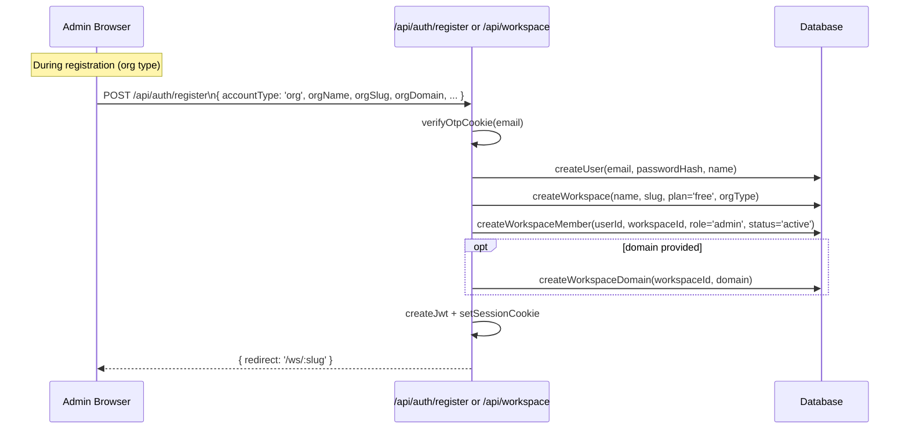
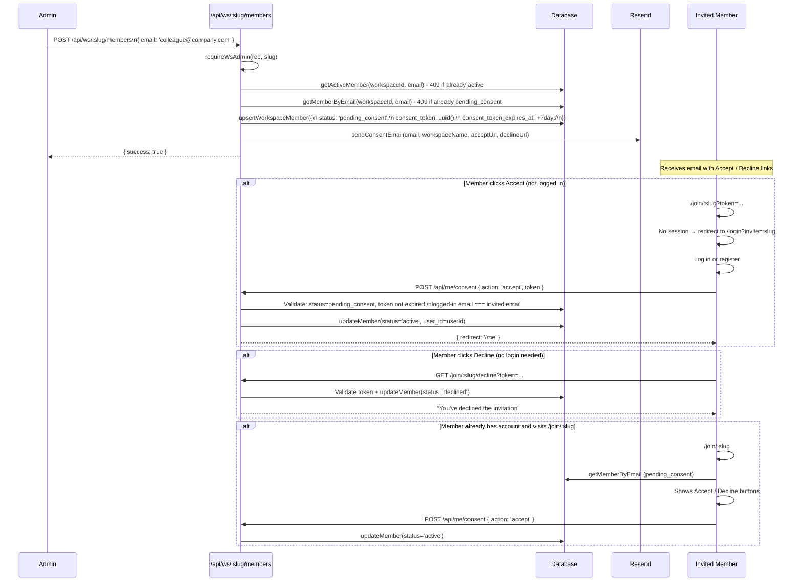
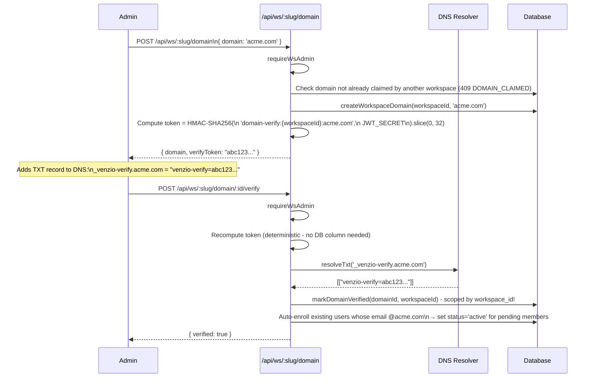
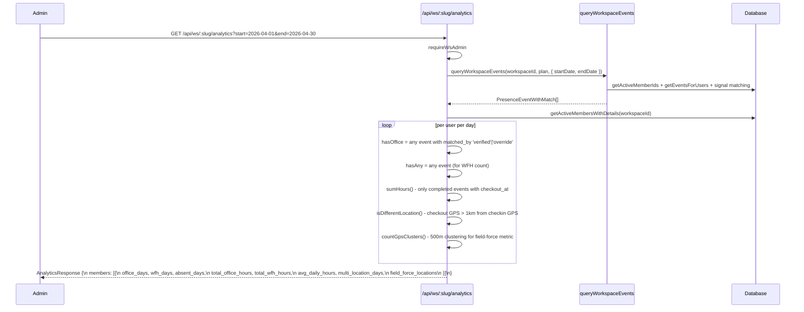
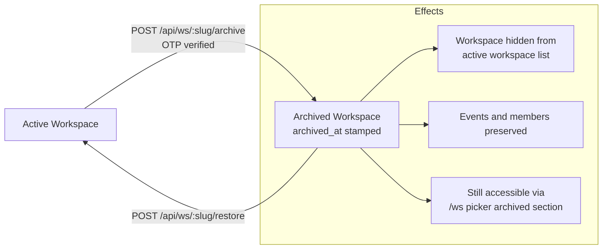
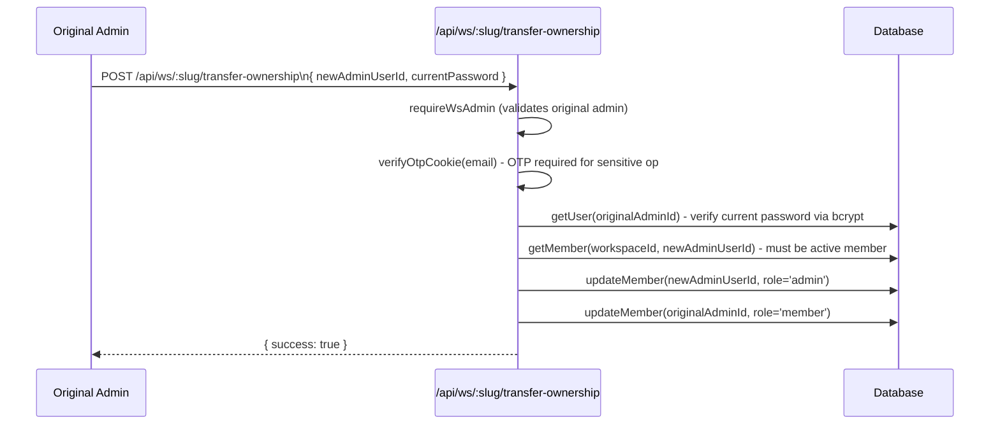

# Workspace Management Flows

---

## 1. Workspace Creation



**Workspace limits:** Free plan allows 1 workspace per account. Attempting a second returns 403 `WORKSPACE_LIMIT_REACHED`.

---

## 2. Member Invite & Consent Flow



---

## 3. Domain Verification Flow



---

## 4. Signal Configuration

```mermaid
flowchart TD
  A[Admin opens Settings tab] --> B{Signal type to add?}

  B -->|GPS| C[/ws/:slug/signals POST\n{ signal_type: 'gps',\n  gps_lat, gps_lng, gps_radius_m }]
  C --> D[Stored in workspace_signal_config\nbcrypt NOT used - GPS is plain coords]

  B -->|WiFi| E[/ws/:slug/signals POST\n{ signal_type: 'wifi', wifi_ssid: 'OfficeNetwork' }]
  E --> F[bcrypt.hash ssid, 12 → wifi_ssid_hash\nRaw SSID NEVER stored]
  F --> G[Stored in workspace_signal_config\nDisplayed as 'Off***k' partial mask]

  B -->|IP| H[/ws/:slug/signals POST\n{ signal_type: 'ip' }\n— server uses requesting IP]
  H --> I[getIpGeo client IP → lat/lng]
  I --> J[Stored as ip_geo_lat/lng + ip_proximity_m]

  subgraph Effect["Effect on queryWorkspaceEvents"]
    D & G & J --> K[configuredTypes Set builds from\nnon-null signal configs]
    K --> L[AND matching: event must match\nALL configured types]
  end
```

---

## 5. Dashboard Query Data Flow

```mermaid
flowchart TD
  A[Admin loads /ws/:slug] --> B[GET /api/ws/:slug/dashboard]
  B --> C[requireWsAdmin slug → workspace.id + userId]
  C --> D[Compute today UTC bounds\ntodayInTz workspace.timezone]
  D --> E[queryWorkspaceEvents\nworkspaceId, plan, startDate, endDate]

  subgraph SignalMatching["Signal Matching (see signal-matching.md)"]
    E --> F[getActiveMemberIds\ncapped by plan.maxUsers]
    F --> G[getEventsForUsers\nfiltered by date range]
    G --> H[getWorkspaceSignals]
    G --> I[getOverrideEventIds]
    H & I --> J[Per-event AND matching\nreturns PresenceEventWithMatch]
  end

  J --> K[Group events by userId → by day]
  K --> L{For each active member}
  L --> M{Any verified/override event today?}
  M -->|Yes| N["In office now" or "Visited today"]
  M -->|No| O["Not in"]

  N & O --> P[DashboardResponse JSON]
  P --> Q[TodayClient renders:\nIn office now · Visited today · Not in\nwith signal badges + durations]
```

---

## 6. Analytics Query Flow



---

## 7. Workspace Archive / Restore



---

## 8. Transfer Ownership



**Security:** Requires both current password verification AND a valid OTP cookie. Prevents account takeover via CSRF or session hijacking.

---

## 9. Security Invariants for Workspace Routes

Every workspace API route must:

1. Call `requireWsAdmin(req, slug)` → returns `{ workspace, userId }` or null
2. Use `ctx.workspace.id` (never slug or URL param) for all DB queries
3. Scope every query: `WHERE workspace_id = ?` with `ctx.workspace.id`
4. Never accept `workspaceId` from request body

```typescript
// Correct pattern:
export async function GET(req: NextRequest, { params }: Props) {
  const { slug } = await params
  const ctx = await requireWsAdmin(req, slug)
  if (!ctx) return NextResponse.json({ error: 'Forbidden', code: 'FORBIDDEN' }, { status: 403 })

  // ctx.workspace.id is verified - use it for ALL queries
  const data = await getSomethingForWorkspace(ctx.workspace.id)
  return NextResponse.json(data)
}
```
