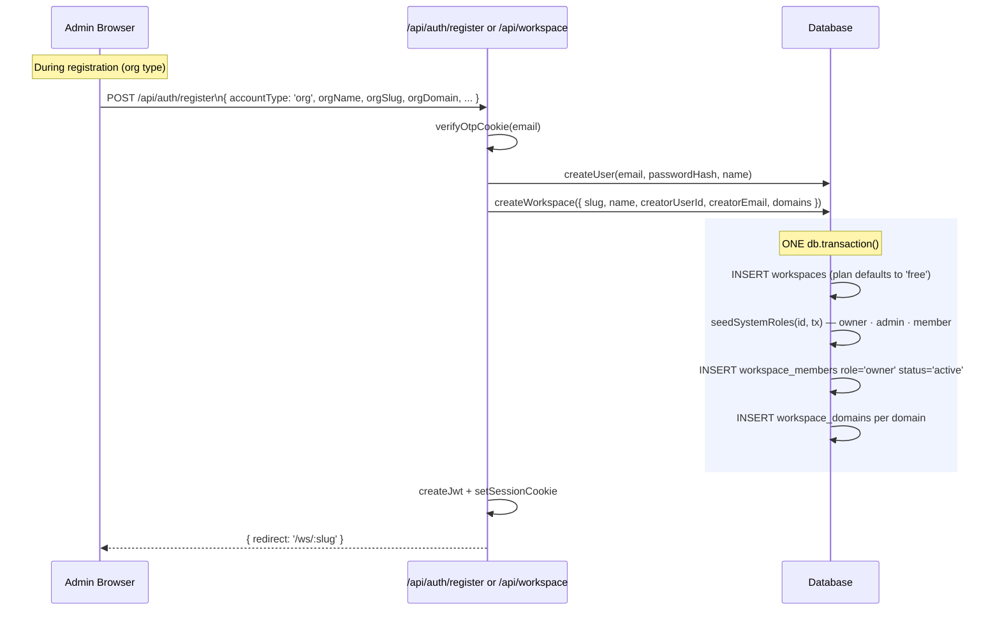
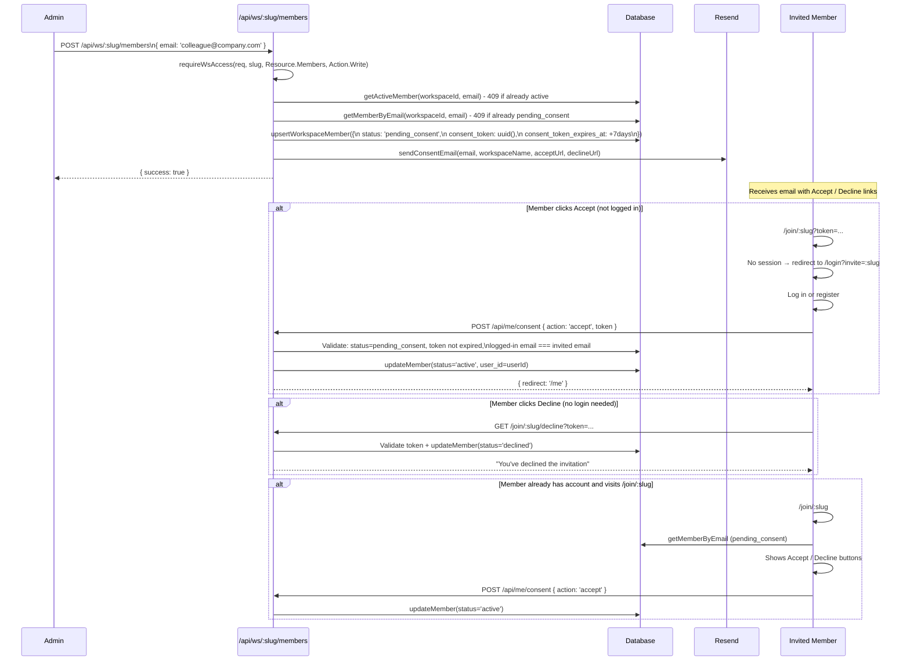
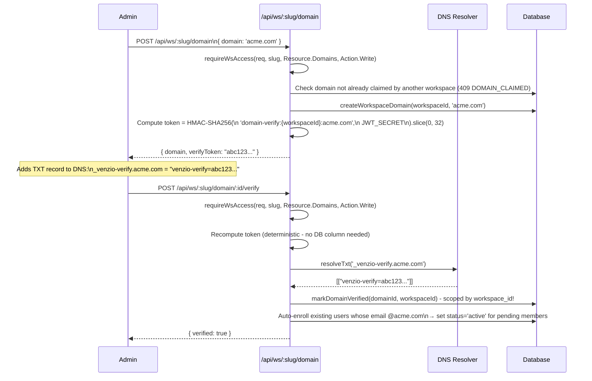
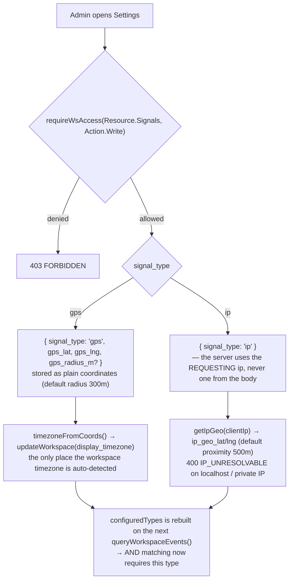
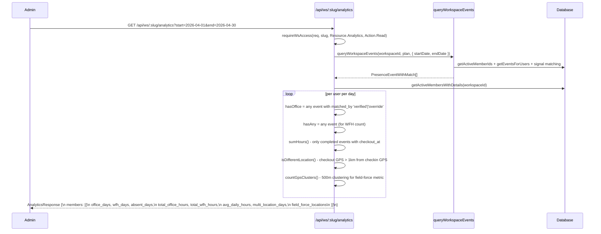
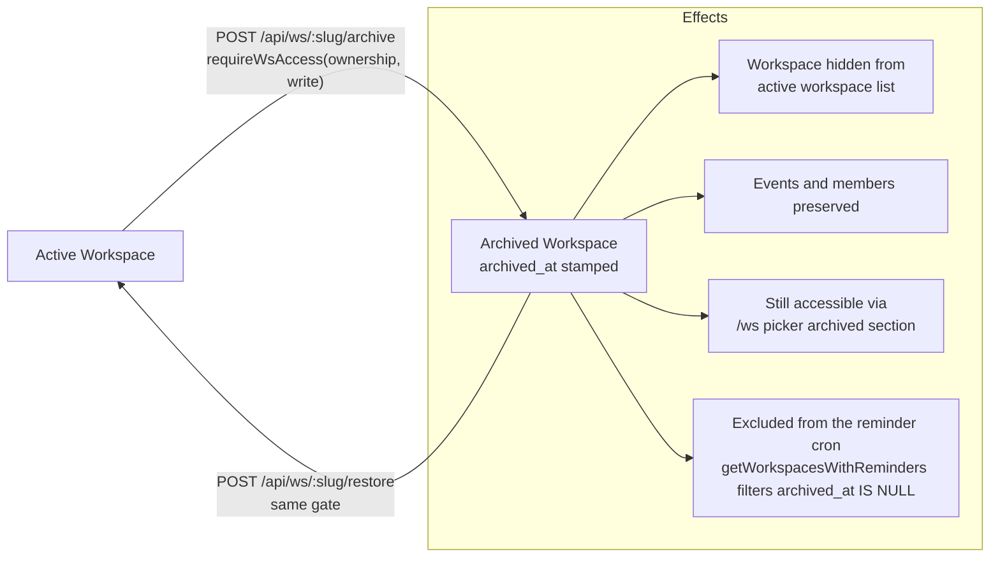
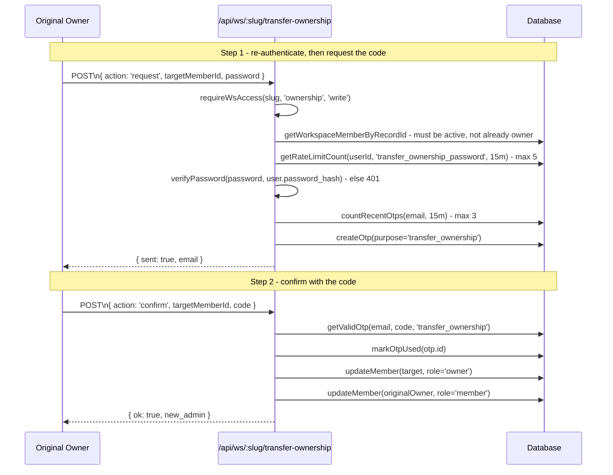

# Workspace Management Flows

> Last updated: 2026-08-31
>
> `requireWsAdmin()` no longer exists. Every route below is gated by
> `requireWsAccess(request, slug, Resource, Action)` — see
> [`permissions.md`](./permissions.md).

---

## 1. Workspace Creation


```mermaid
sequenceDiagram
  participant U as Admin Browser
  participant API as /api/auth/register or /api/workspace
  participant DB as Database

  Note over U: During registration (org type)

  U->>API: POST /api/auth/register\n{ accountType: 'org', orgName, orgSlug, orgDomain, ... }
  API->>API: verifyOtpCookie(email)
  API->>DB: createUser(email, passwordHash, name)
  API->>DB: createWorkspace({ slug, name, creatorUserId, creatorEmail, domains })

  rect rgb(240,244,255)
    Note over DB: ONE db.transaction()
    DB->>DB: INSERT workspaces (plan defaults to 'free')
    DB->>DB: seedSystemRoles(id, tx) — owner · admin · member
    DB->>DB: INSERT workspace_members role='owner' status='active'
    DB->>DB: INSERT workspace_domains per domain
  end

  API->>API: createJwt + setSessionCookie
  API-->>U: { redirect: '/ws/:slug' }
```

**Two invariants live in this transaction:**

1. **Roles are seeded before the member row.** Every permission lookup
   `LEFT JOIN`s `workspace_members.role` to `workspace_roles`, so a workspace
   with no role rows grants *nobody* anything — its creator included. Never
   insert a workspace by any other path.
2. **The creator is the `owner`, not an `admin`.** Only `owner` carries the
   `ownership` resource (transfer, archive, billing), so a workspace whose
   creator is an admin has nobody who can do those things.

`scripts/migrate.js → seedRolesAndOwners()` repairs both for pre-existing
workspaces: `INSERT OR IGNORE` for the three roles, a refresh of any system grid
that has drifted from `system-roles.json`, and an owner backfilled from the
oldest active admin. A workspace with no active admin is counted as `ownerless`
and left alone.

**Workspace limits:** Free plan allows 1 workspace per account. Attempting a second returns 403 `WORKSPACE_LIMIT_REACHED`.

---

## 2. Member Invite & Consent Flow


```mermaid
sequenceDiagram
  participant A as Admin
  participant API as /api/ws/:slug/members
  participant DB as Database
  participant Email as Resend
  participant M as Invited Member

  A->>API: POST /api/ws/:slug/members\n{ email: 'colleague@company.com' }
  API->>API: requireWsAccess(req, slug, Resource.Members, Action.Write)
  API->>DB: getActiveMember(workspaceId, email) - 409 if already active
  API->>DB: getMemberByEmail(workspaceId, email) - 409 if already pending_consent
  API->>DB: upsertWorkspaceMember({\n  status: 'pending_consent',\n  consent_token: uuid(),\n  consent_token_expires_at: +7days\n})
  API->>Email: sendConsentEmail(email, workspaceName, acceptUrl, declineUrl)
  API-->>A: { success: true }

  Note over M: Receives email with Accept / Decline links

  alt Member clicks Accept (not logged in)
    M->>M: /join/:slug?token=...
    M->>M: No session → redirect to /login?invite=:slug
    M->>M: Log in or register
    M->>API: POST /api/me/consent { action: 'accept', token }
    API->>DB: Validate: status=pending_consent, token not expired,\nlogged-in email === invited email
    API->>DB: updateMember(status='active', user_id=userId)
    API-->>M: { redirect: '/me' }
  end

  alt Member clicks Decline (no login needed)
    M->>API: GET /join/:slug/decline?token=...
    API->>DB: Validate token + updateMember(status='declined')
    API-->>M: "You've declined the invitation"
  end

  alt Member already has account and visits /join/:slug
    M->>M: /join/:slug
    M->>DB: getMemberByEmail (pending_consent)
    M->>M: Shows Accept / Decline buttons
    M->>API: POST /api/me/consent { action: 'accept' }
    API->>DB: updateMember(status='active')
  end
```

---

## 3. Domain Verification Flow


```mermaid
sequenceDiagram
  participant A as Admin
  participant API as /api/ws/:slug/domain
  participant DNS as DNS Resolver
  participant DB as Database

  A->>API: POST /api/ws/:slug/domain\n{ domain: 'acme.com' }
  API->>API: requireWsAccess(req, slug, Resource.Domains, Action.Write)
  API->>DB: Check domain not already claimed by another workspace (409 DOMAIN_CLAIMED)
  API->>DB: createWorkspaceDomain(workspaceId, 'acme.com')
  API->>API: Compute token = HMAC-SHA256(\n  'domain-verify:{workspaceId}:acme.com',\n  JWT_SECRET\n).slice(0, 32)
  API-->>A: { domain, verifyToken: "abc123..." }

  Note over A: Adds TXT record to DNS:\n_venzio-verify.acme.com = "venzio-verify=abc123..."

  A->>API: POST /api/ws/:slug/domain/:id/verify
  API->>API: requireWsAccess(req, slug, Resource.Domains, Action.Write)
  API->>API: Recompute token (deterministic - no DB column needed)
  API->>DNS: resolveTxt('_venzio-verify.acme.com')
  DNS-->>API: [["venzio-verify=abc123..."]]
  API->>DB: markDomainVerified(domainId, workspaceId) - scoped by workspace_id!
  API->>DB: Auto-enroll existing users whose email @acme.com\n→ set status='active' for pending members
  API-->>A: { verified: true }
```

---

## 4. Signal Configuration

Only **`gps`** and **`ip`** exist. WiFi was removed in `d0a0dca` and
`POST /api/ws/[slug]/signals` rejects any other `signal_type` with
`400 INVALID_SIGNAL_TYPE`.


```mermaid
flowchart TD
  A[Admin opens Settings] --> B{"requireWsAccess(Resource.Signals, Action.Write)"}
  B -->|denied| F[403 FORBIDDEN]
  B -->|allowed| C{signal_type}

  C -->|gps| D["{ signal_type: 'gps', gps_lat, gps_lng, gps_radius_m? }\nstored as plain coordinates (default radius 300m)"]
  D --> D2["timezoneFromCoords() → updateWorkspace(display_timezone)\nthe only place the workspace timezone is auto-detected"]

  C -->|ip| E["{ signal_type: 'ip' }\n— the server uses the REQUESTING ip, never one from the body"]
  E --> E2["getIpGeo(clientIp) → ip_geo_lat/lng (default proximity 500m)\n400 IP_UNRESOLVABLE on localhost / private IP"]

  D2 & E2 --> G["configuredTypes is rebuilt on the next queryWorkspaceEvents()\n→ AND matching now requires this type"]
```

See [`signal-matching.md`](./signal-matching.md) for what happens to the events.

---

## 5. Dashboard Query Data Flow

```mermaid
flowchart TD
  A[Admin loads /ws/:slug] --> B[GET /api/ws/:slug/dashboard]
  B --> C["requireWsAccess(Resource.Dashboard, Action.Read)\n→ workspace.id + userId + role"]
  C --> D[Compute today UTC bounds\ntodayInTz workspace.timezone]
  D --> E[queryWorkspaceEvents\nworkspaceId, plan, startDate, endDate]

  subgraph SignalMatching["Signal Matching (see signal-matching.md)"]
    E --> F[getActiveMemberIds\ncapped by plan.maxUsers]
    F --> G[getEventsForUsers\nfiltered by date range]
    G --> H[getWorkspaceSignals]
    G --> I[getOverrideEventIds]
    H & I --> J[Per-event AND matching\nreturns PresenceEventWithMatch]
  end

  J --> K[Group events by userId → by day]
  K --> L{For each active member}
  L --> M{Any verified/override event today?}
  M -->|Yes| N["In office now" or "Visited today"]
  M -->|No| O["Not in"]

  N & O --> P[DashboardResponse JSON]
  P --> Q[TodayClient renders:\nIn office now · Visited today · Not in\nwith signal badges + durations]
```

---

## 6. Analytics Query Flow


```mermaid
sequenceDiagram
  participant A as Admin
  participant API as /api/ws/:slug/analytics
  participant SIG as queryWorkspaceEvents
  participant DB as Database

  A->>API: GET /api/ws/:slug/analytics?start=2026-04-01&end=2026-04-30

  API->>API: requireWsAccess(req, slug, Resource.Analytics, Action.Read)
  API->>SIG: queryWorkspaceEvents(workspaceId, plan, { startDate, endDate })
  SIG->>DB: getActiveMemberIds + getEventsForUsers + signal matching
  SIG-->>API: PresenceEventWithMatch[]

  API->>DB: getActiveMembersWithDetails(workspaceId)

  loop per user per day
    API->>API: hasOffice = any event with matched_by 'verified'|'override'
    API->>API: hasAny = any event (for WFH count)
    API->>API: sumHours() - only completed events with checkout_at
    API->>API: isDifferentLocation() - checkout GPS > 1km from checkin GPS
    API->>API: countGpsClusters() - 500m clustering for field-force metric
  end

  API-->>A: AnalyticsResponse {\n  members: [{\n    office_days, wfh_days, absent_days,\n    total_office_hours, total_wfh_hours,\n    avg_daily_hours, multi_location_days,\n    field_force_locations\n  }]\n}
```

---

## 7. Workspace Archive / Restore


```mermaid
flowchart LR
  A[Active Workspace] -->|"POST /api/ws/:slug/archive\nrequireWsAccess(ownership, write)"| B[Archived Workspace\narchived_at stamped]
  B -->|"POST /api/ws/:slug/restore\nsame gate"| A

  subgraph Effects
    B --> C[Workspace hidden from\nactive workspace list]
    B --> D[Events and members preserved]
    B --> E[Still accessible via\n/ws picker archived section]
    B --> F[Excluded from the reminder cron\ngetWorkspacesWithReminders filters archived_at IS NULL]
  end
```

Both archive and restore are gated on `ownership:write`, which **only the owner
holds** — admins deliberately lack it. Archiving an already-archived workspace
returns `409 ALREADY_ARCHIVED`. There is no OTP step on archive; the OTP flow
belongs to ownership transfer (§8).

---

## 8. Transfer Ownership


```mermaid
sequenceDiagram
  participant OO as Original Owner
  participant API as /api/ws/:slug/transfer-ownership
  participant DB as Database

  Note over OO,DB: Step 1 - re-authenticate, then request the code
  OO->>API: POST\n{ action: 'request', targetMemberId, password }
  API->>API: requireWsAccess(slug, 'ownership', 'write')
  API->>DB: getWorkspaceMemberByRecordId - must be active, not already owner
  API->>DB: getRateLimitCount(userId, 'transfer_ownership_password', 15m) - max 5
  API->>API: verifyPassword(password, user.password_hash) - else 401
  API->>DB: countRecentOtps(email, 15m) - max 3
  API->>DB: createOtp(purpose='transfer_ownership')
  API-->>OO: { sent: true, email }

  Note over OO,DB: Step 2 - confirm with the code
  OO->>API: POST\n{ action: 'confirm', targetMemberId, code }
  API->>DB: getValidOtp(email, code, 'transfer_ownership')
  API->>DB: markOtpUsed(otp.id)
  API->>DB: updateMember(target, role='owner')
  API->>DB: updateMember(originalOwner, role='member')
  API-->>OO: { ok: true, new_admin }
```

**Entry point:** the Role dropdown on `/ws/:slug/people`. `owner` is listed there for anyone holding `ownership:write`, but it is NOT a grantable role — `canGrant` refuses owner→owner because rank must be strictly greater, and `PATCH .../members/:id/role` rejects `owner` with `USE_TRANSFER`. Picking it opens the OTP flow above instead of the role-change modal.

**Targets:** any active member OR admin. Promoting your most trusted admin is the normal path; only the sitting owner is rejected (`409 ALREADY_OWNER`), as is transferring to yourself (`400 SELF_TRANSFER`).

**Security:** Gated on the `ownership:write` permission, which only the owner's role grid holds — admins deliberately lack it. Beyond that it takes **two factors in sequence**: the account password (verified with `verifyPassword` against `users.password_hash`) before any code is issued, then a fresh emailed OTP to complete the swap. A hijacked session with access to the same inbox therefore is not sufficient on its own.

Two independent rate limits back this, both in `rate_limit_log`: 5 password attempts per 15 minutes keyed on the acting user (`transfer_ownership_password`) to stop brute force, and the existing 3 OTPs per 15 minutes keyed on their email to stop the endpoint being used as an email bomb. The password is deliberately not re-checked at step 2 — the code is single-use, short-lived, and only exists because the password already passed.

**Aftermath:** the outgoing owner becomes a plain `member` and loses `/ws` access immediately; the UI redirects them to `/me`. Only the new owner can restore their access.

---

## 9. Security Invariants for Workspace Routes

Every workspace API route must:

1. Call `requireWsAccess(request, slug, Resource.X, Action.Y)` — it returns an
   `AccessContext` or `null`
2. Use `ctx.workspace.id` (never the slug or a URL param) for all DB queries
3. Scope every query: `WHERE workspace_id = ?` with `ctx.workspace.id`
4. Never accept `workspaceId` (or `userId`) from the request body
5. Resolve any client-supplied foreign id against **this** workspace before
   writing it — see the `getEmployee(employeeId, ctx.workspace.id)` check in the
   asset-assign route

```typescript
import { requireWsAccess, forbidden } from '@/lib/ws-access'
import { Action, Resource } from '@/lib/permissions/catalogue'

export async function GET(req: NextRequest, { params }: Props) {
  const { slug } = await params
  const ctx = await requireWsAccess(req, slug, Resource.Holidays, Action.Read)
  if (!ctx) return forbidden()          // { error: 'Forbidden', code: 'FORBIDDEN' }, 403

  // ctx.workspace.id is verified - use it for ALL queries.
  // ctx.role.permissions is available for secondary can() checks that shape
  // the response (e.g. which buttons the client may render).
  const data = await getSomethingForWorkspace(ctx.workspace.id)
  return NextResponse.json(data)
}
```

`/me/*` routes use `requireWsMember(request, slug)` instead. It authenticates an
active membership and carries **no permission meaning** — the `/me` surface is
self-only for every role, decided by the session user id with no role lookup at
all.
